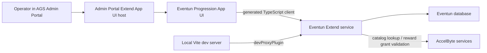

# Eventun Extend App UI Progression Admin Design and Implementation Plan

Status: Draft
Date: 2026-06-11
Primary repository: `github.com/ikigai-github/eventun`
Related repository: `github.com/ikigai-github/ascentun`
Related design: `30_designs/ascent-rivals/eventun-medals-progression-goals-challenges-rewards-solution-design.md`
Follow-on authoring plan: `30_designs/ascent-rivals/eventun-extend-app-ui-progression-authoring-design-plan.md`

## Purpose

Evaluate AccelByte Extend App UI as the first operator UI for Eventun progression authoring: reward bundles, achievements, masteries, challenges, definition imports, and related validation/inspection workflows.

This is not yet a decision to replace Ascentun as the long-term admin surface. The goal is to prove whether an embedded AGS Admin Portal UI is practical for Eventun progression operations before restructuring the Eventun repository around a permanent frontend.

## Recommendation

Start with a separate spike project scaffolded from AccelByte's official `react` Extend App UI template. Keep it outside the Eventun repository until the following are proven:

- The App UI can be registered and opened from AGS Admin Portal.
- Codegen works against Eventun's Swagger v2 spec.
- The UI can call at least one Eventun admin endpoint from local development and from the embedded portal.
- Eventun's auth path accepts Admin Portal cookie-based requests.
- A small progression authoring workflow is ergonomic enough to justify continuing.

If the spike is viable, move it into the Eventun repository under `app/` and keep the Go service layout otherwise stable. Do not perform a broad Eventun repo restructure as part of the initial evaluation.

## Current Context

Eventun already exposes Swagger UI and an OpenAPI/Swagger v2 document under the service base path. The current local service docs point to `/eventun/apidocs`, and `main.go` serves a combined Swagger JSON at `/eventun/apidocs/api.json`.

The Eventun repository root already has a minimal `package.json` for Buf/OpenAPI generation. It is not a frontend package. The App UI should use its own package manifest and dependency tree to avoid coupling frontend tooling to the Go/proto generation workflow.

Eventun currently has progression admin APIs for goals, goal versions, reward catalog lookup, reward validation, reward bundle definitions, definition imports, earned reward inspection, and retry. These are enough for an initial UI spike without inventing a separate backend.

One important backend prerequisite exists: Eventun's current claim parsing path reads `authorization` metadata. AccelByte's Extend App UI troubleshooting guide says Admin Portal calls authenticate through an `access_token` cookie when the UI is embedded, so Eventun must add cookie-based token extraction before embedded calls to protected admin endpoints can succeed reliably.

## AccelByte App UI Requirements

Official AccelByte documentation identifies Extend App UI as a hosted micro-frontend embedded inside AGS Admin Portal. UI assets are uploaded to AGS with Extend Helper CLI; Admin Portal loads the uploaded bundle and calls the module's `mount(container, context)` entry point.

Required setup:

- Extend Helper CLI `0.0.11` or newer.
- AGS base URL, namespace, confidential IAM client ID, and client secret.
- IAM permission to create/read/update Extend App UI entries.
- Node.js `24` or newer.
- A deployed Extend Service Extension or Event Handler when using typed codegen.
- A Swagger v2 spec at the deployed service URL's `/apidocs/api.json`.

Template choice:

| Template | Use case | Fit for Eventun |
| --- | --- | --- |
| `react-minimal` | Hello-world UI with no API calls. | Useful only for a pure mount/upload smoke test. Too small for progression authoring. |
| `react` | One Extend service, typed codegen from Swagger v2. | Recommended for the Eventun spike. |
| `react-multiple-extend-apps` | One UI calling multiple Extend services. | Defer unless the UI must directly call more than Eventun. |

Use Eventun as the single backend service for the first pass. Even for AccelByte catalog data, prefer Eventun's catalog lookup and reward validation APIs over direct frontend calls to multiple AGS services. Eventun should remain the policy boundary that normalizes catalog targets, validates reward definitions, and shields the UI from catalog implementation details.

Namespace is deployment context, not authoring data. A deployed Eventun instance is configured for one AccelByte game namespace, for example through `AB_NAMESPACE`. The embedded App UI can display the Admin Portal namespace and Eventun target for diagnostics, but reward definitions, imports, and catalog selections should not carry a namespace field. Eventun catalog lookup, validation, and fulfillment APIs use the namespace configured on the Eventun service.

## Proposed Architecture



The App UI is a frontend-only operator surface. It does not own progression state, reward policy, or AccelByte integration logic.

Responsibilities:

- App UI renders authoring, validation, preview, and support workflows.
- Generated clients call Eventun admin APIs.
- Eventun validates input, persists definitions, validates AccelByte reward targets, and performs reward fulfillment.
- AccelByte remains the source of truth for catalog, entitlements, and wallet balances after Eventun calls AGS APIs.

## Initial Product Scope

The first useful App UI should support a narrow progression-operations workflow rather than trying to become a full CMS.

V1 spike screens:

1. **Connectivity**
   - Show current Admin Portal namespace and configured Eventun target.
   - Treat namespace as display and diagnostic context, not reward authoring input.
   - Call a low-risk Eventun endpoint to verify auth and codegen.
   - Show clear unauthorized/forbidden states.

2. **Reward Catalog Lookup**
   - List normalized reward targets from Eventun.
   - Support filtering by reward type and SKU/name.
   - Show invalid or unavailable catalog targets clearly.

3. **Reward Bundle Definitions**
   - List reward bundle definitions and activation status.
   - Create a simple bundle with one or more entries.
   - Validate bundle entries before activation.
   - Avoid storing AccelByte item IDs in user input; operators should work with SKU or Eventun-normalized target identifiers.

4. **Progression Definition Import**
   - Upload or paste a structured JSON/CSV-derived import payload.
   - Create a dry-run preview through Eventun.
   - Show validation errors row-by-row.
   - Apply the import only after explicit confirmation.

5. **Goal Overview**
   - List goals by kind: achievement, mastery, challenge.
   - Show active version, reward bundle, status, and basic requirement summary.
   - Link to the import preview or existing goal-version APIs for edits.

Deferred UI workflows:

- Full visual requirement-tree builder.
- Drag-and-drop challenge scheduling.
- Inline medal-code creation beyond Eventun metadata.
- Player-facing reward claim UI.
- Public website stat/profile surfaces.
- Direct AccelByte catalog mutation.

## Authoring Model

Use import-first authoring for the spike.

Rationale:

- The existing progression design already supports structured definition imports.
- Bulk authoring is important for achievements and challenges.
- CSV or generated JSON can be reviewed outside the UI.
- A dry-run import preview gives better validation feedback than a complex first-pass form builder.
- A future row-based editor can generate the same import payload internally.

The UI should still provide simple forms for reward bundle definitions because reward bundles are small, operator-authored, and needed before goals can link rewards. For goals and challenges, start with import preview/apply and a read-only goal list.

## Repository Strategy

### Spike Layout

Create the spike as a separate local project first:

```text
eventun-app-ui-spike/
  package.json
  src/
  swaggers.json
  abcodegen.config.ts
  vite.config.ts
  .env.local
```

This keeps evaluation work isolated from Eventun until the App UI path proves useful.

### Eventun Repository Layout After Adoption

If the spike is successful, move it into Eventun:

```text
eventun/
  app/
    package.json
    src/
    swaggers.json
    abcodegen.config.ts
    vite.config.ts
  api/
  gen/
  internal/
  migration/
  proto/
  main.go
  package.json
```

Keep the existing root `package.json` focused on proto/OpenAPI generation. The App UI package should own frontend build, codegen, lint, and upload scripts.

Do not move Go service code into a new `service/` directory for the spike. That can be revisited only if Eventun accumulates more colocated applications.

## Backend Prerequisites

Before the embedded App UI can be considered viable, Eventun should support:

- Cookie-based `access_token` fallback in auth claim parsing when `authorization` metadata is absent.
- Admin endpoints that are safe to call from a browser-hosted operator UI.
- Swagger v2 generation that codegen can consume without manual patching.
- Stable API responses for empty lists and validation failures.
- Clear permission behavior for admin progression endpoints.

Auth implementation notes:

- Preserve existing Bearer-token behavior for Swagger, generated game clients, service calls, and command-line testing.
- When `authorization` metadata is absent, inspect incoming gRPC metadata for `cookie`, parse it with Go's `net/http` cookie parser, and extract the `access_token` value.
- Validate the cookie token through the same AccelByte SDK claim parsing path as a Bearer token.
- Apply the helper anywhere Eventun derives claims, player id, namespace, or operator identity from the request token.
- Do not use a token-derived or UI-provided namespace for reward fulfillment. AccelByte reward calls use Eventun's configured namespace.
- Add focused tests for Bearer-token auth, cookie auth, missing auth, and malformed cookie auth.

If existing APIs are too granular for the UI, add small Eventun facade endpoints rather than moving domain logic into the frontend. Good facade candidates:

- `ListProgressionAdminOverview`
- `GetGoalDefinitionDetail`
- `PreviewProgressionDefinitionImport`
- `ListRewardAuthoringCatalog`

These are optional. The spike should first attempt to use the existing admin APIs.

## Security and Permission Notes

The App UI must not commit secrets. `AB_CLIENT_SECRET` belongs in the local shell environment and CLI-managed local env files only.

The frontend should hide controls based on `isCurrentUserHasPermission`, but Eventun must still enforce authorization server-side. Client-side permission checks are UX hints, not security boundaries.

On AGS Shared Cloud, AccelByte currently documents a limitation where all admin roles can open an App UI, but endpoints requiring custom permissions may only work for Studio Admin users. Treat this as a spike risk and verify with the actual operator roles planned for progression management.

## Visual Style Baseline

The App UI should look like an AGS Admin Portal module, not like a separate Ascentun page.

Use the official template stack as the starting point:

- React with Ant Design components for tables, forms, tabs, drawers, modals, alerts, buttons, tags, pagination, and validation states.
- Tailwind utilities only for layout glue when Ant Design primitives are not enough.
- AccelByte/Admin UI CSS variables for color, typography, spacing, radius, and motion.

Captured Admin Portal CSS tokens show the relevant baseline:

- Font: `Roboto, sans-serif`.
- Base font size: `14px`.
- Primary color: `#0b6cff`.
- Link hover: `#2AA1FF`.
- Layout background: `#f5f5f5`.
- Container background: `#ffffff`.
- Text: `#000000e0`; secondary/description text: `#000000a6` and `#00000073`.
- Border: `#00000026`; secondary border/split: `#0000000f`.
- Control height: `32px`; large control height: `40px`; small control height: `24px`.
- Default radius: `4px`; large radius: `8px`; extra small radius: `2px`.
- Standard spacing scale: `4px`, `8px`, `12px`, `16px`, `20px`, `24px`, `32px`, `48px`.
- Status colors should use the Admin UI success, warning, error, and info token families rather than custom colors.

Design constraints for the spike:

- Prefer dense, operator-focused tables with filters and compact row actions.
- Prefer drawers or modals for create/edit flows so list context is preserved.
- Avoid marketing-style cards, oversized hero text, gradients, and decorative imagery.
- Keep page sections unframed unless they represent a repeated item, modal, drawer, or table container.
- Use tags/status chips for goal status, reward validation status, fulfillment mode, challenge period, and activation state.
- Match Admin Portal spacing and control heights before adding custom styling.

## Implementation Plan

### Phase 0: Environment and Access Check

- Confirm Node.js `24+`.
- Confirm Extend Helper CLI `0.0.11+`.
- Confirm AGS base URL, namespace, App UI name, and confidential IAM client credentials.
- Confirm the IAM client can create/read/update Extend App UI entries.
- Confirm the deployed Eventun service URL and `/apidocs/api.json` URL.
- Confirm which AGS role will test the embedded UI.

Exit criteria:

- CLI can register or inspect an App UI entry.
- Eventun Swagger JSON is reachable from the development machine.

### Phase 1: Template Spike

Scaffold the official React template:

```bash
extend-helper-cli clone-template --scenario "Extend App UI" --template react -d eventun-app-ui-spike
cd eventun-app-ui-spike
```

Configure shell environment:

```bash
export AB_BASE_URL='<ags-base-url>'
export AB_CLIENT_ID='<client-id>'
export AB_CLIENT_SECRET='<client-secret>'
export AB_NAMESPACE='<game-namespace>'
export AB_APPUI_NAME='eventun-progression-admin'
```

Register and configure local env:

```bash
extend-helper-cli appui create --namespace "$AB_NAMESPACE" --name "$AB_APPUI_NAME"
extend-helper-cli appui setup-env --namespace "$AB_NAMESPACE" --name "$AB_APPUI_NAME"
npm install
```

Set `.env.local`:

```text
VITE_AB_EXTEND_APP_NAME=<eventun-extend-app-name>
VITE_SINGLE_EXTEND_APP_ONLY=true
```

Exit criteria:

- `npm run dev` starts.
- The template can be uploaded with `extend-helper-cli appui upload`.
- The uploaded UI opens from AGS Admin Portal.

### Phase 2: Eventun Codegen

Update `swaggers.json` to point at Eventun:

```json
[["eventun", "eventun", "eventun.json", "https://<eventun-service-url>/apidocs/api.json"]]
```

Run:

```bash
npm run codegen
```

Use the single-service codegen configuration with `basePath: ''` so the runtime Extend app name and namespace determine the service path.

Exit criteria:

- Generated TypeScript client files compile.
- No manual edits to generated code are required.
- Any schema override is documented in `abcodegen.config.ts`.

### Phase 3: Eventun Cookie Auth Support

Update Eventun auth before relying on embedded App UI calls:

- Add a token extraction helper that checks `authorization` metadata first.
- Add a fallback path that parses `access_token` from `cookie` metadata.
- Route both token sources through the same AccelByte token validation and claims parsing code.
- Keep error messages clear enough to distinguish missing auth from invalid auth.
- Add regression tests for Authorization-header auth and Admin Portal cookie auth.

Exit criteria:

- Existing Bearer-token requests still authenticate.
- Requests with only `cookie: access_token=<token>` authenticate.
- Requests with no usable token return unauthenticated.
- The auth helper does not hand-parse cookie strings.

### Phase 4: App UI Connectivity

Build a small connectivity page:

- Read namespace/context from the App UI SDK for display and troubleshooting only.
- Call one Eventun read-only admin endpoint.
- Render success, unauthorized, forbidden, and unexpected-error states.

Exit criteria:

- Local dev calls work through the Vite dev proxy.
- Embedded Admin Portal calls work without manually adding an Authorization header.
- Eventun logs make it possible to distinguish Bearer-token auth from cookie fallback auth during verification.

### Phase 5: Reward Authoring Thin Slice

Implement reward-oriented screens first:

- List normalized catalog targets.
- List reward bundle definitions.
- Create one reward bundle definition.
- Validate a draft bundle against Eventun's reward validation endpoint.
- Show activation or validation errors without losing form state.

Exit criteria:

- An operator can create a test reward bundle using SKU-based catalog targets.
- Invalid SKUs or unavailable targets are surfaced before activation.
- The frontend does not bypass Eventun validation.

### Phase 6: Definition Import Thin Slice

Implement import-first goal/challenge authoring:

- Paste/upload a JSON import payload.
- Send it to Eventun for dry-run preview.
- Show row-level validation results.
- Apply a valid import after explicit confirmation.
- Refresh the goal overview after apply.

Exit criteria:

- A test achievement or challenge can be created through import preview/apply.
- Validation failures are understandable enough for an operator to correct the source file.
- Bulk authoring remains possible without a full visual editor.

### Phase 7: Adoption Decision

Evaluate the spike against these questions:

- Is the embedded Admin Portal UX better than putting this in Ascentun for operators?
- Does App UI auth and permission behavior work with expected roles?
- Does codegen remain stable against Eventun's proto/OpenAPI output?
- Are reward and import workflows understandable without extensive training?
- Does AGS-hosted deployment fit the expected development and release workflow?

If yes, move the app into `eventun/app/`, add Eventun repo scripts for local dev/codegen/build/upload, and document the workflow in Eventun's README.

If no, keep the App UI work as a reference spike and build the production admin UI in Ascentun while reusing Eventun's admin APIs.

## Acceptance Criteria

The spike is successful when:

- The UI runs locally and embedded in AGS Admin Portal.
- It calls Eventun using generated TypeScript clients.
- Eventun handles Admin Portal cookie-authenticated requests.
- Operators can create or validate a reward bundle in dev.
- Operators can dry-run and apply one progression definition import in dev.
- No secrets are committed.
- The outcome clearly supports either adopting `eventun/app/` or choosing Ascentun instead.

## Risks

- **Auth mismatch:** Embedded Admin Portal requests use cookies, while Eventun currently expects Authorization metadata. This is the first backend risk to resolve.
- **Role limitations:** Shared Cloud custom permission support may require Studio Admin for endpoint calls.
- **Tooling version drift:** Node.js `24+` and Extend Helper CLI `0.0.11+` are required by the current docs.
- **Codegen friction:** Eventun's generated Swagger may expose protobuf-derived shapes that need codegen overrides.
- **Frontend/backend leakage:** The UI could become a second policy engine if validation is implemented client-side. Keep validation in Eventun.
- **Repository churn:** Moving the app into Eventun too early could mix frontend tooling with service tooling before the App UI path is proven.

## Open Decisions

- Final App UI name.
- Actual Eventun Extend app name used for `VITE_AB_EXTEND_APP_NAME`.
- Whether the first operator workflow should create reward bundles only, or also apply one goal import in the same spike.
- Permission resource strings for progression admin operations.
- Whether App UI remains the long-term admin home or only a convenience surface beside Ascentun.

## Sources

- AccelByte, [Extend App UI](https://docs.accelbyte.io/gaming-services/modules/foundations/extend/extend-app-ui/)
- AccelByte, [Generate code from Extend app specs](https://docs.accelbyte.io/gaming-services/modules/foundations/extend/extend-app-ui/codegen-specs/)
- AccelByte, [Extend App UI SDK API Reference](https://docs.accelbyte.io/gaming-services/modules/foundations/extend/extend-app-ui/api-reference/)
- AccelByte, [Target multiple Extend apps in one App UI](https://docs.accelbyte.io/gaming-services/modules/foundations/extend/extend-app-ui/targeting-multiple-extend-apps/)
- AccelByte, [Troubleshoot Extend App UI](https://docs.accelbyte.io/gaming-services/modules/foundations/extend/extend-app-ui/extend-app-ui-troubleshooting/)
- AccelByte, [extend-app-ui-templates GitHub repository](https://github.com/AccelByte/extend-app-ui-templates)
