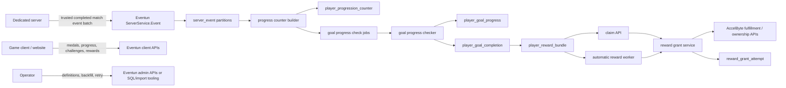
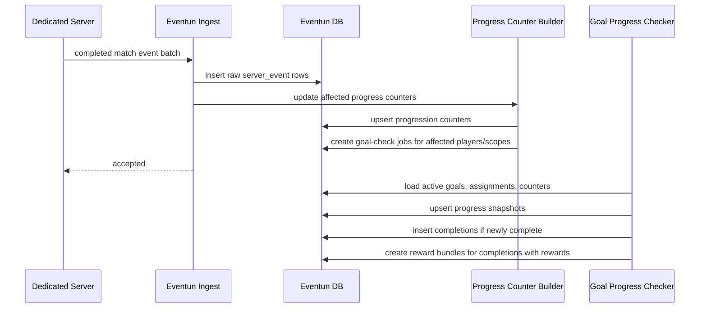
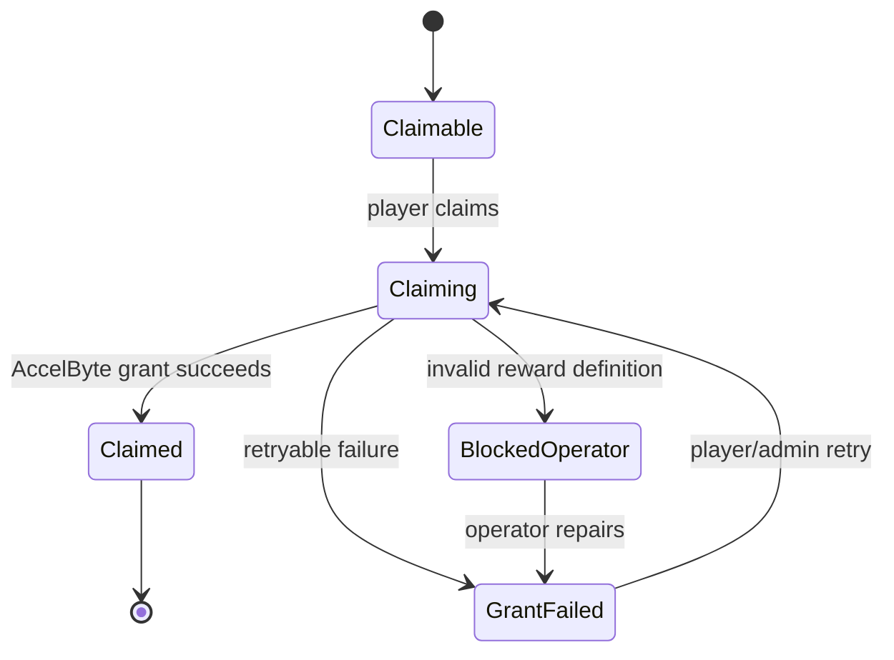

# Eventun Medals, Progression Goals, Challenges, and Rewards Solution Design

Status: Solution design draft
Date: 2026-05-26
Primary repository: `github.com/ikigai-github/eventun`
Related UI repository: `github.com/ikigai-github/ascentun`
Requirements: `30_designs/ascent-rivals/eventun-medals-progression-goals-challenges-rewards-requirements.md`

## Purpose

Define an Eventun-native solution for Ascent Rivals gameplay medals, achievements, masteries, challenges, and reward claiming.

The design favors the more flexible architecture: registered progression metrics, validated goal definitions, durable completion history, challenge assignment state, reward ledgers, and retryable AccelByte fulfillment. The scope is still intentionally bounded to Ascent Rivals use cases and should not become a generic rules platform without concrete product demand.

## Decision Summary

- Eventun owns gameplay medal facts, goal progress checking, challenge assignment, goal completion history, and player-facing reward claim state.
- The game runtime owns medal-rule logic and sends final per-player heat medal count summaries with any augment parent context.
- Raw Eventun gameplay events remain the source of truth.
- V1 does not introduce new occurrence ids, heat ids, or match ids for progression. Existing event identity is sufficient: session id, match number, heat number, event type, timestamp, plus player id and payload context.
- Eventun `match_id` values come from the Ascent Rivals runtime match index and are zero-based within a session; validators must reject negative values only.
- `PlayerHeatEnd.event_data.medalCounts` carries the V1 medal progression payload. Each entry includes a medal code, count, and optional parent medal code for augment counts.
- `HeatStart` carries one V1 game-authored boolean, `canonical`, used by progression and record policies.
- Goals use versioned definitions with a validated JSON requirement tree, not normalized requirement rows.
- Metrics are constrained by a registry. Goal JSON may reference only registered metrics, allowed dimensions, supported matchers, and bounded boolean composition.
- Challenge assignments are persisted per player and period for daily, weekly, and monthly scopes. Seasonal challenges are fixed shared goals.
- Goal completion creates one reward bundle when the goal has rewards.
- Claimable rewards are claimed through Eventun. Eventun calls AccelByte only when the player claims the bundle.
- Automatic rewards use the same reward bundle, entry, and grant-attempt model, but are triggered by an internal worker.
- AccelByte remains the system of record for fulfilled item ownership and currency balances.

## Non-Goals

- No V1 AccelByte Challenge mirror.
- No V1 AccelByte Achievement mirror.
- No V1 custom expression language.
- No V1 hidden, prerequisite-gated, or repeatable achievements.
- No V1 challenge rerolls.
- No V1 limited-supply reward enforcement.
- No V1 dedicated admin UI or Extend App UI.
- No V1 notification inbox.
- No V1 migration to add synthetic occurrence ids to existing gameplay events.

## System Context



Event ingestion should persist raw events and create repairable counter-building and goal-check work. Reward fulfillment must never block event acceptance. A completed goal is durable even if the reward grant later fails.

## Ownership Boundaries

Eventun owns:

- medal definitions and stored gameplay medal facts
- progression metric definitions and maintained counters
- goal definitions, versions, progress snapshots, and completions
- challenge pools, periods, assignments, and historical assignment state
- reward definitions, player reward bundles, grant attempts, claim state, retry, and audit
- backfill, rebuild, and reconciliation tooling

AccelByte owns:

- player identity
- catalog items and SKU-to-item records
- durable entitlements and ownership state
- wallet/currency balances
- fulfillment transaction history after Eventun calls AccelByte

The game runtime owns:

- medal rule logic
- whether an occurrence earns a base or specialized medal
- authoritative heat canonical context
- trusted completed match event batch submission

## Event Ingestion Design

### Complete Match Batch Contract

The existing trusted server event ingestion path remains the only V1 gameplay submission API.

Rules:

- The dedicated server sends one best-effort completed match batch after a successful match.
- The server does not retry the same completed match batch.
- V1 does not add duplicate match-batch protection for normal ingest.
- Raw event rows are identified by the existing Eventun gameplay event shape.
- Goal progress checking counts rows, summary counts, and unnested medal count facts; it does not require per-kill, per-medal, or per-occurrence ids.
- If the delivery contract later adds retries, idempotency should be added at the batch or counter-building boundary without changing the gameplay event payload model.

### Event Identity

Use existing fields for joins and counting:

- `session_id`
- `match_id`
- `heat`
- event `name`
- event `time`
- `player_id` where player-scoped
- `event_data`

Do not add new `occurrenceId`, `matchId`, or `heatId` fields for this feature. If a current payload already contains a runtime `heatId`, it can remain as payload context, but progression joins should use `session_id + match_id + heat`.

Eventun `match_id` values come from the Ascent Rivals runtime match index and are zero-based within a session; validators must reject negative values only. `match_id = 0` is the first match in a session.

### Heat Context

Extend server `HeatStart.event_data` with a minimal game-authored canonical signal:

```json
{
  "canonical": true
}
```

Required V1 field:

- `canonical`: `true` when the game runtime says the heat used default/canonical gameplay settings.

Custom game mode alone should be treated as canonical in V1. A custom-game heat should become non-canonical only when the heat itself uses modified lap counts, special loadout rules, gauntlet-finals behavior, or another non-default gameplay setting.

No other V1 heat-context flags are planned for this feature. Additional descriptive context, such as ruleset key, ruleset version, or special-case reason, should be added only when a concrete gameplay, support, or analytics requirement needs it.

Counting policy decides how the signal is used. The default for progression goals is `canonical_only`. Medal history may expose both canonical and all-completed totals if a client surface needs both.

V1 progression implementation should only activate counting policies that have counter-builder support. `canonical_only` is the initial supported policy. `all_completed_heats` and `definition_specific` remain design-supported future policies, but goals using them should remain draft/inactive or fail activation until the corresponding counter builders and validation paths exist.

### Medal Summary Payload

Add per-player, per-heat medal summary counts to server `PlayerHeatEnd.event_data`.

Suggested payload:

```json
{
  "medalCounts": [
    { "medalName": "warp", "count": 12 },
    { "medalName": "airborne", "parentMedalName": "warp", "count": 4 },
    { "medalName": "perfect", "parentMedalName": "warp", "count": 2 },
    { "medalName": "splatterKill", "count": 3 },
    { "medalName": "airborne", "parentMedalName": "splatterKill", "count": 1 }
  ]
}
```

Rules:

- The game sends one medal summary per player per completed heat, preferably embedded in that player's `PlayerHeatEnd` row.
- `medalCounts` contains one entry for each primary medal count and one entry for each augment medal count under a parent medal.
- `medalName` is the primary medal or augment medal being counted.
- `count` is the number of times that medal fact occurred for the player in the heat. It must be a positive integer when present.
- `parentMedalName` is omitted for primary medal counts and required for augment medal counts.
- Eventun derives `is_augment` from whether `parentMedalName` is present.
- Parent context is preserved because the same augment can apply to different parent medals. For example, `airborne` can augment both a kill medal and a warp medal.
- If a specialized primary medal replaces a base primary medal, the game sends only the specialized primary medal fact.
- Eventun does not derive base-versus-augment relationships from metadata for V1; it stores the parent context implied by the event shape.
- Eventun does not infer compound medals from `PlayerKill`, `PlayerDied`, timing windows, or other raw events.
- Weapon, part, course, and heat context are derived through existing event joins where possible.
- Time-windowed progression attributes medal counts at heat granularity, using the `PlayerHeatEnd` row's heat identity and event time. V1 does not split medal counts across daily, weekly, monthly, or seasonal boundaries inside a single heat.
- If a future medal requires event-level weapon precision, location, timestamp, or ordering that cannot be derived from heat loadout or existing event fields, add a minimal payload dimension or a dedicated occurrence event for that specific use case.
- Counter building should normalize each `medalCounts` entry into a medal fact with `medal_count`, then sum `medal_count`. Augment counters should preserve `parentMedalName` as `parent_medal_name`.

The current game `UHGMedalEvent` also carries display values with types such as time, meters, credits, and speed, plus `displaySign` for UI formatting. Those fields are useful for the in-match medal feed, but they are not required for Eventun V1 progression. Add a separate optional display payload later only if a post-match or website surface needs to reproduce detailed medal text from Eventun rather than from the game client.

`PlayerHeatEnd` embedding is the V1 recommendation because it avoids hundreds of extra medal occurrence rows in high-action heats. A separate `PlayerHeatMedalSummary` event remains a viable future refactor if the heat-end payload becomes too large, but it should use the same `medalCounts` array shape and one row per player per heat.

## Progress Counter Building Model

The solution uses raw events plus maintained counters:

- Raw event partitions are the audit and backfill source.
- Registered metrics define supported progression inputs.
- Progress counter building updates player metric counters for cheap reads and goal progress checks.
- Counters are rebuildable cache state, not the canonical source of truth.

### Metric Registry

`progression_metric_definition`

| Field | Purpose |
| --- | --- |
| `code` | Stable system metric code such as `medal.count`. Metrics are developer-defined registry entries, not operator-entered goal data. |
| `value_type` | `integer`, `decimal`, or `boolean`. |
| `source_event_name` | Event partition or source family used by the counter builder. |
| `allowed_dimensions` | JSON schema or key list for valid dimensions. |
| `default_counting_policy` | Default policy when a goal omits one. |
| `status` | `draft`, `active`, or `retired`. |

Initial metric model:

| Metric | Source | Example dimensions | V1 status |
| --- | --- | --- | --- |
| `medal.count` | `server_player_medal_fact` derived from `server_player_heat_end.event_data.medalCounts` | `medal_name`, `parent_medal_name`, `is_augment`, `weapon_sku`, `part_sku`, `course_code` | Initial active metric. |
| `kill.count` | `server_player_kill` | `weapon_sku`, `method`, `part_sku`, `course_code` | Initial active metric. |
| `heat.completed` | `server_player_heat_end` | `part_sku`, `weapon_sku`, `course_code` | Initial active metric. |
| `match.completed` | `server_player_match_end` | `course_code`, `podium_finish` | Initial active metric. |
| `podium.count` | `server_player_match_end` or `server_player_heat_end` | `part_sku`, `weapon_sku`, `course_code` | Active only when the counter builder is implemented. |
| `death.count` | `server_player_died` | `method`, `course_code` | Placeholder until a concrete goal/stat requires it and a counter builder exists. |
| `lap.completed` | `server_player_lap` | `part_sku`, `weapon_sku`, `course_code` | Placeholder until a concrete goal/stat requires it and a counter builder exists. |
| `warp.distance` | segment events when stable payload exists | `part_sku`, `course_code` | Future metric. |
| `stat.sum` | existing summary fields | `stat_key`, `course_code`, `part_sku` | Placeholder until a concrete summary-stat builder is designed. |

Do not add metrics speculatively. Add a metric when a concrete achievement, mastery, challenge, career stat, or UI surface needs it.

Only metrics with implemented counter builders should be marked `active`. Placeholder metrics may exist in design examples or seed files as `draft`, but they should not validate active goals until counter support is present.

### Counter Table

`player_progression_counter`

| Field | Purpose |
| --- | --- |
| `player_id` | AccelByte user id for human players. |
| `metric_code` | References `progression_metric_definition.code`. |
| `scope_kind` | `career`, `challenge_period`, `season`, or `custom_window`. |
| `scope_id` | `career`, `daily:YYYY-MM-DD`, `weekly:YYYY-Www`, `season:<season-key>`, etc. |
| `counting_policy_code` | `canonical_only`, `all_completed_heats`, or future policy. |
| `dimensions_hash` | Stable hash for indexed lookup. |
| `dimensions` | JSON dimensions used by the counter. |
| `integer_value` / `decimal_value` / `boolean_value` | Typed value slots. |
| `first_source_time`, `last_source_time` | Historical bounds for support and backfill. |
| `updated_at` | Last counter update. |

The primary key should include player, metric, scope, counting policy, and dimension hash.

### Counting Policies

| Policy | Meaning |
| --- | --- |
| `canonical_only` | Count only facts from heats where `HeatStart.event_data.canonical=true`. Default for achievements, masteries, and challenges. |
| `all_completed_heats` | Count all facts from accepted completed match batches. Useful for broad medal history or explicit casual/custom goals. |
| `definition_specific` | Reserved for future mode, event, or ruleset-specific policies. |

If `canonical` is missing, new V1 progression should treat the heat as non-canonical unless an operator runs an explicit legacy backfill policy.

## Current Game Medal Parity

The current Ascent Rivals game code should guide the V1 parity target:

- `Source/AscentRivals/Public/Race/HGMedal.h` defines primary medal names, augment medal names, value types, and `UHGMedalEvent`.
- `Source/AscentRivals/Private/Race/HGMedal.cpp` uses `mdl-` and `mdl-aug-` stat-code prefixes for AccelByte-backed medal and augment stats.
- `Source/AscentRivals/Private/Server/Subsystems/HGStatsServerSubsystem.cpp` tracks `AwardedMedals` and `AwardedMedalAugments`, then bulk updates AccelByte stat items at match end.
- `Source/AscentRivals/Private/Server/Contexts/HGRaceServerContext.cpp` adds augment medals to different primary medals. For example, `airborne` can augment kill medals and warp medals.

V1 Eventun parity should preserve:

- primary medal tallies equivalent to current `AwardedMedals`
- augment medal tallies equivalent to current `AwardedMedalAugments`
- optional parent medal context for every augment fact
- current post-match medal tally behavior, where primary medals and augment medals can both appear in a player's match result breakdown
- no dependency on current `UHGMedalEvent` display value formatting for V1 Eventun progression

The current AccelByte stat model counts augment code alone. Eventun should additionally preserve the parent `medalName` for each augment so future goals can distinguish `airborne` attached to `warp` from `airborne` attached to a kill medal without changing the game event contract again.

## Goal Definition Model

Achievements, masteries, and challenges use the same versioned goal model.

### Core Tables

`goal_definition`

| Field | Purpose |
| --- | --- |
| `id` | Generated UUID used as the durable goal identifier. |
| `operator_key` | Optional human-readable import or admin key. It should be generated by tooling when omitted, not required as manual data entry. |
| `kind` | `achievement`, `mastery`, or `challenge`. |
| `category` | Product grouping such as `combat`, `weapon_mastery`, or `daily`. |
| `status` | `draft`, `active`, `inactive`, or `retired`. |
| `current_version` | Current active definition version when applicable. |

`goal_definition_version`

| Field | Purpose |
| --- | --- |
| `goal_id` | Parent goal. |
| `version` | Monotonic integer version. |
| `title`, `description` | Player-facing copy. |
| `presentation` | Asset keys, rarity, sort order, and optional future media references. |
| `visibility` | `public`, `private`, or future `hidden`. V1 hidden behavior is not required. |
| `requirement_expression` | Validated JSON requirement tree. |
| `counting_policy` | Default policy for metric reads in this goal. |
| `reward_bundle_definition_id` | Optional linked reward bundle definition. |
| `active_from`, `active_until` | Optional activation window. |

Active goal versions are immutable. Edits create a new version. Completion records store the version completed.

Admin tools and imports should be UUID-first. When importing, a blank `id` means create a new draft definition; a populated `id` means update or version the existing draft/definition according to the import operation. `operator_key` exists for generated labels, CSV readability, and operator search, but should not be required manual entry.

### Validated JSON Requirement Tree

Goal requirements are stored as JSON because the natural shape is a small tree, definitions are low-volume configuration, and versioning an immutable document is simpler than copying a graph of normalized rows.

Example:

```json
{
  "operator": "all",
  "requirements": [
    {
      "metric": "medal.count",
      "matcher": "greater_than_or_equal",
      "target": 10,
      "dimensions": {
        "medal_code": "double_kill",
        "weapon_sku": "weapon_smg_01"
      }
    }
  ]
}
```

V1 operators:

- `all`
- `any`

V1 should validate the simple form: one root operator with one or more leaf requirements. That supports goals such as "10 splatter kills AND 10 airborne medals" by using root `all`, and "10 splatter kills OR 10 airborne medals" by using root `any`. Mixed nested boolean expressions should remain out of V1 unless a concrete achievement requires them.

V1 matchers:

- `greater_than_or_equal`
- `greater_than`
- `equal`
- `less_than_or_equal`
- `less_than`

Validation before activation:

- `operator` must be supported.
- Nesting depth must stay within a configured maximum.
- Leaf `metric` must exist and be active.
- `target` type must match the metric value type.
- `matcher` must be valid for the metric value type.
- `dimensions` keys must be allowed by the metric definition.
- Dimension values must use stable identifiers, preferably SKU for items.
- Challenge goals must have compatible scope and period semantics.
- Requirement JSON must not contain executable expressions or raw SQL.

This keeps the flexible design disciplined. Admin/search tooling can later add extracted indexes for common queries such as "all goals involving `weapon_smg_01`" without making normalized requirement rows the source of truth.

## Challenge Model

Daily, weekly, monthly, and seasonal challenges are goal definitions with assignment and period state.

### Tables

`challenge_pool`

| Field | Purpose |
| --- | --- |
| `id` | Generated UUID used as the durable challenge pool identifier. |
| `operator_key` | Optional human-readable import or admin key, such as `daily_default`. It should be generated by tooling when omitted. |
| `scope` | `daily`, `weekly`, `monthly`, or `seasonal`. |
| `status` | `draft`, `active`, or `retired`. |
| `assignment_count` | Number assigned per player for daily/weekly/monthly pools. |
| `reset_timezone` | Solution default should be UTC unless product chooses otherwise. |
| `repeat_policy` | Default repeat/cooldown behavior. |

`challenge_pool_goal`

| Field | Purpose |
| --- | --- |
| `pool_id` | Parent pool. |
| `goal_version_id` | Challenge goal version. |
| `weight` | Weighted random assignment. |
| `cooldown_periods` | Period count before the same goal can repeat. |
| `eligibility` | JSON constraints such as required item SKUs. |
| `active` | Whether the goal is selectable. |

`challenge_period`

| Field | Purpose |
| --- | --- |
| `pool_id` | Parent pool. |
| `period_key` | Stable key such as `daily:2026-05-26`. |
| `starts_at`, `ends_at` | Period bounds. |
| `assignment_seed` | Deterministic selection seed. |
| `status` | `scheduled`, `active`, or `closed`. |

`player_challenge_assignment`

| Field | Purpose |
| --- | --- |
| `player_id` | Assigned player. |
| `period_id` | Challenge period. |
| `goal_version_id` | Assigned challenge goal version. |
| `assignment_reason` | `generated`, `seasonal_shared`, `operator`, future `reroll`. |
| `eligibility_snapshot` | Ownership and selection context at assignment time. |
| `status` | `active`, `completed`, `expired`, or future `replaced`. |

### Assignment Rules

- Daily, weekly, and monthly assignment counts are configurable.
- Calendar reset windows are used; UTC is the solution default until product chooses otherwise.
- Assignments are persisted and stable for the active period.
- Selection is deterministic from player id, period, pool, and seed.
- Item-specific goals should be filtered out when ownership data shows the player does not own the required non-currency item.
- If ownership lookup is unavailable, prefer non-item-specific challenges before assigning item-specific challenges.
- Item-specific challenge assignment can be deferred from V1. While deferred, item-specific challenge goals should stay inactive or out of active pools so the player-facing assignment path does not silently omit expected challenge content.
- Repeat is allowed by default.
- Cooldowns are honored when configured.
- If all otherwise eligible goals are on cooldown, ignore cooldowns rather than failing assignment.
- Seasonal challenges are shared fixed goal sets. Per-player assignment/progress rows may be materialized lazily on first read or first goal-progress check.

## Player Progress and Completion

`player_goal_progress`

| Field | Purpose |
| --- | --- |
| `player_id` | Player. |
| `goal_version_id` | Goal version being tracked. |
| `assignment_id` | Present for assigned challenges. |
| `scope_kind`, `scope_id` | Career, challenge period, season, or custom window. |
| `status` | `not_started`, `active`, `completed`, or `expired`. |
| `progress` | JSON snapshot for UI display and goal-check audit. |
| `current_value`, `target_value`, `percent_complete` | Convenience fields for simple single-leaf goals. |
| `first_progress_at`, `completed_at`, `last_checked_at` | Timeline fields. |

`player_goal_completion`

| Field | Purpose |
| --- | --- |
| `player_id` | Player. |
| `goal_version_id` | Completed goal version. |
| `assignment_id` | Present for assigned challenge completions. |
| `scope_kind`, `scope_id` | Completion scope. |
| `completed_at` | Completion timestamp. |
| `completion_snapshot` | Requirement values and source context at completion. |
| `source_session_id`, `source_match_id` | Optional source context for match-triggered completions. |

Completion unique key:

- player
- goal version
- assignment id when present
- scope kind
- scope id

The unique key prevents duplicate completion and reward creation during goal-check retry or backfill.

## Goal Progress Check Flow



Failure policy:

- If raw event insertion fails, reject the batch.
- If counter updates cannot be recorded consistently, reject the batch or persist a repair job in the same transaction.
- If goal-check job creation fails, reject the batch or persist an outbox row in the same transaction.
- If a goal check fails later, keep the job retryable and visible to operator tooling.
- If reward grant fails, do not alter the completion. Keep reward state retryable or blocked for operator repair.

### Goal-Check Jobs

Use `player_goal_progress_check_job` as a retryable work ledger:

| Field | Purpose |
| --- | --- |
| `player_id` | Affected player. |
| `scope_kind`, `scope_id` | Career, period, season, or custom window to check. |
| `session_id`, `match_id` | Optional triggering match context. |
| `trigger_kind` | `match_ingest`, `challenge_assignment`, `manual_repair`, or `backfill`. |
| `status` | `queued`, `running`, `succeeded`, `failed`, or `cancelled`. |
| `attempt_count`, `available_at`, `locked_at` | Retry and worker coordination. |
| `last_error_code`, `last_error_message` | Support visibility. |

This is not gameplay data and does not imply match-batch deduplication. It exists so progress and completion checks can be retried safely after raw events and counters are durable.

## Reward Model

Rewards are attached to goal definition versions. Each completed goal creates at most one player reward bundle.

The admin UI should treat "inline rewards" as the default authoring path. An operator can add one or more rewards directly while creating an achievement, mastery, or challenge. Eventun still stores those inline rewards as a generated reward bundle definition behind the scenes. Reusable reward bundles remain available for repeated packages, but they should not be required for the common single-reward case.

### Definition Tables

`reward_bundle_definition`

| Field | Purpose |
| --- | --- |
| `id` | Generated UUID used as the durable reward bundle definition identifier. |
| `operator_key` | Optional human-readable import or admin key. Generated goal reward bundles do not require manual keys. |
| `bundle_kind` | `generated_goal_reward` or `reusable`. |
| `title` | Optional display label. |
| `fulfillment_mode` | `claimable` or `automatic`. |
| `duplicate_policy` | Default `convert_item_to_arc_when_price_available`. |
| `status` | `draft`, `active`, or `retired`. |

`reward_entry_definition`

| Field | Purpose |
| --- | --- |
| `bundle_definition_id` | Parent reward bundle. |
| `reward_type` | `item`, `currency`, `battlepass_xp`, future `title`, or `custom`. |
| `namespace` | AccelByte namespace when external. |
| `item_sku` | Preferred durable item reference for item rewards; V1 ARC currency rewards may also require a configured AccelByte COINS SKU as the fulfillment target. |
| `item_id` | Optional resolved AccelByte item id cache when an endpoint requires it. SKU remains the durable reference. |
| `currency_code` | Logical currency code such as `ARC`. V1 assumes ARC is the only supported currency. |
| `quantity` | Quantity. |
| `last_validation_status`, `last_validated_at` | Last known catalog validation result for operator visibility. |
| `metadata` | Eventun source context and future presentation hints. |

### Player Tables

`player_reward_bundle`

| Field | Purpose |
| --- | --- |
| `player_id` | Owner. |
| `completion_id` | Source completion. |
| `bundle_definition_id` | Definition used. |
| `fulfillment_mode` | Copied from definition for history. |
| `status` | `claimable`, `claiming`, `claimed`, `auto_pending`, `auto_fulfilled`, `grant_failed`, or `blocked_operator`. |
| `earned_at`, `claimed_at`, `fulfilled_at` | Timeline. |
| `last_error_code`, `last_error_message` | Support visibility. |

`player_reward_entry`

| Field | Purpose |
| --- | --- |
| `reward_bundle_id` | Parent player bundle. |
| `reward_entry_definition_id` | Definition used. |
| `reward_type` | Copied from definition. |
| `item_sku`, `item_id`, `currency_code`, `quantity` | Resolved grant details. |
| `status` | `pending`, `granting`, `granted`, `skipped_duplicate`, `converted_to_arc`, `failed`, or `blocked_operator`. |
| `duplicate_compensation_currency`, `duplicate_compensation_quantity` | ARC compensation details when applicable. |
| `external_reference` | AccelByte transaction or entitlement reference. |

`reward_grant_attempt`

| Field | Purpose |
| --- | --- |
| `reward_bundle_id` | Parent bundle. |
| `attempt_number` | Monotonic attempt number. |
| `external_service` | `accelbyte`. |
| `idempotency_key` | Deterministic transaction id or request key. |
| `request_payload`, `response_payload` | Audit and reconciliation. |
| `status` | `started`, `succeeded`, `failed`, or `uncertain`. |
| `error_code`, `error_message` | Failure details. |

## AccelByte Catalog Reference Validation

Eventun should not attempt to become a fully synchronized copy of the AccelByte catalog for V1. Catalog events could improve freshness later, but they do not solve replacement decisions when a reward reference becomes invalid. Eventun should query AccelByte for current catalog state during operator workflows and again before external fulfillment.

Reference policy:

- Store SKU as the durable item reference for AccelByte item rewards.
- V1 item rewards are expected to reference AccelByte `INGAMEITEM` catalog entries. Default account bundles and Season Pass catalog entries are not reward targets for achievements, masteries, or challenges.
- Store currency code for AccelByte currency rewards as the logical reward identity. For V1 ARC grants, also store or resolve the configured AccelByte COINS SKU required by the chosen fulfillment endpoint.
- V1 assumes ARC is the only supported spendable currency. Additional currencies require explicit product and fulfillment design before activation.
- Store Battle Pass context and XP quantity for Battle Pass XP rewards.
- Store optional display snapshots, such as title, item type, price, and image reference, for audit and admin review only.
- Do not auto-substitute a different reward when an AccelByte catalog item is deleted, disabled, ambiguous, or no longer grantable.
- Resolve AccelByte item id from SKU only when the selected AccelByte grant endpoint requires item id.

Validation points:

- Goal or reward-bundle create validates all external reward references before saving an active version.
- Definition import validates each reward row and returns row-level errors before apply.
- Activation validates the reward references attached to the goal version being activated.
- Claimable and automatic fulfillment resolve and validate the reward entry again immediately before calling AccelByte.
- Operator repair can revalidate blocked reward definitions or player reward entries after the AccelByte catalog is fixed.

Invalid catalog outcomes:

- If a draft definition references a missing or invalid AccelByte target, reject activation and keep the definition in draft or import-error state.
- If an already-earned player reward references a missing or invalid AccelByte target at claim time, move the affected entry or bundle to `blocked_operator`.
- Keep the source completion durable even when reward fulfillment is blocked.
- After an operator repairs the reward definition or AccelByte catalog state, retry fulfillment through the normal grant service.

Admin UI catalog lookup should call Eventun, not AccelByte directly. Eventun can present normalized reward targets from live AccelByte queries or a short-lived cache:

| Reward target type | Durable Eventun reference |
| --- | --- |
| Item | SKU |
| Currency | Currency code, such as `ARC`, plus configured AccelByte COINS SKU when fulfillment requires SKU |
| Battle Pass XP | AccelByte Season Pass context plus XP quantity |
| Future Eventun-owned reward | Eventun reward code |

## AccelByte Fulfillment Design

Use AccelByte Platform fulfillment for AccelByte-backed items and currency. Fulfillment is preferred over direct entitlement grant because AccelByte documents fulfillment as granting entitlements/coins while also retaining fulfillment transaction history.

Preferred endpoint:

```text
PUT /platform/v2/admin/namespaces/{namespace}/users/{userId}/fulfillments/{transactionId}
```

Rationale:

- It accepts a caller-provided `transactionId`.
- Repeated calls with the same transaction id should not create duplicate entitlements.
- Failed fulfillments can be retried with the same transaction id after the cause is corrected.
- Requests can use `itemSku` when `itemId` is not present.
- Metadata can carry Eventun source context.

Grant payload policy:

- Use SKU as Eventun's durable item reference.
- Resolve item id only when the chosen AccelByte endpoint requires it.
- For V1 item rewards, validate that the SKU resolves to a grantable AccelByte `INGAMEITEM`.
- For V1 ARC rewards, use the configured ARC COINS SKU required by AccelByte fulfillment. Do not infer support for additional currencies until they are planned.
- Use `source` consistently, recommended `REWARD`.
- Use metadata fields for Eventun bundle id, completion id, goal id, optional operator key, goal version, source kind, and source match context when available.
- Use a stable transaction id based on the reward bundle, for example `eventun-reward:<bundle_id>`.

### Battle Pass XP Rewards

If Ascent Rivals uses AccelByte Season Pass as the battle pass owner, Eventun challenge, achievement, and mastery reward bundles can include Battle Pass XP as an external reward entry.

This reward type is not fulfilled through Platform item/currency fulfillment. It should use AccelByte Season Pass server XP grant:

```text
GrantUserExp / GrantUserExpOp
```

Grant rules:

- Use `reward_type='battlepass_xp'`.
- Store the XP amount in `quantity`.
- Store namespace, season/pass context, source goal, completion id, and reward bundle id in entry metadata.
- For claimable rewards, Eventun grants the XP when the player claims the reward bundle.
- For automatic rewards, the automatic reward worker grants the XP.
- After XP is granted, AccelByte owns the resulting Battle Pass XP, tier progression, and tier reward claim state.
- AccelByte Season Pass tier rewards are claimed through AccelByte Season Pass APIs unless a later design intentionally mirrors them into Eventun.

Current AccelByte docs show the external XP grant as an amount-based Season Pass server operation and do not show a caller-provided transaction id comparable to Platform Fulfillment V2. Eventun must therefore use its local reward bundle and grant-attempt ledger to prevent duplicate Battle Pass XP grants before invoking AccelByte. On uncertain timeout, Eventun should reconcile against AccelByte player season state or require operator review before retrying if duplicate XP would be harmful.

### Claimable Flow



Rules:

- The claim endpoint locks the reward bundle row.
- Only the owning player can claim.
- `claimable` and retryable `grant_failed` bundles can be claimed.
- Eventun checks ownership for durable item entries before grant when possible.
- Duplicate durable items do not block the bundle.
- Duplicate item entries convert to ARC using a global duplicate compensation percentage of catalog price when price is available.
- If price is unavailable, the duplicate entry is skipped and recorded.
- Mark the bundle claimed only after grantable entries are granted, converted, or validly skipped.
- If AccelByte returns an uncertain timeout, record `uncertain` and reconcile before retrying with a different transaction id.

### Automatic Flow

Automatic rewards use the same tables and grant service:

- completion creates `player_reward_bundle.status='auto_pending'`
- worker locks pending bundles with `FOR UPDATE SKIP LOCKED`
- worker calls the grant service
- successful grants move to `auto_fulfilled`
- failed grants move to `grant_failed` or `blocked_operator`

## API Surface

Exact protobuf names should follow Eventun's existing service split. The route names below are conceptual HTTP gateway shapes.

### Server API

Existing:

```text
POST /v1/server/events
```

Changes:

- Accept `PlayerHeatEnd.event_data.medalCounts`.
- Accept `HeatStart.event_data.canonical`.
- Continue using trusted service authentication.
- Do not call AccelByte from server event ingest.

### Public Client APIs

```text
GET /v1/progression/goals
GET /v1/player/{player_id}/medals
GET /v1/player/{player_id}/progression
```

Public responses may include medal totals, completed public goals, and public progression stats. Claimable reward state remains private by default.

### Logged-In Player APIs

```text
GET  /v1/player/me/progression
GET  /v1/player/me/challenges/active
GET  /v1/player/me/challenges/history
GET  /v1/player/me/rewards?status=claimable
POST /v1/player/me/rewards/{reward_bundle_id}/claim
GET  /v1/player/me/matches/{session_id}/{match_id}/progression-summary
```

`GET /v1/player/me/challenges/active` should ensure current daily, weekly, and monthly assignments exist before returning.

`GET /v1/player/me/matches/{session_id}/{match_id}/progression-summary` may return `pending` if the post-match goal-progress check has not completed yet. This keeps event ingest independent from client presentation timing.

### Admin APIs Or Controlled Import

Initial operation may use SQL/import files plus limited admin operations. Durable APIs should exist for support workflows that are unsafe or error-prone by direct SQL.

Candidate admin operations:

```text
GET  /v1/admin/progression/metrics
POST /v1/admin/progression/definition-imports
GET  /v1/admin/progression/definition-imports/{import_id}
POST /v1/admin/progression/definition-imports/{import_id}/apply
POST /v1/admin/progression/goals
POST /v1/admin/progression/goals/{goal_id}/versions
POST /v1/admin/progression/goals/{goal_id}/versions/{version}/activate
POST /v1/admin/progression/medals
POST /v1/admin/progression/medals/bulk
POST /v1/admin/challenges/pools
POST /v1/admin/challenges/periods/generate
GET  /v1/admin/rewards/catalog-targets
POST /v1/admin/rewards/validate
GET  /v1/admin/rewards/bundles
POST /v1/admin/rewards/bundles
GET  /v1/admin/progression/players/{player_id}
GET  /v1/admin/rewards?status=grant_failed
POST /v1/admin/rewards/{reward_bundle_id}/retry
POST /v1/admin/progression/backfills
GET  /v1/admin/progression/backfills/{backfill_id}
```

Definition import should support CSV and JSON payloads for bulk medal, goal, challenge-pool, and reward setup. The import flow should validate rows, return row-level errors, support dry-run preview, and apply changes only after explicit operator confirmation. Applying an import should create new goal versions for changed active definitions rather than mutating active versions in place.

Admin UI can come later when repeated workflows justify an Ascentun or AccelByte Extend App surface. When it exists, the UI should fetch normalized reward targets from Eventun, not AccelByte directly, and should hide generated single-goal reward bundles behind an inline reward editor.

## Retroactive Goal Checking And Backfill

Operator-triggered retroactive goal checking is required for achievements and masteries when sufficient source history exists.

`progression_backfill_job`

| Field | Purpose |
| --- | --- |
| `goal_version_ids` | Goal versions to check. |
| `player_ids` | Optional targeted player list. |
| `starts_at`, `ends_at` | Historical scan range. |
| `dry_run` | Preview without writes. |
| `rebuild_counters` | Whether to rebuild counters before checking goals. |
| `fulfill_automatic_rewards` | Whether automatic rewards should grant during backfill. Default false. |
| `status`, `result_summary` | Operator reporting. |

Backfill rules:

- Dry run should be available.
- Backfill reads retained raw server events or rebuildable counters.
- Backfill must report the exact source range scanned.
- Backfill must not imply complete historical coverage when old partitions are unavailable.
- Backfill inserts completions and reward bundles idempotently.
- Backfill should not fulfill automatic rewards unless explicitly requested.

## Operational Concerns

### Definition Lifecycle

- Draft definitions can be edited.
- Active versions are immutable.
- Changes create a new version.
- Retired definitions remain readable for history.
- Active challenge period definitions should not be changed in place.
- V1 seasonal challenges are fixed after season start.
- Bulk imports should be first-class enough for testing and content setup, even before a dedicated UI exists.
- Bulk import preview should show creates, updates, unchanged rows, validation failures, and new goal versions that would be produced.

### Rebuild And Repair

Required operator capabilities:

- rebuild counters for a metric, player set, or time range
- re-enqueue goal checks for a player, match, period, or goal
- inspect failed goal-check jobs
- inspect failed reward grants
- retry or block a reward bundle
- reconcile uncertain AccelByte grant attempts against ownership or fulfillment history

### Data Retention

V1 stores historical assignments, progress, completions, reward bundles, claims, and grant attempts indefinitely unless a separate retention policy is established.

Raw event retention is the limiting factor for future backfill. If old seasons move to archive partitions, backfill must explicitly include or exclude those partitions.

## Delivery Phases

These phases are implementation order, not product-scope reduction.

### Phase 1: Medal Summaries And Canonical Heat Context

- Add `PlayerHeatEnd.event_data.medalCounts` support with primary medal counts and augment parent context.
- Add `HeatStart.event_data.canonical`.
- Add medal definitions.
- Add medal totals query for player profile/client use.
- Keep joins based on existing event identity.

### Phase 2: Metrics, Counters, And Goal Progress Checking

- Add metric registry.
- Add progress counter building for initial metrics.
- Add goal definitions with validated JSON requirement trees.
- Add player progress and completion tables.
- Implement achievements and masteries.

### Phase 3: Challenge Assignment

- Add challenge pools, periods, and assignment tables.
- Implement daily/weekly/monthly assignment.
- Implement seasonal shared goals.
- Add ownership-aware filtering and cooldown fallback.

### Phase 4: Reward Bundles And Claiming

- Add reward definitions, player reward bundles, entries, and attempts.
- Integrate AccelByte fulfillment and ownership checks.
- Add claim API.
- Add duplicate-to-ARC behavior.
- Add automatic reward worker.

### Phase 5: Backfill And Operator Workflows

- Add backfill jobs with dry run.
- Add repair/retry admin operations.
- Add support inspection surfaces.
- Decide whether direct SQL remains acceptable or a minimal admin UI is needed.

## Risks And Mitigations

| Risk | Mitigation |
| --- | --- |
| Goal model becomes a generic rules engine | Keep JSON schema small, metric registry explicit, and new operators tied to concrete Ascent Rivals goals. |
| JSON definitions become hard to search | Add extracted indexes or search tables for operator workflows after query needs are known. |
| Runtime sends incomplete medal summary data | Require each `medalCounts` entry to include `medalName` and a positive `count`; require `parentMedalName` for augment counts. Treat missing `medalCounts` as an empty list for legacy or no-medal heat rows. |
| Weapon-specific medal goals are ambiguous | Use loadout joins where enough; add a minimal medal payload dimension only for concrete ambiguous medals. |
| Counters drift from raw events | Treat counters as rebuildable, add repair jobs, and expose rebuild operations. |
| Special-case heats count inconsistently | Use game-authored `canonical` and explicit counting policies. |
| Heat crosses a challenge period boundary | Attribute heat-level medal summaries by `PlayerHeatEnd` time for V1. Add occurrence-level medal events only if period-boundary precision becomes a real product requirement. |
| AccelByte grant succeeds but Eventun sees a timeout | Record attempt as `uncertain`, reconcile against fulfillment/ownership before issuing a different transaction id. |
| Duplicate item rewards block claim | Convert duplicates to ARC when price is available; otherwise skip duplicate item entries without blocking unrelated entries. |
| Backfill overstates historical coverage | Require backfill reports to name scanned ranges and partitions. |

## Open Design Decisions

1. Confirm the exact AccelByte endpoint and permissions in the target namespace. Current recommendation is Fulfillment V2 with caller-provided `transactionId` for item/currency fulfillment and Season Pass `GrantUserExp` for Battle Pass XP.
2. Confirm the catalog lookup path for SKU-to-item-id and item price retrieval.
3. Confirm whether public APIs should expose active challenge assignment/progress for other players in V1 or keep that surface self-only despite low sensitivity.
5. Confirm the first supported content setup path: direct SQL, CSV/JSON import endpoint, minimal admin APIs, or a combination. The solution should support bulk creation before a dedicated UI exists.

## Sources

- Requirements draft: `30_designs/ascent-rivals/eventun-medals-progression-goals-challenges-rewards-requirements.md`
- Eventun event notes: `50_knowledge/ascent-rivals/eventun/events.md`
- Eventun data model notes: `50_knowledge/ascent-rivals/eventun/data-model.md`
- Eventun API notes: `50_knowledge/ascent-rivals/eventun/api.md`
- Eventun overview: `50_knowledge/ascent-rivals/eventun/overview.md`
- Website player profile note: `30_designs/ascent-rivals/website/pages/player-profile.md`
- Ascent Rivals game code: `Source/AscentRivals/Public/Race/HGMedal.h`
- Ascent Rivals game code: `Source/AscentRivals/Private/Race/HGMedal.cpp`
- Ascent Rivals game code: `Source/AscentRivals/Private/Server/Subsystems/HGStatsServerSubsystem.cpp`
- Ascent Rivals game code: `Source/AscentRivals/Private/Server/Contexts/HGRaceServerContext.cpp`
- AccelByte Fulfillment overview: https://docs.accelbyte.io/gaming-services/services/monetization/fulfillment/
- AccelByte Fulfillment V2 and transaction id behavior: https://docs.accelbyte.io/gaming-services/modules/online/wallets-payments/fulfillment/third-party-fulfillments/
- AccelByte Season Pass overview: https://docs.accelbyte.io/gaming-services/modules/online/season-pass/
- AccelByte Season Pass integration and server XP grant: https://docs.accelbyte.io/gaming-services/modules/online/season-pass/integrating-season-pass-to-your-game/
- AccelByte Challenge supported requirements: https://docs.accelbyte.io/gaming-services/modules/online/challenges/supporting-requirements-for-challenge-goals/
- AccelByte Challenge client display/progress: https://docs.accelbyte.io/gaming-services/modules/online/challenges/display-challenges-in-game-client/
- AccelByte Challenge API events: https://docs.accelbyte.io/gaming-services/knowledge-base/api-events/challenge/
- AccelByte Developer FAQ: https://docs.accelbyte.io/gaming-services/knowledge-base/developer-faq/
- Eventun repository evidence: `github.com/ikigai-github/eventun`
- Ascentun repository evidence: `github.com/ikigai-github/ascentun`
