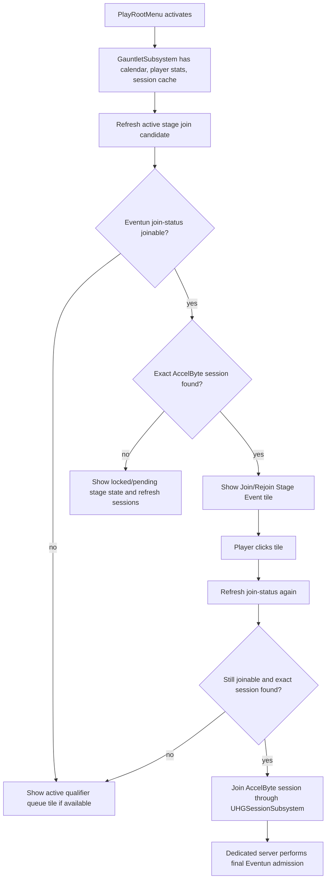

# Gauntlet Stage Client Entry Plan

**Date:** 2026-05-07
**Status:** Draft for review; updated with root-menu review decisions
**Scope:** First-pass game-client discovery, eligibility preflight, and AccelByte session join for active gauntlet stage events.

## Goal

Add a client path for an eligible player to discover and join an active gauntlet stage run from the game client.

The primary first-pass entry point is `PlayRootMenu`. The existing active-event tile currently prefers the active qualifier queue. For stage events, the tile should instead keep the same general presentation, add an extra stage/final line, and show a stage join affordance when the logged-in player qualifies and Eventun says the stage run is joinable now.

The final user-facing stage invitation UX is still undecided. A notification or toast when the stage lobby opens should be a follow-up entry point that consumes the same underlying client eligibility state.

## Root-Menu Schedule Presentation And Freshness

The 2026-07-18 game-client implementation establishes these rules for the root Play-menu active-event tile:

- A future occurrence on the local calendar date is labeled `Starts at {time} today`.
- A future occurrence within eight hours also shows a minute-rounded short countdown, for example `Starts at 7:00 PM today (8h 27m)`.
- The tile re-evaluates its selected occurrence after both full-calendar refreshes and active-calendar transitions, and it chooses the earliest applicable qualifier rather than relying on API response order.
- `UHGGauntletSubsystem` retains the hourly broad Gauntlet sync and performs a separate calendar-only refresh every five minutes so operator schedule adjustments reach running clients sooner.
- Calendar-only refresh assumes the referenced Gauntlet definition is already cached. Newly created Gauntlets may still require the broader sync before the root tile can render their presentation data.

## Desired Player Behavior

When the client is on the play root menu:

- If there is a joinable gauntlet stage run for the player, show that stage event in the active event tile instead of the normal qualifier queue tile.
- The stage tile should feel like the qualifier tile, with one extra line indicating this is a final/stage event.
- If the player clicks the stage tile, refresh join preflight before joining, then join the returned AccelByte game session through the existing session join flow.
- If AccelByte reports the game session is full, show a clear full-session message.
- If Eventun reports the stage is no longer joinable, do not attempt the AccelByte join and fall back to the normal qualifier tile if one is available.
- If the stage match has already started and this player does not have a reserved rejoin path, do not show the stage join tile.
- If the player disconnected from a stage run and still has a reserved seat, the stage tile should remain visible and should take the player back to the same stage session.

The client preflight is advisory only. The dedicated server still owns final admission through `CheckGauntletStageRunAdmission`.

## Current Game Source Shape

The existing client code already has most of the needed pieces:

- `UHGGauntletSubsystem` syncs gauntlet calendar data and gauntlet definitions.
- `UHGGauntletSubsystem::SyncActiveStageSessions()` searches AccelByte sessions tagged with `GAME_SESSION_REQUEST_TYPE=GAUNTLET_STAGE`.
- `FHGGauntletSession` carries `GauntletId`, `GauntletStage`, `StageRunId`, `SessionId`, and the `FOnlineSessionSearchResult`.
- `UHGPlayRootMenu` already selects an active gauntlet calendar item and uses the active event button for qualifier queue or stage join.
- `UHGSessionSubsystem::JoinSession()` already handles the AccelByte join and maps `SessionIsFull` to a user-facing message.
- The generated Eventun client API already exposes `ClientServiceGetGauntletStageJoinStatus(GauntletId, Stage)`.

The current weak spots are:

- `HGPlayRootMenu` uses hard-coded stage timing and local qualification only.
- It only considers a stage before the scheduled start, not a stage run that is already active but still joinable.
- It joins the first cached gauntlet session for a gauntlet id rather than matching the exact Eventun `session_id` and `stage_run_id`.
- It does not call Eventun join-status before rendering the stage join option or before click-time join.
- The session cache is keyed by gauntlet id only, so multi-run or multi-stage disambiguation must be done at lookup time.

## Eventun Contract

The client should call:

- `ClientServiceGetGauntletStageJoinStatus(GauntletId, Stage)`

The response fields needed for this feature are:

- `Joinable`
- `Reason`
- `StageRunId`
- `SessionId`
- `MatchStarted`
- `RunStatus`
- `RunPhase`
- `AcceptedMatchCount`
- `RequiredMatchCount`
- `CurrentMatchId`
- `Admission`

`SessionId` is the AccelByte game session id. The client should use it to choose the correct cached AccelByte session result. `StageRunId` is Eventun run context and should also be used to disambiguate cached stage sessions when available.

Known reasons are documented in the runtime contract. First-pass UI only needs broad handling:

- `joinable`: show stage join.
- `session_not_created` or `no_active_run`: no join yet; show normal qualifier or upcoming-event state.
- `match_started`: hide normal stage join unless Eventun still returns `Joinable=true` for this player's reserved rejoin.
- `stage_completed`, `run_ready_to_complete`, `already_completed_stage`, `inactive_run`: hide stage join.
- `not_qualified`, `not_invited`, `player_not_found`: hide stage join and show normal qualifier if available.
- unknown reason: hide stage join and log for diagnostics.

## Recommended Architecture

`UHGGauntletSubsystem` should own the reusable stage-entry state. `UHGPlayRootMenu` should consume that state rather than embedding Eventun request and selection policy directly in the widget.

Add a small client-side stage entry snapshot, for example:

- `GauntletId`
- `Stage`
- `StageRunId`
- `SessionId`
- `CalendarItem`
- `JoinStatus`
- `LocalQualificationKnown`
- `LocalQualified`
- `EventunJoinable`
- `Reason`
- `MatchStarted`
- `RunPhase`
- `AcceptedMatchCount`
- `RequiredMatchCount`
- `CurrentMatchId`
- `SessionSearchResult`
- `bHasExactSession`
- `bLikelyReservedRejoin`
- `LastUpdatedUtcSeconds`

The exact struct name can follow local style, for example `FHGGauntletStageJoinCandidate` or `FHGGauntletStageJoinStatus`.

Add a multicast delegate on `UHGGauntletSubsystem`, for example:

- `OnActiveGauntletStageJoinCandidateUpdated`

Add public query helpers:

- `GetActiveGauntletStageJoinCandidate()`
- `RefreshActiveGauntletStageJoinCandidate()`
- `RefreshGauntletStageJoinStatus(GauntletId, Stage)`
- `FindGauntletStageSession(GauntletId, Stage, StageRunId, SessionId)`

The widget should not directly choose from raw `GauntletSessionCache` except through this helper.

Refresh should be event-driven, not a continuous poll. The first pass should refresh when gauntlet state changes, when stage session search completes, and when the root menu needs to render or click a candidate. If Eventun returns a terminal non-joinable reason such as `match_started`, `not_qualified`, `not_invited`, or `stage_completed`, the client does not need to check that same stage again until another known gauntlet/session event invalidates the result. Deferred-stage recovery can add harder polling or invalidation later.

## Candidate Selection

Candidate selection should combine three inputs:

1. Calendar stage events near now or active now.
2. Local gauntlet/player stats qualification.
3. Eventun join-status.

Recommended selection rules:

1. Prefer stage calendar items that are active now or inside the stage lobby-open window.
2. For a locally qualified player, call Eventun join-status for the candidate stage.
3. For a player who is not locally qualified, still allow an Eventun join-status probe when a stage run/session exists and the stage is currently active. This leaves room for reserved rejoin, invite, team, or admin-granted cases that local stats cannot prove.
4. Show the stage tile only when Eventun returns `Joinable=true` and the client can match the returned `SessionId` to a cached AccelByte session result.
5. If Eventun returns `Joinable=true` but the client has not found the AccelByte session yet, keep the tile in a pending/locked state and refresh session search.
6. If no joinable stage candidate exists, preserve the current fallback behavior: active qualifier first, then upcoming qualifier/calendar state.

The client should trust Eventun's `Joinable` more than local timing or local qualification. Local qualification is a fast filter and display hint, not the final authority.

Known events that should invalidate or refresh the candidate include calendar sync, player stats sync, active calendar changes, stage session search completion, root menu activation, and click-time preflight. The first pass should not add a background join-status poll just to rediscover a stage that Eventun already rejected for this player.

## Root Menu Flow

Click-time preflight matters because the root menu state can become stale between render and click. The click handler should not join a cached session until the latest Eventun response still allows it.

## Tile Presentation

First-pass copy can stay simple:

- Stage/final line: `Gauntlet Final`, `Final Stage`, or similar concise copy.
- Qualified first join: `Join Final` or `Join Stage Event`
- Reserved rejoin: `Rejoin Final` or `Rejoin Stage Event`
- Joinable but session lookup pending: `Finding Stage Lobby`
- Not joinable after click: show a short popup or rely on button refresh, then fall back to qualifier.
- Session full: use or specialize the existing `UHGSessionSubsystem` full-session error.

The root menu tile should still show the gauntlet title, subtitle, media, and stage time display. The stage-specific copy should be easy to tune and should not require a separate presentation component. For a multi-match stage, the root menu does not need to explain every match in the circuit for the first pass.

## Join Mechanics

The implementation should use the existing `UHGSessionSubsystem::JoinSession(FOnlineSessionSearchResult)` path.

Add `EHGSessionConnectionFlow::GauntletStageJoin` so errors can use stage-specific copy while still using the same join mechanics. Generic full-session handling already exists, but a dedicated flow keeps telemetry and user-facing errors clearer:

- `Unable to join the match because it is full.`

The join path should not use join code. Eventun returns the AccelByte `session_id`, and the client should match that to a session search result.

## Session Matching

The current session cache is a map from `GauntletId` to a list of `FHGGauntletSession`.

For stage entry, matching should be stricter:

1. `GauntletId` must match.
2. `GauntletStage` must match the calendar/Eventun stage.
3. If Eventun returned `StageRunId`, it must match when the cached session has one.
4. If Eventun returned `SessionId`, it must match the cached AccelByte session id.

Do not join the first session in the gauntlet bucket for this flow. That can route players into the wrong stage run once multiple runs, retries, or future multi-stage sessions coexist.

## Reserved Rejoin

The client cannot reliably infer a reserved rejoin from local state alone.

Required Eventun behavior:

- If the logged-in player is allowed to rejoin a locked stage run through an existing reservation, `GetGauntletStageJoinStatus` should return `Joinable=true`, the active `session_id`, and the active `stage_run_id`.
- If the match has started and the player is not allowed to join or rejoin, Eventun should return `Joinable=false`, usually with `Reason=match_started`.

The client should therefore show the stage tile after match start only when Eventun explicitly returns `Joinable=true`.

## Notification Follow-Up

Notification entry should be a later pass, but should be planned as a consumer of the same candidate state.

The intended behavior is similar to party invite notification: when the client discovers a joinable stage session for the local player, it can send a notification that routes to the same stage join flow. The notification should not duplicate qualification or session lookup logic.

The first pass should still keep the state reusable:

- `UHGGauntletSubsystem` owns refresh and selection.
- `PlayRootMenu` only renders and clicks the current candidate.
- A later notification system can listen to the same candidate-updated delegate.
- Notification should fire when a candidate first transitions into `Joinable=true`, not on every refresh, following the party-invite style of a single actionable notification.
- Notification click should reuse the same click-time preflight and session-join path.

## Multi-Match Stage Notes

For a single stage run with multiple matches and return-to-lobby between matches:

- The client entry point joins the stage session, not an individual match.
- Between-match progression is server-owned after the player is in the session.
- `RunPhase=between_matches` can still be joinable if Eventun policy allows it.
- `RunPhase=match_in_progress` should normally be non-joinable except for reserved rejoin.
- The root menu should not try to model the stage circuit. It only needs to know whether Eventun says this player can enter the current stage run.

## Edge Cases

**Session full**

Eventun join-status is advisory and may be stale relative to AccelByte capacity. If AccelByte returns full, show the full-session message and refresh the stage candidate. Do not implement waitlist or replacement queueing in this pass.

**Stage started after the tile was shown**

The click handler refreshes join-status. If the player no longer has a join path, abort the join and fall back to qualifier UI.

**Cached session missing**

If Eventun returns a joinable `session_id` but session search does not include it yet, refresh `SyncActiveStageSessions()` and keep the tile locked/pending. If it remains missing, log the gauntlet id, stage, stage run id, and session id for diagnostics.

**Server crash or non-completion**

If Eventun reports no active joinable run, the client should hide the stage join. Recovery, abort, or relaunch behavior belongs to Eventun/admin tooling, not the client entry flow.

**Multiple active stage sessions**

Only the Eventun `session_id` and `stage_run_id` returned for this player should be considered authoritative. This avoids joining stale retry sessions or another stage run.

**Spectators, shoutcasters, and administrators**

Do not support spectator/admin stage entry in the first pass. Later role-aware entry should either extend join-status/admission to identify the role or use a separate admin/spectator flow.

**Team backup players**

Do not support team backup replacement in this pass. The client should leave room for Eventun to return joinability that local stats cannot prove, but the rules remain server/Eventun-owned.

**Bot backfill**

Client entry does not decide bot fill. Competitive tournament stages should default toward human competition, so bot backfill does not make sense as the normal rule. Some test, dev, or low-population cases will still need bot support, so the system should leave room for stage-level bot backfill configuration in a later pass. The runtime contract currently keeps stage validity, bot policy, and completion server-owned.

**Parties**

First pass should assume solo entry unless existing session join and matchmaking party rules already handle the case. Party-wide stage entry needs a separate decision because eligibility can differ per player.

## Likely Game Source Changes

Primary:

- `Source/AscentRivals/Public/HGGauntletSubsystem.h`
- `Source/AscentRivals/Private/HGGauntletSubsystem.cpp`
- `Source/AscentRivals/Public/UserInterface/Menus/HGPlayRootMenu.h`
- `Source/AscentRivals/Private/UserInterface/Menus/HGPlayRootMenu.cpp`
- `Source/AscentRivals/Public/Client/HGSessionSubsystem.h`
- `Source/AscentRivals/Private/Client/HGSessionSubsystem.cpp`

Likely supporting:

- `Source/AscentRivals/Public/Utils/HGGauntletUtils.h`
- `Source/AscentRivals/Private/Utils/HGGauntletUtils.cpp`

No server source should be required for the first client entry pass unless testing exposes a mismatch in dedicated-server admission results.

## Implementation Plan

1. Add a client-side stage join candidate struct and delegate to `UHGGauntletSubsystem`.
2. Add a wrapper around `ClientServiceGetGauntletStageJoinStatus(GauntletId, Stage)`.
3. Add exact session lookup by gauntlet id, stage, stage run id, and AccelByte session id.
4. Add `EHGSessionConnectionFlow::GauntletStageJoin` and use it for stage session joins.
5. Update gauntlet subsystem refresh points so the active stage candidate refreshes after:
   - login gauntlet sync
   - calendar sync
   - player stat sync
   - active calendar changes
   - stage session search completion
   - root play menu activation
   - click-time preflight
6. Update `HGPlayRootMenu` to render the subsystem's active stage candidate before falling back to qualifier queue.
7. Keep the root-menu button visually close to the existing qualifier tile, adding only a compact stage/final line and join/rejoin copy.
8. Update the active event click handler so stage entry performs a fresh join-status preflight before calling `UHGSessionSubsystem::JoinSession` with `GauntletStageJoin`.
9. Preserve existing qualifier queue fallback when there is no joinable stage candidate.
10. Add stage-specific logging for preflight failures, missing sessions, stale session ids, and join attempts.
11. Add focused tests or manual QA cases around root-menu tile selection and click-time stale preflight.
12. Leave notification entry and bot backfill for follow-up passes, while keeping the candidate state reusable for notification.

## Manual QA Cases

- Qualified player sees `Join Stage Event` while the stage lobby is open.
- Qualified player clicks and lands in the stage lobby.
- Unqualified player sees the normal qualifier queue tile.
- Eventun returns `Joinable=false` with `match_started`; player sees normal qualifier tile.
- Reserved rejoin player sees `Rejoin Stage Event` even after match start when Eventun returns `Joinable=true`.
- AccelByte session full result shows the full-session message.
- Eventun returns joinable but session search is temporarily missing the session; UI does not join a random session.
- Two sessions exist for the same gauntlet; the client joins the session id returned by Eventun.
- Stage joinable state changes while the play menu is open; the tile updates without requiring restart.

## Feasibility And Limitations

This is feasible as a client-first pass because the generated Eventun client API and AccelByte session join path already exist.

The main limitation is that `GetGauntletStageJoinStatus` must provide the correct per-player answer for reserved rejoin. If Eventun returns `Joinable=false` after match start for everyone, the client cannot safely distinguish a reserved reconnect from a new late join.

The other practical limitation is session-search freshness. Eventun can know the run and session before the client has a matching `FOnlineSessionSearchResult`. The first pass should refresh and wait briefly rather than joining by guesswork.

## Open Decisions

- Exact root-menu button copy for first join versus reserved rejoin.
- Whether notification entry ships immediately after root-menu validation or waits for a broader notification UX pass.
- Which stage/server setting should own optional bot backfill for dev or low-population tournament stages.
- Whether deferred-stage recovery should add a later refresh path after an initial non-joinable response.
