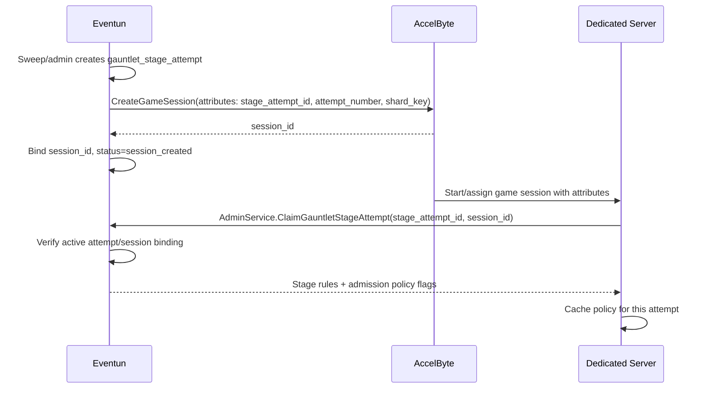
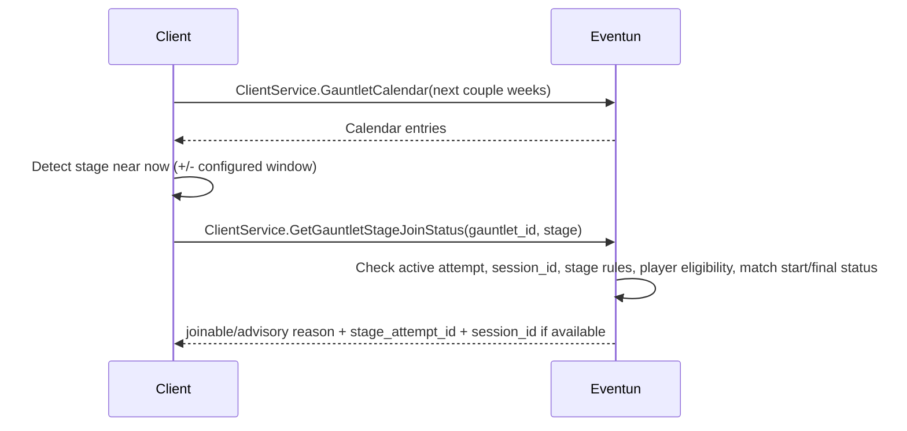
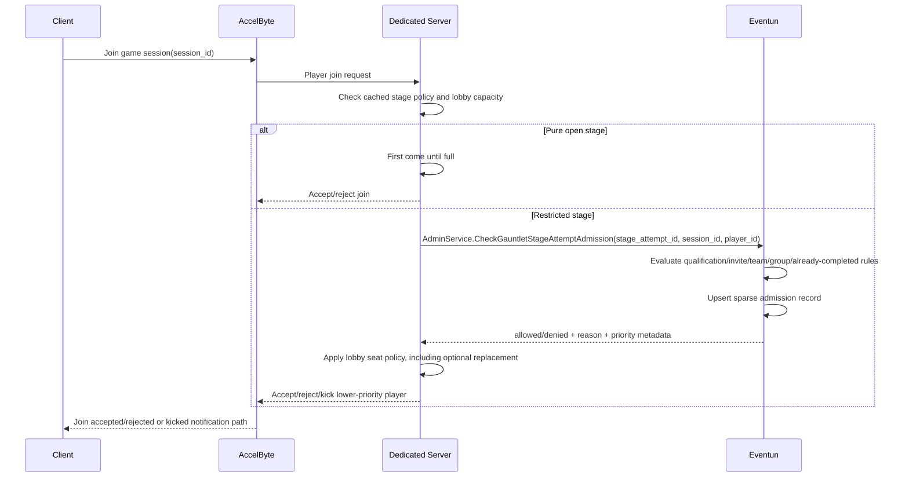
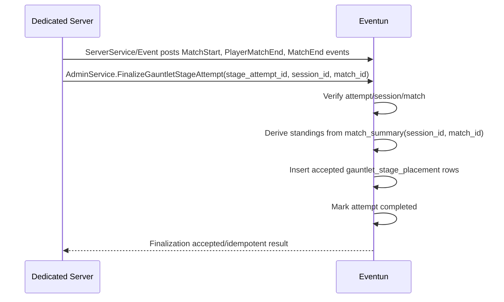

# Gauntlet Stage Orchestration Design

Date: 2026-04-24

## Purpose

This note captures the current gauntlet stage orchestration direction for Ascent Rivals.

The goals are:

- make stage attempt allocation and recovery durable
- keep `session_id` exclusively for the AccelByte/session-event id
- use `stage_attempt_id` for Eventun's durable attempt id
- keep Eventun authoritative for competition state without replicating full lobby state
- keep the dedicated server authoritative for actual join, seat replacement, and kick decisions
- support open, qualifier, team-restricted, group-restricted, and invite-only modes without adding a broad eligibility roster
- leave bracket advancement and bracket-specific assignment behavior out of this pass

## Implementation Status

Implemented in Eventun as of 2026-04-24:

- Eventun creates AccelByte game sessions for gauntlet stages and records server events.
- `gauntlet_stage_attempt` is the durable attempt table.
- One active attempt per `(gauntlet_id, stage, shard_key)` is enforced in the database.
- Stage allocation claims or creates a persisted attempt row before calling AccelByte.
- AccelByte session attributes include:
  - `StageAttemptId`
  - `AttemptNumber`
  - `StageAttemptShardKey`
- `gauntlet_stage_attempt.session_id` stores the AccelByte session id.
- Allocation can reconcile an AccelByte session back into the DB attempt row using `StageAttemptId`.
- A minute-based sweep expires overdue attempts and re-enters the DB-backed allocation path.
- Dedicated-server AdminService APIs exist for claim, admission check, and finalization.
- ClientService has an advisory join-status/preflight API.
- Sparse admission rows are recorded in `gauntlet_stage_attempt_admission`.
- `gauntlet_stage_placement` now records `stage_attempt_id`; accepted placements remain the participation record.

Not implemented in this pass:

- bracket advancement
- team hierarchy or designated-racer priority metadata
- richer mid-tournament gauntlet mutation safeguards
- manual retry / hold / defer / cancel admin controls
- automatic retry policy
- dedicated AccelByte cleanup before the existing age-based cleanup window

## Core Invariants

- `stage_attempt_id` identifies Eventun's durable stage attempt.
- `session_id` identifies the AccelByte game session and server-event session.
- A player may compete at most once per gauntlet stage.
- A stage attempt must have exactly one authoritative owner session at a time.
- A stage attempt must end in one terminal state: `completed`, `aborted`, `failed`, `deferred`, or `cancelled`.
- Eventun is the source of truth for stage attempt ownership, admission policy inputs, and accepted outcomes.
- The dedicated server is the final authority for runtime admission, seat replacement, and kicks.
- Client preflight is advisory only.
- Claim, join, and admission do not count as participation.
- Final accepted placement is the only participation signal.

## Data Model

### `gauntlet_stage_attempt`

This table represents one attempt to run one stage shard.

Important fields:

- `id`: Eventun `stage_attempt_id`
- `gauntlet_id`
- `stage`
- `shard_key`
- `attempt`
- `region_code`
- `session_id`: AccelByte session id
- `status`
- `failure_reason`
- `manual_hold`
- `rules_snapshot`
- `deadline_claim`
- `deadline_start`
- `deadline_finish`
- `created_at`
- `updated_at`

Important constraints:

- unique `(gauntlet_id, stage, shard_key, attempt)`
- partial unique index allowing at most one active attempt per `(gauntlet_id, stage, shard_key)`

Active statuses:

- `pending`
- `allocating`
- `session_created`
- `claimed`
- `started`

### `gauntlet_stage_attempt_admission`

This table is sparse admission audit/cache storage, not a participant roster.

Rows are written only when Eventun evaluates a restricted join:

- `stage_attempt_id`
- `player_id`
- `allowed`
- `reason`
- `priority_score`
- compact JSON `context`
- `evaluated_at`

This replaces the older broad eligibility snapshot idea. Long term, this is the better shape because eligibility can be large, stale quickly, and is not the same concept as participation. The dedicated server can ask Eventun for a specific player when needed, and Eventun records only the decisions that actually mattered.

### `gauntlet_stage_placement`

This table remains the final accepted per-stage result table.

Important fields:

- `gauntlet_id`
- `stage`
- `stage_attempt_id`
- `session_id`
- `match_id`
- `player_id`
- `placement`
- `circuit_points`

Participation is consumed only when Eventun accepts finalization and inserts placement rows.

## API Status

Existing:

- Eventun creates AccelByte game sessions.
- Eventun records client/server events.
- Legacy `ReportGauntletStageResults` remains, but now resolves the attempt by AccelByte `session_id` and uses the attempt finalization path.

New in this pass:

- `AdminService.ClaimGauntletStageAttempt(stage_attempt_id, session_id)`
- `AdminService.CheckGauntletStageAttemptAdmission(stage_attempt_id, session_id, player_id)`
- `AdminService.FinalizeGauntletStageAttempt(stage_attempt_id, session_id, match_id)`
- `ClientService.GetGauntletStageJoinStatus(gauntlet_id, stage)`

Not implemented in this pass:

- bracket advancement
- team hierarchy/designated racer priority data
- DS-owned kick notification API; the DS/AccelByte path owns the actual kick behavior

## Client / DS Implementation Checklist

Use this checklist when implementing the game client or dedicated server flows.

### Dedicated server

- On session start, read AccelByte session attributes:
  - `Gauntlet`
  - `GauntletId`
  - `GauntletStage`
  - `StageAttemptId`
  - `AttemptNumber`
  - `StageAttemptShardKey`
  - `EntryRequirement`
  - lobby and race rule fields such as `PlayersPerTeam`, `MinCompetitors`, `MaxCompetitors`, `MinLobbySize`, `MaxLobbySize`, `RaceMode`, `Circuit`, and `AllowedTeams`
- Treat `StageAttemptId` as Eventun's durable attempt id.
- Treat the AccelByte game session id as `session_id`.
- Call `AdminService.ClaimGauntletStageAttempt(stage_attempt_id, session_id)` before admitting restricted players.
- Cache the claim response for the life of the attempt.
- For pure unrestricted open stages, use first-come admission until capacity is full.
- For restricted stages, call `AdminService.CheckGauntletStageAttemptAdmission(stage_attempt_id, session_id, player_id)` before accepting the player.
- Use Eventun admission output as policy input, not as the final lobby decision.
- Apply DS-owned seat policy:
  - qualification modes may replace the lowest-priority current player when a higher `priority_score` player joins
  - team-restricted modes use returned team context
  - invite-only defaults to first come after Eventun validation
- Do not count claim, join, or admission as participation.
- Do not include rejected, kicked-before-start, or admitted-only players in final standings.
- For a normally completed match, emit `PlayerMatchEnd` for every human participant, including disconnected or DNF players.
- After trusted server match events are posted, call `AdminService.FinalizeGauntletStageAttempt(stage_attempt_id, session_id, match_id)`.
- Retry finalization with the same inputs if the call times out or returns a transient error; it is intended to be idempotent.

### Game client

- Fetch the gauntlet calendar for the target upcoming window.
- Detect stages near now using the configured client join window.
- Call `ClientService.GetGauntletStageJoinStatus(gauntlet_id, stage)` before attempting AccelByte join.
- Treat the returned `session_id` as the AccelByte session id.
- Treat `joinable=true` as advisory, not a reservation.
- Hide or disable the normal join affordance when preflight returns a non-joinable reason.
- Still handle DS rejection or kick after AccelByte join because the DS remains authoritative.
- Refresh Eventun gauntlet state after rejection, kick, match completion, or finalization.
- Display Eventun-accepted standings as authoritative over local provisional race UI.

### Required code references

An implementation agent should read these Eventun contracts directly, not rely only on this design note:

- `proto/ikigai/eventun/v1/admin.proto`
- `proto/ikigai/eventun/v1/client.proto`
- `proto/ikigai/eventun/v1/gauntlet.proto`

## Stage Start / Claim Flow

## Client Preflight Flow

The preflight result is advisory. It exists so the game client can show a sane UI before attempting AccelByte join. It does not reserve a seat and does not override the dedicated server.

Returned reasons include:

- `no_active_attempt`
- `session_not_created`
- `match_started`
- `stage_completed`
- `already_completed_stage`
- `not_qualified`
- `not_invited`
- `wrong_session`
- `inactive_attempt`
- `player_not_found`
- `joinable`

## Player Join / DS Admission Flow

Mode behavior:

- Pure unrestricted open: the DS does not need an Eventun admission check; first come gets a seat until full.
- Qualification modes: Eventun returns allowed/denied with `priority_score=qualification_points`; the DS may replace the lowest-priority current player if the lobby is full.
- Team-restricted qualifier modes: Eventun returns allowed/denied, `team_id`, and player/team qualification context; the DS applies the current team priority policy.
- Invite-only: Eventun validates explicit player, team, or group invite; the DS uses first come unless future team hierarchy/designated racer metadata exists.
- Eventun does not decide who to kick. It supplies policy inputs and records sparse admission evaluations.

## Stage Finalization Flow

Finalization rules:

- wrong attempt, wrong session, wrong match, inactive attempt, and mismatched duplicate reports are rejected
- repeated finalization with the same attempt/session/match is idempotent
- only `PlayerMatchEnd` rows in a normally completed match become placements
- admitted or joined-only players do not participate
- the DS must emit `PlayerMatchEnd` for every human participant in a normally completed match, including disconnected or DNF players

## State Machine

Current statuses:

- `pending`
- `allocating`
- `session_created`
- `claimed`
- `started`
- `completed`
- `aborted`
- `failed`
- `deferred`
- `cancelled`

Current backend transitions:

- `allocating -> session_created` when AccelByte session creation succeeds
- `allocating -> failed` when AccelByte session creation fails before a session id is stored
- `allocating -> failed(no_server_claim)` when `deadline_claim` expires
- `session_created -> failed(no_server_claim)` when `deadline_claim` expires
- `session_created -> claimed` through `ClaimGauntletStageAttempt`
- `claimed -> failed(no_final_report)` when `deadline_finish` expires
- `started -> failed(no_final_report)` when `deadline_finish` expires
- `claimed -> completed` through `FinalizeGauntletStageAttempt`

Still pending:

- explicit `claimed -> started` status transition
- explicit `claimed -> aborted(insufficient_players)`
- explicit `started -> failed(runtime_failure)`
- admin-driven `deferred` and `cancelled`

## Participation Semantics

A player should only be considered to have competed in a stage if the stage attempt runs to accepted completion.

This means:

- joining a lobby does not consume participation
- being admitted by Eventun does not consume participation
- leaving before race start does not consume participation
- an aborted, deferred, or failed attempt does not consume participation
- a server crash does not consume participation if the attempt is not accepted as completed
- disconnecting mid-race does count as participation if the stage attempt completes successfully and the DS emits the participant's final event

Operationally, participation is consumed only when Eventun accepts finalization and inserts `gauntlet_stage_placement`.

## Client Expectations

The game client should:

- fetch the gauntlet calendar for the next couple weeks
- inspect stages near now using the configured join window
- call `GetGauntletStageJoinStatus` before attempting AccelByte join
- treat returned `session_id` as the AccelByte session id
- treat preflight as advisory, not as admission
- handle server-side rejection or kick as a normal competitive rules outcome
- refresh Eventun-backed gauntlet state when a stage ends, aborts, or rejects the player

## Multi-Instance Behavior

The implementation is intended to be safe if multiple Eventun instances are running.

The key rules are:

- scheduling intent comes from the database
- the stage row is locked before allocation work begins
- the stage-attempt row is the durable ownership record
- the active-attempt unique index prevents two active owners for the same shard
- a short allocation lease on `updated_at` stops a second worker from duplicating a still-live external create
- if one worker dies, another worker can recover on the next sweep after the lease or deadline logic takes effect

## Open Items

- Define the DS implementation for applying priority replacement and kick notifications.
- Decide whether retry stays manual-only or gains targeted automation for specific failure reasons.
- Decide how and when failed attempts should trigger immediate AccelByte session deletion rather than waiting for generic cleanup.
- Map AccelByte DS lifecycle states to Eventun attempt states if polling or reconciliation is added later.
- Add bracket advancement in a separate pass.
- Add team hierarchy/designated racer priority data in a separate pass if invite-only team priority needs to be stricter than first come.
