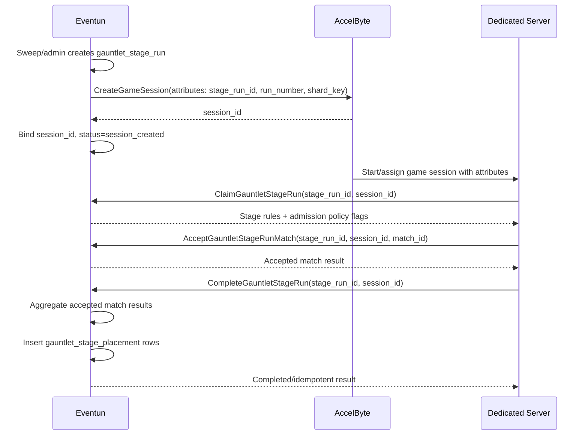

# Gauntlet Stage Run Orchestration Design

Date: 2026-04-24
Updated: 2026-04-26

## Status

Implemented in Eventun. This note records the design intent and follow-up work. The authoritative runtime contract is:

- [[../50_knowledge/ascent-rivals/eventun/gauntlet-stage-runtime-contract|gauntlet-stage-runtime-contract]]

The older client lifecycle and multimatch planning note has been folded into this file and the runtime contract. Client code changes remain separate from this knowledge-base update.

## Purpose

Gauntlet stage orchestration needs one durable Eventun-owned runtime unit that can survive server allocation, dedicated-server claim, reconnect/preflight checks, per-match result acceptance, aggregate completion, and retry/failure handling.

The goals are:

- keep `session_id` exclusively for the AccelByte game session and server-event id
- use `stage_run_id` for Eventun's durable stage run id
- keep Eventun authoritative for competition state without mirroring full lobby state
- keep the dedicated server authoritative for actual join, seat replacement, and kick decisions
- support open, qualifier, team-restricted, group-restricted, and invite-only modes without broad eligibility rosters
- support one or more matches inside one stage run with a simple aggregate result rule
- leave bracket advancement and bracket-specific assignment behavior out of this pass

## Work Completed

Completed in Eventun:

- `gauntlet_stage_run` is the durable runtime table for one stage shard.
- One active run per `(gauntlet_id, stage, shard_key)` is enforced in the database.
- Stage allocation claims or creates a persisted run row before calling AccelByte.
- AccelByte session attributes include:
  - `StageRunId`
  - `RunNumber`
  - `StageRunShardKey`
- `gauntlet_stage_run.session_id` stores the AccelByte session id.
- Allocation can reconcile an AccelByte session back into the DB run row using `StageRunId`.
- A minute-based sweep expires overdue runs and re-enters the DB-backed allocation path.
- Dedicated-server AdminService APIs exist for claim, admission, per-match acceptance, and aggregate completion.
- ClientService has an advisory join-status/preflight API.
- Sparse admission rows are recorded in `gauntlet_stage_run_admission`.
- Per-match accepted results are recorded before aggregate completion.
- `gauntlet_stage_placement` records `stage_run_id`; accepted placements remain the participation record.
- The unused compatibility wrapper around the older result-reporting shape was removed before client adoption.

Not implemented in this pass:

- bracket advancement
- team hierarchy or designated-racer priority metadata
- richer mid-tournament gauntlet mutation safeguards
- manual retry, hold, defer, or cancel admin controls
- automatic retry policy
- dedicated AccelByte cleanup before the existing age-based cleanup window

## Core Invariants

- `stage_run_id` identifies Eventun's durable stage run.
- `session_id` identifies the AccelByte game session and server-event session.
- A player may compete at most once per gauntlet stage.
- A stage run must have exactly one authoritative owner session at a time.
- A stage run must end in one terminal state: `completed`, `aborted`, `failed`, `deferred`, or `cancelled`.
- Eventun is the source of truth for run ownership, admission policy inputs, accepted match results, and final accepted outcomes.
- The dedicated server is the final authority for runtime admission, seat replacement, and kicks.
- Client preflight is advisory only.
- Claim, join, and admission do not count as participation.
- Final accepted placement is the only participation signal.

## Data Model

### `gauntlet_stage_run`

This table represents one run of one stage shard.

Important fields:

- `id`: Eventun `stage_run_id`
- `gauntlet_id`
- `stage`
- `shard_key`
- `run_number`
- `region_code`
- `session_id`: AccelByte session id
- `status`
- `failure_reason`
- `manual_hold`
- `rules_snapshot`
- `deadline_claim`
- `deadline_start`
- `deadline_finish`
- `created_at`
- `updated_at`

Important constraints:

- unique `(gauntlet_id, stage, shard_key, run_number)`
- partial unique index allowing at most one active run per `(gauntlet_id, stage, shard_key)`

Active statuses:

- `pending`
- `allocating`
- `session_created`
- `claimed`
- `started`

### `gauntlet_stage_run_admission`

This table is sparse on-demand admission audit/cache storage, not a participant roster.

Rows are written only when Eventun evaluates a human competitor join/rejoin:

- `stage_run_id`
- `player_id`
- `allowed`
- `reason`
- `priority_score`
- compact JSON `context`
- `evaluated_at`

This keeps admission checks cheap to audit without materializing large, stale rosters. The dedicated server asks Eventun for a specific player when needed, and Eventun records only the decisions that mattered. Open stages still call admission; they simply avoid restricted eligibility lookup.

### `gauntlet_stage_run_match`

This table is the accepted-match ledger for a run. It records only matches Eventun has accepted through `AcceptGauntletStageRunMatch`. The configured match plan remains `gauntlet_stage_circuit`.

### `gauntlet_stage_run_match_result`

This table stores accepted per-match result rows for a stage run. It is the boundary between raw server event ingestion and final aggregate standings.

### `gauntlet_stage_placement`

This table stores final accepted per-stage results.

Important fields:

- `gauntlet_id`
- `stage`
- `stage_run_id`
- `session_id`
- `match_id`
- `player_id`
- `placement`
- `circuit_points`

Participation is consumed only when Eventun accepts run completion and inserts placement rows.

## API Status

Existing foundation:

- Eventun creates AccelByte game sessions.
- Eventun records client/server events.
- Eventun derives match summaries from trusted server events.

Current stage-run APIs:

- `AdminService.ClaimGauntletStageRun(stage_run_id, session_id)`
- `AdminService.CheckGauntletStageRunAdmission(stage_run_id, session_id, player_id)`
- `AdminService.AcceptGauntletStageRunMatch(stage_run_id, session_id, match_id)`
- `AdminService.CompleteGauntletStageRun(stage_run_id, session_id)`
- `ClientService.GetGauntletStageJoinStatus(gauntlet_id, stage)`

The API split is intentionally simple:

- Accepting a match validates one `match_summary(session_id, match_id)` and stores its result rows.
- Completing a run verifies that all configured match ids are accepted, computes aggregate standings, writes final placements, and marks the run `completed`.
- A single-match stage uses the same flow: accept match 0, then complete the run.

## Aggregate Scoring

For multi-match stages, final placements are computed from accepted match results:

1. highest total `circuit_points`
2. best single-match placement
3. lowest sum of placements
4. stable player id ordering

This follows the straightforward cup/championship pattern from racing while preserving the combat-oriented circuit point reward model. It avoids hidden per-mode logic and keeps final placement explainable.

## Dedicated Server Checklist

- On session start, read AccelByte session attributes:
  - `Gauntlet`
  - `GauntletId`
  - `GauntletStage`
  - `StageRunId`
  - `RunNumber`
  - `StageRunShardKey`
  - `EntryRequirement`
  - lobby and race rule fields such as `PlayersPerTeam`, `OverflowPolicy`, `AdmissionPriorityRule`, `RosterLockPoint`, `MinCompetitors`, `MaxCompetitors`, `MinLobbySize`, `MaxLobbySize`, `RaceMode`, `Circuit`, and `AllowedTeams`
- Treat `StageRunId` as Eventun's durable run id.
- Treat the AccelByte game session id as `session_id`.
- Call `AdminService.ClaimGauntletStageRun(stage_run_id, session_id)` before admitting players.
- Cache the claim response for the life of the run.
- For every human competitor join/rejoin, call `AdminService.CheckGauntletStageRunAdmission(stage_run_id, session_id, player_id)` before accepting the player.
- Use Eventun admission output as policy input, not as the final lobby decision.
- Apply DS-owned seat policy:
  - open stages use first come until full after Eventun run/session/phase validation
  - qualification modes may replace the lowest-priority current player when a higher `priority_score` player joins
  - team-restricted modes use returned team context
  - invite-only defaults to first come after Eventun validation
  - `OverflowPolicy`, `AdmissionPriorityRule`, and `RosterLockPoint` describe the configured policy knobs
- Do not count claim, join, or admission as participation.
- Do not include rejected, kicked-before-start, or admitted-only players in final standings.
- For each normally completed match, emit `PlayerMatchEnd` for every human participant, including disconnected or DNF players.
- After trusted server match events are posted, call `AdminService.AcceptGauntletStageRunMatch(stage_run_id, session_id, match_id)`.
- After all configured match ids are accepted, call `AdminService.CompleteGauntletStageRun(stage_run_id, session_id)`.
- Retry match acceptance and run completion with the same inputs after transient failures; they are intended to be idempotent.

## Game Client Expectations

The game client should:

- fetch the gauntlet calendar for the next couple weeks
- inspect stages near now using the configured join window
- call `GetGauntletStageJoinStatus` before joining through AccelByte
- treat returned `session_id` as the AccelByte session id
- treat preflight as advisory, not as admission
- use `run_phase`, accepted match count, required match count, and current match id to distinguish prestart, in-progress, between-match, ready-to-complete, and completed states
- handle server-side rejection or kick as a normal competitive rules outcome
- refresh Eventun-backed gauntlet state when a stage ends, aborts, rejects the player, or completes
- display Eventun-accepted standings as authoritative over local provisional race UI

## Runtime Flow

## Join Status

`GetGauntletStageJoinStatus` is advisory. It exists so the game client can show a sane UI before joining through AccelByte. It does not reserve a seat and does not override the dedicated server.

Returned reasons include:

- `no_active_run`
- `session_not_created`
- `match_started`
- `stage_completed`
- `already_completed_stage`
- `not_qualified`
- `not_invited`
- `wrong_session`
- `inactive_run`
- `player_not_found`
- `run_ready_to_complete`
- `joinable`

Returned phases include:

- `prestart`
- `match_in_progress`
- `between_matches`
- `ready_to_complete`
- `completed`

## Multi-Instance Behavior

The implementation is intended to be safe if multiple Eventun instances are running.

The key rules are:

- scheduling intent comes from the database
- the stage row is locked before allocation work begins
- the stage-run row is the durable ownership record
- the active-run unique index prevents two active owners for the same shard
- a short allocation lease on `updated_at` stops a second worker from duplicating a still-live external create
- if one worker dies, another worker can recover on the next sweep after lease or deadline logic takes effect

## Participation Semantics

A player should only be considered to have competed in a stage if the stage run reaches accepted completion.

This means:

- joining a lobby does not consume participation
- being admitted by Eventun does not consume participation
- leaving before race start does not consume participation
- an aborted, deferred, or failed run does not consume participation
- a server crash does not consume participation if the run is not accepted as completed
- disconnecting mid-race does count as participation if the stage run completes successfully and the DS emits the participant's final event

Operationally, participation is consumed only when Eventun accepts completion and inserts `gauntlet_stage_placement`.

## Open Items

- Define the DS implementation for applying priority replacement and kick notifications.
- Decide whether retry stays manual-only or gains targeted automation for specific failure reasons.
- Decide how and when failed runs should trigger immediate AccelByte session deletion rather than waiting for generic cleanup.
- Map AccelByte DS lifecycle states to Eventun run states if polling or reconciliation is added later.
- Add bracket advancement in a separate pass.
- Add team hierarchy/designated-racer priority data in a separate pass if invite-only team priority needs to be stricter than first come.
