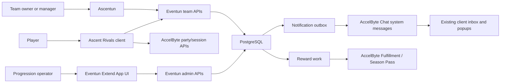

# Ascent Rivals Team Experience And Progression Solution Design

Status: Approved; local backend and web implementation reviewed, deployment pending
Date: 2026-07-10
Last updated: 2026-07-21
Program index: [[teams-solution-design]]
Primary backend repository: [Eventun](https://github.com/ikigai-github/eventun)
Web reference repository: [Ascentun](https://github.com/ikigai-github/ascentun)

Foundation alignment: local foundation implementation, rehearsal, and runtime hardening are complete and committed. T00 approved this design against that local baseline. The Eventun Team Core schema, API, authorization, and pending-migration implementation passed local verification and implementation review and is committed as `c4260f3`. The staged, uncommitted Ascentun Team Core working tree based on `a0a40ad` also passed implementation review; coordinated shared-development deployment remains pending. Membership validity is part of the committed local model. G02 Pass 1 closed historical correction passed implementation review and is committed as Eventun `3e1606c`; frozen team qualification Pass 2 may now build on that boundary.

## Related

- [Delivery plan and gates](delivery-plan.md)
- [Eventun development cutover and runtime hardening](../eventun-foundation/development-cutover-and-runtime-hardening.md)
- [[ascent-rivals/system/game-client|game-client]]
- [[ascent-rivals/system/website|website]]
- [[ascent-rivals/system/eventun/interface-architecture|eventun-interface-architecture]]
- [[ascent-rivals/system/eventun/data-model|eventun-data-model]]
- [[ascent-rivals/sources/analysis/eventun-team-postgresql-derivation-review]]
- [[ascent-rivals/sources/analysis/eventun-foundation-api-simplification-review]]
- [[ascent-rivals/archive/initiatives/eventun-progression/eventun-medals-progression-goals-challenges-rewards-solution-design|progression solution design archive]]
- [[team-gauntlets-and-brackets-solution-design]]
- [[ascent-rivals/initiatives/website-v2/flows/team-lifecycle|team-lifecycle]]
- [[ascent-rivals/initiatives/website-v2/pages/teams-index|teams-index]]
- [[ascent-rivals/initiatives/website-v2/pages/team-profile|team-profile]]

## Purpose

Define the first teams workstream: make teams visible in normal play, let players discover and interact with teams from the game client, support team identity and cosmetic expression, and establish a bounded model for social contribution.

This design deliberately excludes team gauntlet orchestration. It supplies the canonical team state, membership history, notification delivery, and client team subsystem that the later gauntlet workstream can reuse.

## Goals

- Make team membership apparent during common game-client workflows and races.
- Let friends find, join, and invite one another without leaving the game.
- Preserve Eventun as the authoritative team system.
- Separate visible team titles from authorization.
- Let teams own a growing library of identity cosmetics while allowing members to select how they represent the team.
- Give non-elite members a meaningful participation path without creating a passive economy farm.
- Reuse AccelByte services where their ownership model fits; do not create a second team entity to fit a platform feature.

## Non-Goals

- creating or disbanding teams in the game client;
- ownership transfer or capability management in the game client;
- game-client media upload; team avatar upload remains website-only and no in-game upload is planned;
- token-gated game-client joins;
- a team activity feed;
- event-level rooting or persistent fan state;
- team-specific public matchmaking;
- large-team pagination in this iteration;
- choosing a final team progression economy before its product rules are approved;
- team gauntlet qualification, runtime slots, or brackets.

## Confirmed Current State

### Eventun

- The shared-development baseline still owns legacy team records, delete-on-leave roster rows,
  join requests, invitations, numeric designation, and a separate `team_player.rank`.
- The accepted local replacement at Eventun `c4260f3` generates team identity, stores explicit
  owner and active/disbanded lifecycle, retains immutable membership intervals, and separates
  mutable title, delegated capability, and competition rank. It is not yet active in a shared
  runtime environment.
- The replacement pending-action model uses stable action UUIDs plus versioned generations and
  explicit terminal states. It is not deployed until Ascentun can move to the same breaking
  contract.
- Team lists return compact active-team summaries; one team detail returns its complete active roster.
- Existing progression goals, counters, assignments, and completions are player-scoped.
- Existing claimable and automatic reward bundles can deliver AccelByte items, currency, and Battle Pass XP with idempotent transaction tracking.
- The existing Eventun Extend App UI already hosts progression and operational administration.

### Game Client

- Menu-side racing-team helpers still read AccelByte Groups using the `racing-team` configuration and `Member` or `Captain` roles.
- The race session already carries Eventun team identity and replicated session team indexes.
- `HGTeamMenu` and `HGNoTeamMenu` exist but their reviewed C++ behavior is stubbed.
- The minimap owns friendly, enemy, and local colors, but currently displays the spectated player in blue and all other racers in red.
- `AHGShipEntityRenderer` exposes bounty state to Blueprint. The visible bounty beam and its color are content-side and require Blueprint inspection.
- The lobby, player-card, pre-heat decal light, party, challenges, and gauntlet screens provide reusable presentation patterns.
- `UHGChatSubsystem` queries persistent and transient AccelByte Chat system messages, tracks unread state, displays popups, and marks messages read.
- `UHGSocialSubsystem` already adapts those messages into the client inbox and popup surfaces.
- The separate general notification callback reviewed in `UHGClientLocalPlayerSubsystem` is empty; new team delivery should build on the functioning Chat inbox path rather than assume that callback is complete.
- Career XP uses AccelByte Statistics and Battle Pass XP uses AccelByte Season Pass. Both are player-account scoped.

### Website

- Ascentun currently provides the team lifecycle and administration reference.
- Its Team Core breaking-replacement working tree is coder-verified and awaiting implementation
  review. A fresh-database local smoke covers public Team reads, authentication boundaries,
  Ascentun proxies, and the empty directory render, but does not establish player-authenticated
  mutation, commit, deployment, or shared-runtime evidence.
- The website is an interim operational surface. A visually extensive redesign is deferred to the future v2 website.
- Minimal changes are preferred: preserve client-side filtering over compact browse data and use
  the complete roster only on team detail until measured scale requires another contract.

## Design Decisions

1. Eventun is the only canonical team source.
2. The AccelByte Groups racing-team path is removed from new game-client team flows; it is not synchronized.
3. Team creation, disbanding, ownership transfer, capability assignment, and team-wide cosmetic administration remain website operations.
4. The game client supports browse/view, open join, closed-team request and invitation flows, leave, permitted team invitations, and member cosmetic preferences. Gamepad-first browsing ships before optional text search.
5. `AddTeamMember` owns open join, join-request creation, invitation creation, exact-action invite
   acceptance, and exact-action request approval. `ResolveTeamMembershipAction` owns only decline,
   deny, and cancel. Every operation that consumes or resolves an existing action requires its
   exact UUID and version; omission never selects a current action implicitly.
6. Team reads remain unpaginated for this iteration. Pagination is introduced only after measured roster or payload size justifies it.
7. Team titles are presentation metadata. Capabilities authorize actions.
8. AccelByte Chat is the preferred player inbox and notification delivery system. Eventun owns notification intent and retry state, not a second read-state inbox.
9. Team progression is not implemented until XP sources, caps, levels, reset behavior, and reward ownership are defined.
10. If team progression proceeds, Eventun/PostgreSQL owns team aggregate state. AccelByte remains the delivery system for configured player rewards.
11. Team-owned cosmetics and player-owned cosmetics may be selectable on the same presentation surfaces.
12. Pre-alpha contracts may be replaced directly; compatibility branches are not added by default.
13. Players may hide their team affiliation and all optional team cosmetics on player-facing presentation surfaces.
14. Party behavior is not changed. A team-roster party action is allowed only as a thin call to the existing invite path using the member's linked AccelByte id.
15. AccelByte Challenges and Achievements are not used for team goals. Eventun evaluates its own event-backed goal definitions; AccelByte Statistics and Season Pass remain player progression services.
16. An owner may disband the team instead of transferring ownership. Ordinary owner leave remains distinct from disband.
17. A player may have only one active team.
18. Actionable team messages persist until their underlying invitation/request expires or the player completes the action. Informational changes use transient notifications unless a later policy identifies a durable-history need.
19. Team Core discards the invalid pre-alpha team, membership, pending-action, and media state after
    guarded target preflight; it does not invent owners or historical membership intervals.
20. The active-roster limit uses Eventun `TEAM_MAX_ACTIVE_MEMBERS`, defaulting to 16. It is not a
    hard schema constant or per-team setting in Team Core.
21. Names and tags are case-insensitively unique among active teams and may be reused after
    disband; durable UUID identity disambiguates history.
22. Team Core delegates exactly `MANAGE_MEMBERS`, `EDIT_TEAM_PROFILE`, and
    `MANAGE_COMPETITION_ROSTER`. The owner implicitly has all capabilities and exclusively assigns
    them, transfers ownership, or disbands.
23. An actual membership-mode change cancels every effective pending action after locking affected
    players and actions in the normal deterministic order. An ownership transfer preserves pending
    actions because they represent team intent rather than personal owner state.
24. The committed Team Core baseline deliberately defers membership-correction tooling. The first
    G02 implementation pass adds the approved closed-only audited void/replacement model before
    attribution-dependent statistics or qualification; every correction advances each affected
    team's competition-roster revision exactly once.
25. A join that supersedes actions owned by other teams locks every discovered affected team row in
    UUID order before any affected player, membership, or action row. After locking the player, it
    re-reads the pending-action team set. If that set expanded while locks were acquired, the join
    aborts with a retryable `Aborted` result before membership, action, or audit writes. Action
    publication follows the same team-before-player order, so the player lock stabilizes the second
    read. Cross-team audit writes remain inside that transaction and introduce no later team-lock
    inversion.

## System Context

## Team Domain Model

### Team Identity

The team record remains the durable social identity and should hold or reference:

| Field | Purpose |
|---|---|
| `team_id` | Eventun-generated stable identifier |
| `name` and `tag` | Display identity |
| `owner_player_id` | Explicit owner; do not infer ownership only from title order |
| `membership_mode` | Open, request, or invite-only; token-gated membership is removed and unsupported |
| `status` and `disbanded_at` | Active or terminally disbanded lifecycle without deleting historical identity |
| Existing team media | Selected existing team-profile media only |

Every active team has exactly one explicit owner. Ownership transfer locks the team and relevant active memberships, changes the owner atomically, and cannot leave zero or multiple owners. Existing pending actions survive transfer because they represent team intent. Disband is a separate owner-only terminal transition; ordinary owner leave does not implicitly disband or choose a replacement. Disband closes every active membership interval, cancels pending membership actions, excludes the team from normal active browsing, and retains the team row and stable id for attribution and competition history. Hard deletion is not an ordinary lifecycle operation.

Name and tag uniqueness is case-insensitive among active teams. A disbanded team's name and tag may
be reused; historical membership and competition evidence remains attached to the retained UUID,
not inferred from display identity.

`membership_mode` is the authoritative membership-admission policy. When it actually changes, the
same transaction locks and cancels every effective pending invitation and request, records the
transition in audit, and applies the new mode. A request that leaves the mode unchanged does not
cancel pending work. Recruiting metadata remains deferred from Team Core.

Team Core retains website editing for the selected existing profile fields and media. Region, time
zone, recruiting state, links, new cosmetics, and broader description metadata remain later work.

### Membership History

The current delete-on-leave model must become validity-based before progression or competition attribution depends on it:

| Field | Purpose |
|---|---|
| `membership_interval_id` | Stable identity retained for future attribution evidence |
| `team_id` and `player_id` | Membership identity |
| `joined_at` | Inclusive membership start |
| `left_at` | Null while active; exclusive end after departure |
| `created_by` and `ended_by` | Audit actors |
| `reason` | Team creation, open join, accepted invitation, approved request, removal, leave, or disband |

Membership validity is immutable evidence and must not be split merely because a title,
capability, or competition rank changes. Keep those mutable current values in separate membership
state with exact audit rows. A team competition-roster revision advances for active membership
join/end, competition-rank changes, explicit eligibility changes when added, and disband; cosmetic,
title-only, capability, and pending-request changes do not advance it. A closed historical
correction also advances each affected team's revision exactly once.

Team Core replaces the old membership shape and discards the invalid pre-alpha team state after a
guarded target preflight. It does not synthesize owners, join times, or historical membership.
Ascentun sessions that cache discarded team identity are invalidated or versioned at the cutover.
The replacement shape enforces at most one active team membership per player and nonoverlapping
half-open validity intervals. The committed Team Core baseline does not implement historical
correction. The first G02 pass retains its exact old rows and adds closed-only audited
void/replacement evidence; active intervals remain governed by ordinary membership operations.
The later attribution pass stores selected `team_id` and effective `membership_interval_id`
evidence while leaving general match facts without team identity.

Audit references use composite integrity, not existence-only foreign keys: referenced membership
intervals must match the audited team and subject player, and referenced action generations must
match the audited team, subject player, action UUID, and version.

### Titles And Capabilities

Titles and permissions are separate concepts:

- titles describe social or competitive presentation, such as owner, team leader, racer, supporter, or fan;
- capabilities authorize actions, such as inviting, accepting requests, removing members, editing metadata, managing team cosmetics, or managing a competition roster;
- ownership remains an explicit invariant with non-delegable disband and transfer authority unless later changed deliberately;
- a recruiter does not need to be the owner or team leader;
- the game client may expose invite actions only when Eventun reports the effective capability;
- assignment of titles and capabilities remains on the website in this iteration.

The approved Team Core capability vocabulary is deliberately small:

- `MANAGE_MEMBERS` for invitation, request disposition, and removal of ordinary members;
- `EDIT_TEAM_PROFILE` for public metadata and media already managed by Ascentun; and
- `MANAGE_COMPETITION_ROSTER` for competition rank and later explicit roster state.

The owner implicitly has every team capability and exclusively controls capability assignment,
ownership transfer, and disband. Titles grant no capability, and competition rank grants no
administrative authority. This vocabulary is approved for Team Core. Add a cosmetic-specific
capability only when cosmetic administration is implemented.

The current numeric designation path should be replaced directly after the new model is ready. Do not retain numeric designation as a hidden authorization fallback.

## Membership Operation

### Keep One Contextual Operation

One `AddTeamMember` operation is appropriate because the server already knows:

- the authenticated actor;
- the target player;
- whether the actor is acting on themselves or another player;
- the team's membership mode;
- whether an invitation or join request exists;
- the actor's effective capability.

The caller should not reproduce that state machine merely to select an RPC name. The current weakness is not endpoint count; it is an empty response, multi-step mutation behavior, and insufficiently explicit transition reporting.

### Required Contract Changes

The operation should:

1. derive the actor from authentication;
2. discover every team whose pending action can be resolved by the transition, lock all affected
   team rows in UUID order, then affected player rows in UUID order; after the player lock, re-read
   the pending-action team set and return retryable `Aborted` without writes if an undiscovered team
   appeared, otherwise continue to membership and action rows in stable identity/version order;
3. evaluate exactly one transition;
4. apply it transactionally;
5. return a typed outcome;
6. append audit in the same transaction and, only after notification delivery is selected, append
   notification intent to the outbox in that transaction;
7. treat invitations and join requests as valid only before their expiry boundary;
8. renew or replace expired pending state when the actor repeats a valid action rather than preserving the stale row;
9. consume or cancel pending state atomically with membership, membership-mode, leave, removal,
   and disband transitions; preserve it across ownership transfer;
10. address accept, approve, decline, and cancel to an exact stable pending-action id and version,
    so an old notification cannot operate on a later request for the same team and player;
11. recheck the active-roster limit inside the membership transaction; pending invitations do not
    reserve capacity; and
12. cancel or supersede the player's pending actions for other teams when they join one team.

The namespace-level active-roster limit uses Eventun `TEAM_MAX_ACTIVE_MEMBERS`, defaults to 16,
and is not embedded in a database constraint. The locked membership transaction enforces the
configured value. Lowering it below an existing roster does not eject members; it blocks additions
until the roster is below the limit.

Recommended outcome values:

| Outcome | Meaning |
|---|---|
| `JOINED` | Player joined an open team immediately |
| `JOIN_REQUEST_CREATED` | Player requested membership |
| `INVITE_CREATED` | Authorized member invited the target |
| `INVITE_ACCEPTED` | Target accepted an existing invitation |
| `JOIN_REQUEST_APPROVED` | Authorized member accepted an existing request |
| `ALREADY_MEMBER` | Idempotent no-op for an existing membership |
| `TEAM_FULL` | The active-roster limit was reached before the membership transition committed |
| `EXPIRED` | The addressed pending action expired |
| `SUPERSEDED` | A newer pending-action generation replaced the addressed action |
| `ALREADY_HANDLED` | The exact pending action already reached a terminal state |
| `INVITATION_DECLINED` | The invited player declined the exact invitation |
| `JOIN_REQUEST_DENIED` | An authorized member denied the exact join request |
| `ACTION_CANCELLED` | The authorized origin side cancelled the exact action |

Invalid or ambiguous transitions return a typed error. Decline, cancel, remove, and leave may remain separate mutations because they do not mean “add this person,” but they should share the same transition and audit layer.

`AddTeamMember` performs the five additive transitions above. Existing-action acceptance or
approval requires `TeamMembershipActionReference { action_id, version }`.
`ResolveTeamMembershipAction` accepts only typed decline, deny, or cancel resolutions and always
requires the same exact action UUID and version. Neither RPC infers an action by team/player pair.
If an `AddTeamMember` call would consume an invitation or join request but omits that reference,
it returns `InvalidArgument` rather than locating a current action implicitly. Decline is available
to the invited player, deny to the owner or a member with `MANAGE_MEMBERS`, and cancel to the
requester for their own request or to the owner/`MANAGE_MEMBERS` actor for a team invitation.
Typed `EXPIRED`, `SUPERSEDED`, and `ALREADY_HANDLED` retries are returned only after applying that
same actor-and-action-kind authorization boundary; terminal state does not make action evidence
readable or operable by an otherwise unauthorized caller.

The breaking protobuf uses fully prefixed enum values because top-level enum values share package
scope: membership mode, team status, presentation title, capability, action kind/state,
resolution, and membership outcome all follow names such as
`TEAM_MEMBERSHIP_MODE_OPEN` and `TEAM_MEMBERSHIP_OUTCOME_JOINED`. Externally returned lifecycle
and action timestamps are signed 64-bit Unix milliseconds. `UpdateTeam` is a presence-aware patch;
optional scalar presence distinguishes omission from replacement, and the media wrapper
distinguishes omission from explicit clearing. At least one field must be supplied. The transaction
locks the team, normalizes and compares the requested values, and authorizes only actual semantic
changes: profile/media requires `EDIT_TEAM_PROFILE`, membership mode requires `MANAGE_MEMBERS`, and
a mixed patch requires both. The owner implicitly satisfies both. A normalized no-op emits no
audit, but the caller must still be an active member. Team names are trimmed and 4–16 characters,
tags are trimmed 2–4 ASCII alphanumeric characters normalized to uppercase, and colors are
normalized uppercase `#RRGGBB` values.

Authenticated AccelByte UUID subjects and externally supplied team/media/action/player UUIDs are
parsed and converted to the same canonical hyphenated representation before authorization,
comparison, or persistence. A nil authenticated UUID is rejected as `Unauthenticated`. A compact
and hyphenated representation of the same media UUID is a semantic no-op. Every player-facing team
projection, including `PlayerCareer`, uses the complete team mapper rather than reconstructing a
partial shape. Member-update responses are read inside the mutation transaction before its locks
are released, so a later remove or disband cannot turn a committed successful update into a
reported `NotFound`.

Team creation first ensures the authenticated creator has an ID-only `player` row, then locks that
player before enforcing one active membership and creating the owner interval. This handles the
valid interval between authentication and scheduled profile synchronization.

### Transition Examples

| Actor and state | Result |
|---|---|
| Non-member targets self; team is open | Join |
| Non-member targets self; team requires request; no pending state | Create join request |
| Invited player targets self | Accept invitation |
| Recruiter targets non-member; join request exists | Approve request |
| Recruiter targets non-member; no request exists | Create invitation |
| Existing member repeats a completed action | Return idempotent existing-state outcome |

## API And Read Model

### Initial Client Reads

The game client needs:

- current player's team, effective capabilities, title, competition rank, and cosmetic preferences;
- team browse data using the existing practical dataset;
- public team detail with current complete roster;
- pending invitations for the current player;
- pending join requests for authorized team members;
- team-filtered map or course leaderboard;
- roster-stat view derived from the public leaderboard data;
- public watch, region, time-zone, and recruiting metadata;
- team progression summary only after progression is approved.

For current scale, compact unpaginated browse reads, complete per-team detail rosters, and
client-side filtering are deliberate. Add payload instrumentation so pagination can be introduced
from evidence rather than from a hypothetical thousand-member team.

`MyPendingTeamInvitations` is player-scoped across teams. Recruiter pending-request reads remain
team-scoped and capability-protected. Stable pending ids and versions are returned on both paths.
If request and invite modes are omitted from an implementation cutoff, these reads and writes are
omitted together rather than exposing actions without discovery.

### Authentication And IAM

- Authenticated players need no custom Eventun permission for team mutations; Eventun derives the
  actor and evaluates team ownership or delegated capabilities.
- Ascentun's public directory and team-detail server loaders use a subjectless client-credentials
  token. Eventun permits only `Team` and `Teams` for that caller with Eventun Server `READ`, and
  the Ascentun confidential IAM client needs that grant in each deployed environment.
- Team writes from Ascentun forward the authenticated player's bearer token rather than using the
  confidential client as a team administrator.
- Dedicated-server IAM grants do not change for Team Core. AccelByte Chat Inbox permission is not
  added until notification delivery is implemented.

### Team-Filtered Leaderboard

T03 exposes this as a reusable current-roster comparison rather than a Website-specific statistic.
It accepts team, public course, player-facing leaderboard category, and optional exact season, and
returns the full current roster at the configured maximum of 16 members:

- preserve each player's global rank where available;
- support course and mode filters already used by the normal leaderboard;
- return the team's full current roster with null or “unranked” values where a member has no result;
- do not derive this by filtering an already truncated global top-N response;
- carry a nested optional record so rank/time absence survives generated Unreal clients without a
  zero-value convention;
- include response-level as-of time and public course/category identity;
- do not introduce an aggregate “best team” ranking until the metric is selected.

Potential aggregate team metrics such as best member, sum of top N, or average of top N remain product ideation, not part of this contract.

### Public Team And Performance Read Boundary

Team Core's existing detail response remains useful for authenticated management, but it is not the
public roster contract. T03 adds public team summaries and public roster members that omit effective
capabilities, membership-interval ids, action generations, roster revisions, and audit evidence.
Website V2 and the game client share these domain messages. Website-specific search results, cards,
routes, copy, and composition remain Website view models.

The reusable performance reads separate three meanings that must not be blended:

| Read | Membership basis | Meaning |
|---|---|---|
| Performance summary | Effective membership at canonical MatchStart | Distinct represented matches, represented player-match results, individual podium finishes, individual ascensions, and latest result time |
| Current-roster leaderboard comparison | Current active roster at read time | Each member's existing global course/category record and rank, including explicit unranked rows |
| Represented-result history | Effective membership at canonical MatchStart | Bounded public player results earned while representing the team |

The first and third reads support lifetime and exact-season scope. None is a generic team rating,
team podium count, or sum of current members' lifetime careers. Team-format qualification and stage
results use the owner-aware gauntlet reads instead.

One private `TeamViewerState`-style read supplies the authenticated player's relationship to the
viewed team, current-team conflict where relevant, exact pending action and version, and allowed
transitions. It is reusable by Website V2 and T05. Public team detail never carries this state, and
management capabilities and whole-team pending queues remain separate authorized reads.

## Game-Client Architecture

### Team Subsystem

Add an Eventun-backed `UHGTeamSubsystem` or equivalent owner for:

- authenticated player's team snapshot;
- team browse and detail requests;
- membership mutations and typed outcomes;
- pending request and invitation state;
- effective capabilities;
- member presentation preferences;
- cache invalidation after inbox actions or explicit mutations;
- a stable “team state changed” event for menus and HUD consumers.

Existing local-player racing-team helpers should either delegate temporarily to this subsystem or be deleted. They must not fall back to AccelByte Groups as another writable source.

### Player Relation Resolver

Use one resolver for presentation decisions:

| Relation | Definition |
|---|---|
| Local | The locally controlled or currently spectated player |
| Teammate | Same canonical Eventun team under the session's team snapshot |
| Opponent | None of the above |

Race presentation uses the session snapshot rather than a mid-race menu refresh. Leaving or joining a team during a race must not recolor existing racers unpredictably.

Party-member minimap treatment is outside this iteration.

## UI Surfaces

### Team Presence

| Surface | Initial behavior |
|---|---|
| Minimap | Render teammates green for the full race; preserve distinct local/spectated presentation |
| Bounty beam | When a bountied racer is a teammate, start with green instead of default yellow and tune it during implementation |
| Lobby roster | Show team badge or short name and group teammates visually without changing matchmaking |
| Player card/profile | Show selected team identity and member-selected team cosmetic treatments |
| Pre-race | Continue team decal light and support optional ground hologram projection |
| Course flags | Later experiment: show a flag carrying the team avatar or approved team image in addition to sponsor billboards; current course support is incomplete |
| Spectator/post-match | Show team badge or short name beside racers and results |

Friendly green must be validated against track backgrounds, color-vision modes, party indicators, local player color, and bounty state. Visibility starts “always on” as requested and can be reduced only after playtest evidence.

Badge, tag, border, decal, and other player-specific affiliation presentation obey the member's hide preference. A team-wide course flag is controlled by the team manager rather than each member. Whether hiding affiliation also suppresses private teammate relation indicators such as the minimap marker remains unresolved.

### Team Menus

The initial route set should include:

- browseable team list;
- team detail and current roster;
- current player's team overview;
- open-team join or closed-team request;
- pending invitations with accept or decline;
- roster invitation action for members with capability;
- leave team;
- roster leaderboard/stat filters;
- member cosmetic preferences.

Create, disband, transfer ownership, assign capabilities, edit team metadata, upload media, and manage team-wide cosmetic inventory stay on the website.

### Party Integration

Do not modify the party subsystem in this iteration. A possible “invite team member to party” action is acceptable only as a convenience call over the existing behavior:

- resolve the member's AccelByte player identity from the Eventun-linked account id;
- invoke the existing party invite path;
- retain the existing invite acceptance or approval behavior;
- do not add automatic party membership;
- do not change Steam-to-AccelByte friend synchronization;
- show existing presence, friendship, party-full, and invite failure states;
- do not add a team matchmaking queue;
- do not bulk invite an entire roster in the first slice.

If the existing API cannot invite directly by AccelByte id without party-system changes, defer this action.

## Team Cosmetics

### Model

Cosmetics require three distinct layers:

| Layer | Owner | Examples |
|---|---|---|
| Cosmetic definition | Catalog or game content | Border effect, decal treatment, course flag, ground hologram |
| Team entitlement and configuration | Team | Unlocked fixed cosmetic library, manager-selected defaults, team avatar |
| Member presentation preference | Player membership | Which eligible treatment to display on each player-facing surface |

A member preference may select:

- a cosmetic owned by the team;
- a compatible cosmetic personally owned by the player;
- the team default;
- no optional treatment.

The team identity itself and optional decorative cosmetics should be modeled separately. This iteration does not require a member to display either one.

The initial cosmetic experiment should resemble restrained Discord profile customization: a fixed border effect and a compatible decal treatment. This is intentionally exploratory pre-alpha work; the team may discard or redirect the cosmetic system after playtesting.

### Candidate Surfaces

| Surface key | Team-owned option | Player-owned alternative |
|---|---|---|
| `PLAYER_CARD_BADGE` | Team avatar or icon | Personal badge or none |
| `PLAYER_CARD_BORDER_EFFECT` | Fixed team-unlocked border effect | Personal compatible border or none |
| `PRE_RACE_TEAM_DECAL` | Fixed team-unlocked decal treatment | Personal compatible decal or none |
| `PRE_RACE_GROUND_HOLOGRAM` | Later team projection experiment | Store or personal projection |
| `COURSE_FLAG` | Later team avatar/image flag selected by manager | Not member-selectable |

Course flags affect a shared environment and therefore remain team- or event-controlled. Player card and pre-race personal surfaces are suitable for per-member preference.

### Administration

- Team owners or members with delegated team-management capability manage the team library, defaults, colors, avatar, and any future course flag on the website.
- Members choose their own eligible presentation preferences in the game client.
- Members may disable every team-affiliation and team-cosmetic option on their player-specific presentation surfaces.
- The server validates entitlement and surface compatibility; the client does not trust locally supplied cosmetic ids.
- Existing `team_media` and team color fields remain the starting point for the website-uploaded team avatar.
- Borders, decals, holograms, and other decorations are fixed authored assets unlocked through entitlements, not member uploads.
- Team progression unlocks create durable team cosmetic entitlements, not merely a calculated “currently unlocked” response.
- Team-avatar moderation remains unresolved. No additional upload surface is introduced in this iteration.

## Notifications And Inbox

### AccelByte Capability Review

Official AccelByte Chat supports:

- [persistent system inbox messages](https://docs.accelbyte.io/gaming-services/modules/multiplayer/chat/system-inbox-notifications/) that clients can query and mark read, keep, or delete;
- [transient system notifications](https://docs.accelbyte.io/gaming-services/modules/multiplayer/chat/system-chat-notifications/) for online delivery without durable inbox behavior;
- admin creation of namespace- or user-scoped inbox messages through the [Chat API](https://docs.accelbyte.io/api-explorer/).

The current client already consumes both message forms. Its generated system-message model exposes title, body, timestamps, and a structured JSON field used for gift data. A prototype must confirm that a team category, action, team id, request id, and deep-link route survive the installed SDK's serialization path.

This design uses the Chat SDK's system inbox transport only. It does not add team chat or expose these records as conversational messages.

The official Chat API exposes user-scoped persistent message creation through `POST /chat/v1/admin/inbox/namespaces/{namespace}/messages`. The request supports category, expiry, message JSON, user scope, status, and user ids. The Eventun service client will need the documented `ADMIN:NAMESPACE:{namespace}:CHAT:INBOX` permission. Eventun already depends on the AccelByte Go SDK, so the implementation should use its generated Chat client rather than hand-build HTTP calls.

### Recommended Architecture

Eventun should not add another player inbox:

1. A team transaction writes a notification-outbox row with a stable deduplication key.
2. A worker sends a persistent or transient AccelByte Chat system message.
3. AccelByte stores user delivery and read state.
4. `UHGChatSubsystem` and `UHGSocialSubsystem` continue to populate the existing inbox and popup UI.
5. The team subsystem revalidates current Eventun state, handles the structured action directly from the toast or inbox where practical, and refreshes state after success.
6. Successful or expired actions remove/resolve the actionable inbox item; a stale action returns an explicit expired or already-handled state.

The Eventun outbox stores delivery intent, attempts, remote message id, and terminal status. It is not a player-visible read-state store.

### Candidate Message Policy

| Event | Persistent inbox | Popup | Action |
|---|---|---|---|
| Team invitation | Until action or expiry | Yes, actionable | Accept or decline |
| Join request awaiting recruiter | Until action or expiry | Optional, actionable | Approve or decline |
| Join request approved or declined | No | Yes | Optional open team |
| Removed from team | No | Yes | Optional open team browse |
| Capability or title changed | No | Optional | Optional open team roster |
| Team cosmetic unlocked | No | Optional | Open team cosmetics |
| Team challenge completed | No | Optional | Open team progression |
| Routine contribution progress | No | No | Read from progression screen |

Notification policy must be approved before implementation to avoid turning routine activity into inbox noise.

## Team Progression

### Product Definition Gate

Implementation waits until the following are defined:

- which trusted activities award team XP;
- whether XP is permanent, seasonal, or both;
- per-member and per-team caps and their reset periods;
- level thresholds and maximum level;
- whether team challenges use existing goal requirements or a distinct definition;
- which rewards belong to the team and which belong to individual members;
- eligibility and scaling for any economy-bearing member reward;
- what happens to unlocked team cosmetics if a member leaves;
- how membership at event time is established when historical telemetry is rewritten or corrected.

The initial concept remains participation-oriented: examples include completing N races, participating on multiple days, or collectively meeting bounded gameplay goals. Qualification performance is not the only contribution source.

### AccelByte Boundary

| Service | Product use | Team-progression boundary |
|---|---|---|
| [Statistics](https://docs.accelbyte.io/gaming-services/modules/online/statistics/) | Used for player career XP and player stats | User-account scoped; not authoritative team XP |
| [Season Pass](https://docs.accelbyte.io/gaming-services/services/engagement/season-pass/) | Used for player Battle Pass XP and rewards | Player-season scoped; not an arbitrary Eventun team |
| [Challenges](https://docs.accelbyte.io/gaming-services/modules/online/challenges/) | Deliberately not used | Eventun goals evaluate detailed gameplay events instead of reducing requirements to AccelByte stat codes |
| [Achievements](https://docs.accelbyte.io/gaming-services/services/engagement/achievements/) | Deliberately not used | Eventun owns event-backed goal and completion logic |
| [Rewards](https://docs.accelbyte.io/gaming-services/modules/online/rewards/) and Fulfillment | Used as a player reward delivery mechanism | Does not own team XP, level, or team cosmetic entitlements |
| [Groups](https://docs.accelbyte.io/gaming-services/modules/multiplayer/guilds-clans/) | Legacy racing-team client path to remove | Would create a second team authority |

Eventun/PostgreSQL owns team progression, event-backed team goals, and team cosmetic entitlements. Existing AccelByte fulfillment remains appropriate for optional player rewards after Eventun determines eligibility.

### Candidate Storage Direction

Do not finalize tables until the product gate is approved. The preferred direction is:

- immutable member contribution facts attributed through membership intervals;
- a team XP ledger with a unique source match or contribution key;
- SQL-enforced per-member and team cap accounting;
- level calculated from approved thresholds rather than updated independently;
- durable team cosmetic entitlement grants;
- a generic progression subject key only if reusing current player progression removes meaningful duplication without weakening constraints;
- outbox work for AccelByte player rewards and notifications.

Ordinary SQL views or functions should answer team XP and challenge calculations while their input remains explicitly bounded. If current level, capped contribution, or challenge progress would otherwise scan retained history, maintain an idempotent incremental projection from the immutable contribution ledger. Do not use periodic full refresh; workers remain for external effects, expensive goal evaluation, and bulk repair.

See [[ascent-rivals/sources/analysis/eventun-team-postgresql-derivation-review]] for the database mechanism and worker recommendations.

### Reward Guardrails

- Cosmetic team unlocks may apply to every current member because they do not create passive currency income.
- Economy-bearing rewards require a minimum individual activity threshold.
- Reward scaling and eligibility use the member's accepted contribution, not team size.
- A player joining after a challenge completes does not automatically inherit historical individual rewards.
- A player leaving does not receive future member rewards but may retain already granted personal items.
- Team-owned cosmetics remain owned by the team and become unavailable to a departed member.

These are working recommendations and remain subject to the questions below.

## Administration Surfaces

### Ascentun

Keep website changes functional and small:

- team create and disband;
- ownership transfer;
- title and capability assignment;
- member removal and pending request management where already supported;
- region, time zone, recruiting state, watch or community links;
- team-wide fixed cosmetic library, defaults, colors, and team-avatar administration.

Do not redesign the team directory, add server-side pagination, or polish interim views beyond what the selected APIs require.

### Eventun Extend App UI

Use the [AccelByte Extend App UI](https://docs.accelbyte.io/gaming-services/modules/foundations/extend/) surface already present in Eventun for:

- progression source and cap definitions;
- level thresholds;
- challenge or goal publication;
- cosmetic unlock mappings;
- contribution and reward diagnostics;
- projection replay and repair;
- notification delivery diagnostics.

This keeps admin-only progression configuration out of the player website.

## Pencil.dev And Ascent Rivals Design Phase

Before implementing new menus:

1. capture up-to-date screenshots of every relevant team, social, lobby, profile, leaderboard, party, inbox, challenge, and gauntlet view;
2. record desktop resolution, UI state, and route used for each screenshot;
3. use a separate task rooted in the Ascent Rivals project so it has the game source and available Unreal/MCP context;
4. extract route and transition information from game configuration, C++, Blueprints, and asset tooling;
5. capture each route's widget/component hierarchy, including containers such as vertical boxes, overlays, grids, and scroll boxes;
6. capture responsive layout properties such as Fill versus Auto sizing, anchors, alignment, padding, visibility, min/max size, aspect constraints, and controller focus/navigation;
7. build a navigation graph and reusable-component inventory;
8. reproduce the baseline views in Pencil.dev;
9. design modified and new states using the same component language;
10. annotate animation, focus, loading, error, empty, and controller-navigation behavior outside static boards;
11. review the complete flow before backend contracts are frozen.

The knowledge-base task defines the required output. The extraction itself should occur in a new Ascent Rivals project task with MCP access and stronger asset context.

## Delivery Slices

### Slice A: Canonical Team State

- deliver with the core website-facing membership transitions as one breaking Eventun and
  Ascentun deployment unit;
- replace team identity, owner, membership, pending-action, title, capability, rank, and audit
  state without a legacy compatibility branch;
- provide browse, team detail, current team, roster, and exact pending-state reads;
- update the existing Ascentun administration and membership flows and remove stale token-gating
  and numeric-designation artifacts;
- regenerate Eventun, Swagger, Unreal Client/Models, and Ascentun contracts together; and
- defer the Eventun-backed game-client subsystem, AccelByte Groups removal, player relation
  resolver, and new client menus to the selected client slice.

### Slice B: Visible Team Presence

- Eventun-backed client team subsystem and shared player relation resolver;
- remove the new-flow dependency on AccelByte Groups once the replacement client state works;
- minimap teammate marker;
- bounty-beam teammate treatment after Blueprint inspection;
- lobby, profile, pre-race, spectator, and post-match identity;
- manual visual and multiplayer validation.

### Slice C: Discovery And Membership

- game-client browseable team list and detail over the Team Core reads;
- game-client open join, closed request, invitation, accept or decline, and leave over the Team
  Core typed transitions;
- website-only capability management; and
- AccelByte Chat inbox actions only after the separate notification delivery slice.

Text search is optional last-mile work after controller browsing is validated.

### Slice D: Social And Cosmetic Actions

- optional roster-to-party invite only if it can reuse the current AccelByte-id path without party-system changes;
- team-filtered roster leaderboard;
- watch links and recruiting metadata;
- team cosmetic administration and member preferences.

### Slice E: Progression

- only after progression definition approval;
- contribution facts and caps;
- team XP, level, challenge progress, and cosmetic unlocks;
- Eventun Extend App administration;
- optional activity-gated player rewards.

## Verification

### Backend

- unit-test every membership transition and effective capability check;
- integration-test concurrent invitation/request acceptance and duplicate operations;
- prove one active team membership per player;
- test membership-at-event-time attribution and complete-match fact rebuilding;
- test notification outbox idempotency and retry;
- benchmark hot team detail, roster leaderboard, progression summary, and capability reads;
- test reward idempotency if progression grants player rewards.

### Game Client

Automated game-client coverage is not a release gate for this iteration. Maintain a manual matrix covering:

- no-team, open-team, request-team, invited, member, recruiter, and owner states;
- keyboard, mouse, and controller navigation;
- empty, loading, failure, stale notification, and repeated-action states;
- local, teammate, opponent, spectated player, and bountied combinations;
- lobby, race, spectator, and post-match transitions;
- team and personal cosmetic selection, revocation, and fallback;
- existing party-invite success and failure only if the conditional roster action is retained;
- inbox read state and deep-link action;
- representative track backgrounds and color-vision settings.

Capture screenshots or short recordings for presentation and animation review.

## Risks

| Risk | Mitigation |
|---|---|
| Two team authorities survive | Delete or redirect the AccelByte Groups path once Eventun client state is functional |
| Contextual membership action is opaque | Return a typed outcome and stable audit event from the single operation |
| Inbox payload cannot carry an action reliably | Prototype the installed AccelByte SDK path before committing the interaction design |
| Progression becomes a passive farm | Require approved caps, activity thresholds, and cosmetic-first rewards |
| Team avatar creates moderation issues | Keep the existing upload on the website and define moderation separately; do not add new member-uploaded cosmetic media |
| Team and personal cosmetics conflict | Model entitlement source and surface preference explicitly |
| A telemetry submission is lost while the sender remains at most once | Deploy identified, idempotent match-batch acceptance first; enable bounded sender retry as a separate behavior change after verification |
| Premature scale work delays useful UI | Instrument payloads and defer pagination until current assumptions fail |

## Questions

### Client And Membership

| ID | Decision needed | Working recommendation |
|---|---|---|
| E1 | Which exact team routes must ship in the first client slice? | Current team, browseable team list, team detail/roster, pending invitations, and membership action states |
| E2 | Does “join/invite in game” include leave and recruiter approval of pending requests? | Include leave, invitation, acceptance/decline, and request approval for members with capability; keep broader administration on web |
| E5 | Which membership transitions require confirmation dialogs? | Confirm leave, removal, and invitation decline; make idempotent join/request actions immediate |

### Live Presentation

| ID | Decision needed | Working recommendation |
|---|---|---|
| E32 | Does “hide team affiliation” also suppress the private teammate minimap marker and green teammate bounty beam? | Prefer keeping private relation indicators for the member's own team while hiding public badges/cosmetics, but require an explicit product decision |
| E34 | Does hiding affiliation remove a player from public team rosters and team-filtered leaderboards, or only suppress player-card/race presentation? | Keep authoritative roster membership public for now and treat the preference as presentation-only |

### Cosmetics

| ID | Decision needed | Working recommendation |
|---|---|---|
| E12 | Can a member select personally owned cosmetics instead of team-owned cosmetics on every surface? | Yes only where the surface is player-specific and the asset declares compatibility |
| E14 | What moderation and revocation process applies to the website-uploaded team avatar? | Keep current behavior for this slice unless a concrete abuse or platform requirement forces moderation work |
| E15 | Does a team progression unlock become usable immediately by all active members? | Yes for team-owned cosmetic choices; departed members lose access unless they also own the asset personally |
| E33 | Which exact surface receives the first fixed decal treatment? | Inspect the existing pre-heat ship/decal presentation during the Ascent Rivals design task before naming the entitlement surface |

### Notifications

| ID | Decision needed | Working recommendation |
|---|---|---|
| E17 | Can the installed AccelByte Chat SDK carry typed action payloads without modifying generated SDK code? | Run a vertical prototype using category plus structured JSON before final UI design |

### Progression

| ID | Decision needed | Working recommendation |
|---|---|---|
| E20 | Which activities award team XP in the first season? | Start with bounded participation such as completed races and active days, not raw repeatable telemetry volume |
| E21 | Is team XP permanent, seasonal, or split into permanent level and seasonal progress? | Prefer permanent cosmetic team level only if long-term level inflation is acceptable; otherwise version it by season |
| E22 | What are the per-member and per-team cap periods? | Define both from economy simulation before schema finalization |
| E23 | Are team challenges extensions of Eventun goals or a separate definition type? | Reuse requirement evaluation and publication where possible, but keep team subject and reward semantics explicit |
| E24 | Which rewards are team-owned versus granted to individual members? | Team level unlocks team cosmetics; individual economy rewards require explicit activity eligibility |
| E25 | Does a member who joins during an active challenge contribute immediately and share the team unlock? | Contribute from join time; receive team-owned unlock access while active, but no retroactive personal reward |
| E26 | How are rewritten or corrected historical matches attributed after a player changes teams? | Attribute using trusted event time and effective membership intervals; the separately reviewed G02 Pass 1 supplies closed-only void/replacement evidence before this attribution ships |
| E27 | Should team contribution facts be recalculated after a telemetry rewrite? | Yes; rebuild match-keyed facts before reconciling irreversible external rewards |

### Public Data And Administration

| ID | Decision needed | Working recommendation |
|---|---|---|
| E28 | Which roster statistics are valuable enough for the initial team-filtered view? | Best lap, global rank, qualification points where applicable, and recent participation count |
| E29 | Which region taxonomy and time-zone representation should the website use? | A controlled region code plus an IANA time-zone id |
| E30 | Which watch/community URL hosts are allowed? | Allowlist Twitch and Discord first; render links as external and never embed arbitrary content |
| E31 | What measured threshold triggers pagination work? | Record team count, maximum roster size, response bytes, and p95 latency; decide from observed payload and client behavior |
