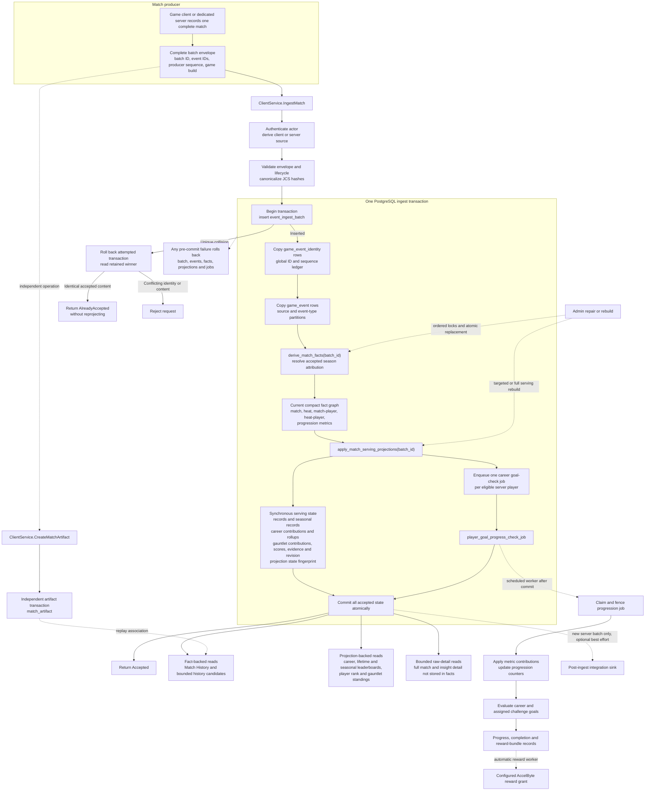

# Identified Match Ingestion

Status: current

Applicability: deployed shared-development behavior as of 2026-07-23. This document does not imply
production deployment.

Last consolidated: 2026-07-23

## Related

- [[overview]]
- [[api]]
- [[data-model]]
- [[events]]
- [[ascent-rivals/initiatives/eventun-foundation/eventun-telemetry-lifecycle-plan|eventun-telemetry-lifecycle-plan]]

[Eventun](https://github.com/ikigai-github/eventun) is the implementation source
for the schema, functions, APIs, and operational tooling described by this
contract. This Knowledge Base document is the authoritative product and
architecture reference.

## Purpose

Eventun's replacement telemetry contract accepts one identified, complete match
as an atomic unit. Stable producer identities and canonical content hashes make
acceptance idempotent even while delivery remains at most once. The storage
model exposes one logical event relation while retaining physical pruning by
source and event type.

The identified-match messages, tables, and runtime operations described here
are authoritative for new ingestion. The legacy `client_event` and
`server_event` relations remain available to existing product reads until the
separately controlled conversion and removal work is complete.

This contract now includes acceptance-time season attribution and seasonal
serving records. It remains neutral about storage segments and retention tiers.
`game_build` is diagnostic metadata and a possible future classification input;
it is not a payload schema version or a substitute for any of those concepts.

## Source and trust provenance

The ingest and artifact operations are defined once on `ClientService`
and accept two explicit authorization modes. Eventun derives `source_kind`
from the verified actor class, not from a producer field or a client/server
route:

- A valid game-namespace token with a nonblank player subject is authorized as
  a player without an Eventun custom permission. Eventun records the verified
  OAuth client and player, and sets `source_kind = client`.
- An exactly subjectless service token must satisfy Eventun Server `CREATE`.
  Eventun records the verified OAuth client, leaves the submitting player
  absent, and sets `source_kind = server`.
- A player token is always classified as `client`, even if that principal also
  has Eventun Server permission. Server-permission fallback is attempted only
  for an exactly subjectless principal. Empty or whitespace-only subjects are
  rejected rather than interpreted as either actor class.

The producer cannot submit, select, or upgrade this classification. Source and
actor attribution are immutable after acceptance and remain available to later
facts and product policies. Client telemetry remains necessary for time
trials, career or local play, and other modes without a dedicated server.

Source and actor fields are server-derived and therefore excluded from the
producer-payload hash. An idempotent duplicate must nevertheless match the
stored source, producer client, and submitting player as well as the canonical
hash. Reusing an identity through a different authorization mode or actor is a
conflict, not an equal duplicate.

### Operation placement

The runtime exposes:

- `ClientService.IngestMatch(MatchIngestRequest)` at
  `POST /v1/match/ingest`;
- `ClientService.CreateMatchArtifact(MatchArtifactRequest)` at
  `POST /v1/match/artifact`;
- those two ClientService operations as the only shared CREATE methods,
  using the player-or-Server-`CREATE` authorization policy above; and
- no duplicate ServerService ingestion or artifact operation.

This keeps one network operation per behavior. The Eventun runtime owns
the service, authorization, validation, persistence, route, and generated
contract. The game-client change consumes those generated
operations: the Unreal Client surface includes the two ClientService operations
normally, and the GameServer surface explicitly selects those same operation
ids alongside the remaining ServerService runtime operations. It does not
create server-specific copies.

## Complete-match contract

`MatchIngestRequest` defines the producer envelope:

- `batch_id` is a non-nil UUID assigned once for the match and retained for any
  later retransmission.
- `session_id` is a required UUID shared by every event.
- `match_id` is required and nonnegative; zero is a valid value, so protobuf
  presence is significant.
- `game_build` is required diagnostic build information of 1-128 characters,
  with no leading or trailing ASCII space.
- `events` contains the complete match in producer order.

Every `MatchIngestEvent` has:

- a non-nil `event_id` UUID assigned when the event is recorded;
- a required `sequence` equal to its zero-based list index and no greater
  than 2,147,483,647, the PostgreSQL `INTEGER` maximum;
- a present `occurred_at_ms` UTC Unix timestamp in milliseconds from 0
  through 9,007,199,254,740,991, the largest integer represented exactly by
  the RFC 8785 number model;
- an `event_type` of 1-128 characters with no leading or trailing ASCII
  space and not equal to `ReplaySaved`; and
- optional heat, canonical player UUID, progress, coordinate, and event data.

Bots and events without a player omit `player_id`; arbitrary bot labels are not
player identities. As a narrow transport-compatibility rule, Eventun also
normalizes an explicitly empty `player_id` string to absence because generated
Unreal models cannot represent optional-string presence. A nonempty value must
be a canonicalizable non-nil UUID. Session and match identity occur only in the
envelope and cannot be overridden by an event.

The event list must satisfy all of these rules:

1. It has at least two events and its sequence values are exactly `0` through
   `N-1`, with no gaps, duplicates, or reordering.
2. Batch and event UUIDs are unique where required by the request and retained
   unchanged for the lifetime of that producer record.
3. It describes exactly one match, with exactly one `MatchStart` followed in
   sequence order by exactly one terminal `MatchEnd`.
4. Sequence is the authoritative producer order. Occurrence timestamps need
   not be unique and are never used to reorder the submitted list.
5. `ReplaySaved` is not a match event. Replay association uses the independent
   artifact contract.
6. Validation and persistence are all-or-nothing. Eventun never merges a
   partial request into an accepted batch.

Eventun derives event count, first and last occurrence times, and match start
and end times from the validated list. Producers do not supply those stored
values.

`MatchIngestResponse` returns the stable `batch_id`, Eventun's raw 32-byte
SHA-256 value, and one of two successful outcomes:

- `MATCH_INGEST_OUTCOME_ACCEPTED` for a new atomic insert;
- `MATCH_INGEST_OUTCOME_ALREADY_ACCEPTED` for an equal idempotent duplicate.

For an equal logical-match duplicate submitted with a different `batch_id`,
the response returns the canonical already-accepted `batch_id` and hash, not
the discarded request identity. The response is returned by
`ClientService.IngestMatch`.

## Canonical payload hashing

Eventun computes SHA-256 over an RFC 8785 JSON Canonicalization Scheme (JCS)
projection. It does not hash protobuf wire bytes, ordinary JSON serialization,
database JSON text, or receipt metadata.

The match projection has this semantic shape before JCS serialization:

```json
{
  "session_id": "canonical UUID",
  "match_id": 0,
  "game_build": "producer value",
  "events": [
    {
      "event_id": "canonical UUID",
      "sequence": 0,
      "occurred_at_ms": 0,
      "event_type": "MatchStart",
      "heat": 0,
      "player_id": "canonical UUID",
      "progress": {
        "placement": 0,
        "lap": 0,
        "checkpoint": 0
      },
      "coordinate": {
        "x": 0,
        "y": 0,
        "z": 0
      },
      "event_data": {}
    }
  ]
}
```

The example displays every optional event member; an actual projection omits
members that were absent in the protobuf request.

Hashing uses these exact rules:

- The projection includes `session_id`, present `match_id`, `game_build`, and
  every event in sequence order. Each event includes `event_id`, present
  `sequence`, `occurred_at_ms`, `event_type`, and every present optional field.
- `batch_id` is intentionally excluded. It is the idempotency key against
  which the resulting content hash is compared.
- UUID-valued fields are parsed and rendered as lowercase, hyphenated canonical
  UUID text. Nil or malformed UUIDs are rejected. This applies to batch,
  session, event, artifact, and nonempty player or source-batch identities even
  when an identity is excluded from a particular hash.
- Non-UUID strings, including `game_build`, `event_type`, and external object
  keys, retain their exact JSON string value after request validation. Hashing
  does not trim, fold case, or perform Unicode normalization.
- A missing protobuf optional field is omitted. The two generated-Unreal
  compatibility cases, event `player_id: ""` and artifact `batch_id: ""`, are
  normalized to absence before validation, hashing, and persistence; empty and
  omitted therefore produce the same canonical hash. This is not general
  blank-value or sentinel handling: whitespace, malformed UUIDs, and nil UUIDs
  remain invalid, and every other present field is retained even when its value
  is zero or otherwise the protobuf default. If a `Progress` or `Coordinate`
  message is present, its scalar members are projected, including zero values.
- `google.protobuf.Struct` objects are projected recursively. Object member
  order is determined by RFC 8785, array order is preserved, and explicit JSON
  null values remain present.
- JSON numbers use RFC 8785 serialization. Producer timestamps must be present
  integers from 0 through 9,007,199,254,740,991 inclusive. NaN, positive or
  negative infinity, unknown protobuf fields, and values that cannot be
  represented by the approved projection are rejected before hashing.
- Source and actor provenance, `received_at`, derived event counts and time
  bounds, database-generated values, and the hash itself are excluded.

Eventun also computes an event-level hash from the same normalized event
projection for its identity ledger. The batch hash remains the acceptance hash
returned to the producer.

## Duplicate and conflict behavior

Acceptance distinguishes an equal retry from identity reuse:

| Condition | Result |
| --- | --- |
| New valid batch and event identities | `ACCEPTED`; gRPC success / HTTP 200 |
| Same batch ID, canonical hash, source, and actor attribution | `ALREADY_ACCEPTED`; gRPC success / HTTP 200; no insert or derivation |
| Different batch ID, same logical-match key, canonical hash, source, and actor attribution | `ALREADY_ACCEPTED`; gRPC success / HTTP 200; return the existing batch ID and hash; no insert or derivation |
| Different batch ID and same logical-match key, but different canonical content or provenance | gRPC `AlreadyExists` / HTTP 409 |
| Same batch ID with different canonical content or provenance | gRPC `AlreadyExists` / HTTP 409 |
| Existing event ID reused with different batch ownership, sequence, type, or canonical content | gRPC `AlreadyExists` / HTTP 409 |
| Persisted `(batch_id, sequence)` reused for conflicting event content | gRPC `AlreadyExists` / HTTP 409 |
| Duplicate IDs, sequence gaps, duplicate sequence, missing required presence, malformed UUID, unknown field, or invalid complete-match shape within a new request | gRPC `InvalidArgument` / HTTP 400 |

Out-of-range numeric values and strings that violate the documented length or
ASCII-space boundaries are also malformed requests and return
`InvalidArgument` / HTTP 400.

There is no partial success response. A storage or derivation failure rolls back
the entire new acceptance transaction. Sender retry remains disabled until a
separate deployment decision enables bounded retries.

Accepted payloads and provenance are immutable. The initial producer API
does not provide correction, replacement, deletion, or last-write-wins
semantics. A different payload for an accepted logical match returns
`AlreadyExists` even when the caller describes it as a correction. A future
correction mechanism must be an explicitly approved, audited supersession that
retains the original acceptance and explicitly rebuilds affected facts. Until
that separate schema and operator workflow exists, payload correction is
blocked rather than silently rewriting history.

## Logical and physical storage

`event_ingest_batch` is the compact acceptance ledger. It stores the stable
batch identity, immutable source and actor provenance, common match identity,
game build, receipt time, occurred-time and match bounds, event count,
and canonical hash.

The ledger enforces one accepted batch for each logical-match observation:

- a server observation is uniquely identified by `server`, `session_id`, and
  `match_id`; there is one authoritative dedicated-server observation;
- a client observation is uniquely identified by `client`, the verified
  `submitting_player_id`, `session_id`, and `match_id`; and
- `producer_client_id` is retained provenance but is not part of logical match
  identity. Changing OAuth clients cannot create another observation for the
  same player and match, and provenance mismatch is a conflict.

A client batch is one player's observation of a complete match, even when its
events describe every lobby participant. Up to one observation per distinct
authenticated player may coexist for the same session and match. These
self-reported observations do not collapse into, replace, or acquire the trust
of the separate server observation. Partial unique indexes enforce the server
and client-observer keys, so a new `batch_id` cannot silently create a second
accepted observation. The runtime implementation resolves a uniqueness race by
reading the winner and applying the equal-versus-conflict rules above.

`game_event` is the single logical raw-event relation. It is list-partitioned
first by `source_kind` into client and server subtrees. Each subtree is
list-partitioned by `event_type` into the known event leaves plus a default
leaf. Consequently:

- a source-and-type predicate prunes to one physical leaf;
- a type predicate without a source visits the corresponding leaf in each
  source subtree; and
- a source predicate without a type visits only that source subtree.

Targeted source-tree and leaf indexes preserve the useful access paths
demonstrated by the legacy client/server event trees. No season, period,
timestamp range, or retention segment is part of this hierarchy.

### PostgreSQL 16 global identity

PostgreSQL 16 requires every partition key to appear in a unique constraint on
a partitioned table. A unique `event_id` or `(batch_id, sequence)` constraint on
`game_event` alone therefore cannot enforce identity across both source and
event-type partitions.

`game_event_identity` is a compact, unpartitioned constraint ledger rather
than a second payload model. It provides:

- a global primary key on `event_id`;
- a global unique key on `(batch_id, producer_sequence)`;
- the immutable batch, source, event type, sequence, and event hash associated
  with the identity; and
- a foreign key to the batch and source tuple.

The partitioned payload row has partition-compatible uniqueness including
`source_kind` and `event_type`, and a composite foreign key to the complete
identity-ledger tuple. The identity ledger fixes one global event ID to one
batch/source/type/sequence tuple; the partitioned key prevents a second
physical row for that tuple. The batch, all identity rows, and all payload rows
are written in one transaction.

The database enforces non-negative, unique sequence values. The request layer
also validates the stronger contiguous `0..N-1` rule and confirms that the
persisted event count matches the atomic insert.

## End-to-end accepted batch flow



Raw persistence, fact derivation, serving projection, and progression-job
enqueueing are synchronous parts of one accepted-batch transaction. There is no
hourly materialized-view refresh in the serving path. Progression evaluation,
automatic reward fulfillment, and an optional dedicated-server post-ingest
integration run only after commit and cannot change the acceptance outcome.
Replay artifacts use their own idempotent operation and transaction rather
than joining the match event envelope.

The optional server-batch post-ingest integration is a bounded non-durable dispatcher, not part
of accepted telemetry. It uses two application-owned workers, a 64-match queue, and a ten-second
sink-call context. Overload or shutdown rejects new work without changing the already committed
ingest result; shutdown drains within its bound, and rejected or failed work is logged and counted
by `eventun_post_ingest_dispatch_total{outcome}`. Production composition accepts only the concrete
bounded dispatcher, so an arbitrary external sink cannot be inserted directly into the request
path.

## Compact fact derivation

Every newly accepted batch is projected after both raw inserts and before the
ingest transaction commits. The runtime calls `derive_match_facts(batch_id)`
once. A projection failure rolls back the batch ledger, identities, raw payload
rows, and facts together. Deliberate producer-validation failures raised by
the projector use private SQLSTATE `P2001` and return `InvalidArgument`.
Unexpected casts, constraints, SQLSTATE class 22 errors, and projector/storage
defects remain `Internal`.

Normal derivation is season-aware. It takes the shared season-schedule lock and
stores nullable `match_fact.season_id` as canonical acceptance-time semantic
evidence. Dedicated-server facts resolve the half-open season containing
MatchStart. A client fact is season-attribution eligible only when MatchStart
and trusted `event_ingest_batch.received_at` both resolve to the same non-null
season; otherwise it remains explicitly unseasoned while continuing to
contribute to lifetime behavior. This is an attribution-eligibility rule, not
anti-cheat or result validation. It deliberately replaces the earlier
occurrence-time-only late-arrival statement.

No season field is copied to raw events or `match_player_fact`. The ordinary
facts-plus-serving repair requires an existing `match_fact` and fails closed if
none exists; an existing null attribution remains distinguishable from a
missing fact. It takes the same shared schedule lock across temporary fact
deletion/reinsertion and restores the exact accepted null or non-null season
evidence rather than recomputing eligibility against a later catalog. Targeted
serving-only repair and a full serving rebuild consume persisted attribution and
do not take the schedule lock.

There is one current fact graph per batch. No derivation revision, selected
revision, status, or parallel online fact set is retained. An equal idempotent
ingest returns the retained acceptance before projection. The explicit repair
operation is:

```sql
SELECT rebuild_match_facts('batch UUID');
```

It locks the accepted batch, deletes the current `match_fact` row (cascading
through its child graph), and derives the graph again in the same transaction.
A failure restores the prior graph. Repeating the rebuild produces the same
rows and progression contribution identities.

Facts keep `batch_id` and `source_kind`. The match row also copies verified
producer-client and submitting-player attribution. Child rows have
source-scoped foreign keys, while every event-derived value retains a stable
source event ID. Contract tests verify the ID belongs to the same batch and
source and has the required event type. Dedicated-server, client-observer, and
distinct client-observer batches consequently remain separate; consumers must
apply an explicit trust policy.

The current mapping is:

| Fact | Grain and retained values |
| --- | --- |
| `match_fact` | One accepted batch: nullable canonical `season_id`, actor/source, session/match/build, MatchStart/MatchEnd identities, sequences and times, race mode, nullable explicit `single_player_mode`, expected heat/lap counts, authoritative MatchStart course, qualifier UUIDs, gauntlet/run context, and all-heats canonicality |
| `heat_fact` | One heat with required HeatStart/HeatEnd identities, sequences and times, plus canonicality; course is deliberately not repeated |
| `match_player_fact` | One player-identified PlayerMatchEnd: terminal statistics and nullable `reported_podium_finish` |
| `heat_player_fact` | One heat/player: optional start/end boundaries, player type, start credits, real nested loadout key/slots/augment slots/version, weight/value fields, terminal result, reported best lap, valid lap count, total valid lap time, best valid lap time, and the deterministic winning PlayerLap event ID |
| `progression_metric_fact` | Bounded idempotent positive contributions for `kill.count`, `heat.completed`, `medal.count`, `match.completed`, and `podium.count` |

`PlayerLap.timeMs > 0` defines a valid lap. Count and total are aggregated at
heat/player scope. The winning lap orders by time, producer sequence, then
event ID. Averages are derived later from count and total. PlayerCheckpoint,
coordinates, tags, and all other segment measurements stay solely in the raw
event-type partitions; there is no `lap_fact` or `checkpoint_fact`.

MatchStart is authoritative for unique course code, course code, course
version, and expected laps. A present HeatStart course value must agree or the
batch is rejected. `single_player_mode` is nullable text of at most 64 bytes.
When present it is the nonblank canonical game enum name, such as `None` or
`TimeTrial`; it is never inferred from race mode or translated through a
boolean compatibility rule.

`heat` is retained raw telemetry context, not a declaration that an event is
heat-scoped. The generated Unreal shape supplies nonnegative ambient context on
global events: MatchStart can carry heat 0 before the first HeatStart, while
PlayerMatchEnd and MatchEnd can carry the final heat after its HeatEnd. Those
values are stored unchanged, do not create or count a heat, need no matching
boundary, and are not constrained to that heat's interval.

HeatStart, HeatEnd, AscensionStart, PlayerHeatStart, PlayerHeatEnd,
PlayerCheckpoint, PlayerLap, PlayerDied, PlayerRespawn, PlayerKill, PlayerGate,
and SlalomGate are explicitly heat-scoped and must name a nonnegative heat.
Only HeatStart and HeatEnd discover boundaries. Each discovered heat has exactly
one pair strictly inside MatchStart/MatchEnd, pairs may not overlap, and every
other explicitly heat-scoped event must be strictly inside its matching pair.
Go rejects missing, duplicate, misordered, overlapping, or escaped boundaries
before persistence; PostgreSQL repeats the checks for rebuilds and direct
maintenance. A malformed interval therefore cannot become the current
match/heat fact graph or canonical match.

Podium reporting is also presence-aware. Explicit true, explicit false, and
missing remain distinct. Only explicit true creates `podium.count`; placement
does not rewrite the producer's value. The emitted per-player
`PlayerHeatStart` is the sole loadout snapshot for that player and heat;
subsequent events derive that context through the heat/player fact rather than
copying loadout data into PlayerKill, PlayerDied, or other payloads. Extraction
keeps the current item-ID shape in `loadout.slots` and
`loadout.augmentSlots`; item ID versus SKU changes are deferred. Actual medal extraction reads
`medalCounts[].medalName`, `parentMedalName`, and `count`, deriving
`is_augment` from a nonempty parent. Kill dimensions use the emitted
`weaponItemId`; no synthetic top-level weapon/part SKU fields are assumed.

Progression dimensions are JSONB objects limited to 2,048 bytes and the scalar
course, method, weapon-item, medal, parent-medal, and augment keys. The ledger
has the approved player/metric/time B-tree and no unproven JSONB GIN.
Match-player recency and heat-player best-lap B-trees are reserved for the
approved serving-projection access paths. Current product reads and native
materialized views remain unchanged until the incremental serving cutover.

The request layer validates every selected value that PostgreSQL casts:
integer and boolean presence, nullable bounded play-context text, positive
heat/lap counts, nested loadout arrays, qualifier UUIDs, medal entries, and
generated-column shapes. SQL retains cross-row lifecycle/course checks and
defensive shape checks for operator rebuilds. Unknown event types and
unselected fields remain raw without expanding facts.

## Season catalog and serving contract

The initial scope is “Season catalog, deterministic attribution, exact-season
Match History, and seasonal lap/finish records.” A season has an immutable UUID
`season_id`, a mutable non-unique display `title` of 1 through 128 Unicode
characters, a `regular` or `off_season` kind, and finite UTC
`starts_at`/`ends_at` instants aligned exactly to Unix milliseconds. It has no
human-readable code or stored publication/current state. PostgreSQL excludes
overlap between the half-open `[starts_at, ends_at)` ranges; touching windows
and gaps are valid. Status is derived at one catalog evaluation instant.

Application catalog writes call `create_season`, `update_season`, or
`delete_season`. Create takes the exclusive schedule lock and then captures one
`clock_timestamp()` decision. A semantic full replacement or delete takes the
exclusive lock, locks the season row, and then captures its one decision time.
It succeeds only while the existing season is future and unreferenced, and a
replacement start must also be future. A full replacement whose kind and
boundaries equal the caller's expected semantics is classified as title-only:
it does not take the global schedule lock, uses conditional row update, and
permits last-writer-wins title changes. A zero-row title update is NotFound
when the row disappeared and Aborted when its semantics changed. Database-owner
direct SQL is trusted maintenance; only immutable identity and static
nonempty/kind/finite/range constraints remain as defensive direct-SQL checks.

`ListSeasons(include_off_seasons=false)` returns every past, current, and
upcoming regular season. Setting the flag returns regular and off-season rows.
Both public and Admin results order by `starts_at`, then `season_id`.
Leaderboard, player-rank, and Match History requests accept an optional exact
`season_id`: omission retains lifetime/all-history behavior, an unknown UUID is
NotFound, and a known season without rows returns an empty result. Match History
returns `optional string season_id`; clients can resolve its current title and
kind through ListSeasons. The `match_fact_season_history_idx` exists for
season-wide fact enumeration or a future explicit migration. Player-selective
Match History materializes the requested server/player rows through
`match_player_fact_player_time_idx`, then performs one keyed parent-fact lookup
per candidate before exact season filtering and artifact selection. It does not
use the season-wide index or denormalize season onto the player fact.

Lifetime `player_course_record` remains unchanged. Seasonal lap/finish records
use `player_season_course_record` keyed by season, source, category, course, and
player. Winner selection and rank retain the lifetime ordering: time,
loadout-value ascending with null last, then the existing occurrence/batch/heat/
event tie fields for winner ownership and player UUID for displayed rank.
Seasonal leaderboard and player-rank reads enumerate course codes represented
by persisted records as well as active courses, so deactivating a course does
not hide its past-season results. Lifetime and seasonal leaderboard assembly
rank every requested course/source/category in one set-based query, materialize
the projected player profile once, and pivot the grouped entries into the
existing eight arrays per course.
Projection obtains season only by joining each existing contribution's
batch/source identity to `match_fact`; the contribution has no season column.
The seasonal winner has a cascading foreign key to that exact contribution,
and projection, targeted repair, and full rebuild assert that its season equals
the winning match fact's persisted season for every affected key, including an
A-to-B replacement winner. The focused normalized next-winner contract retains
1,500 faster same-key contributions whose parent facts belong to another season.
It examined 1,501 contribution candidates and 4,566 shared buffers in isolation,
selected one deterministic winner through
`player_course_record_contribution_winner_idx` and keyed `match_fact` access,
and used no sequential scan. The complete schema suite observed 4,590 shared
buffers for the same 1,501 candidates. The approved limits are 2,000 candidates
and 6,500 shared buffers; the buffer ceiling represents about three B-tree
buffer visits per candidate plus bounded startup/executor overhead. The earlier
combined fixture observation of 1,501 candidates and 4,591 shared buffers is
also retained as implementation evidence.

Match/player serving projection schema and projector generation are `2/2` for
normal projection, targeted repair, full rebuild, historical acceptance, and
cutover completion. Targeted serving repair and full serving rebuild consume
persisted attribution without a schedule lock. Fact repair holds the shared
schedule lock across temporary fact deletion/reinsertion and restores the
accepted attribution. Gauntlet projection state, qualification version checks,
and sealed qualification evidence remain `1/1`; no reconciliation surface or
manifest is added.

The Extend App season editor labels every boundary as exact UTC, preserves the
canonical millisecond instant even in a non-UTC browser timezone, displays
schedule gaps and the absence of a currently covering season, freezes semantic
controls when appropriate, and keeps title editing available.

### Representative PostgreSQL 16.14 measurement

`migration/benchmarks/compact_fact_derivation_benchmark.sql` creates deterministic complete
three-heat server matches. A provided 100,000-row production sample contained
108 HeatStart rows across 35 observed matches (3.09 per match), a median of 16
participants per observed heat, and 900 bot versus 528 human PlayerHeatStart
rows. Those values support workload shape only; they are not encoded as a
lifecycle rule. The representative cases are a 5-human/11-bot lobby and the
maximum normal 16-human lobby, each with 4,681 events. Bots omit `player_id`.
The 32-human, 9,362-event case is synthetic stress evidence. All cases include
three heat pairs, three laps per participant/heat, production-weighted
checkpoint/death/respawn/kill counts, six item-ID core slots, eight augment
slots, three medal entries, and terminal rows.

Raw-only and raw-plus-projection transactions alternate first position in
each of ten sample pairs to reduce environmental ordering bias. The disposable
PostgreSQL 16.14 container is configured for one CPU, 2 GiB RAM, and 256 MiB
shared memory, matching the Azure B1ms CPU/RAM envelope. Production storage is
32 GiB; the disposable Docker filesystem is not capacity- or IOPS-shaped to
Azure storage, so the results remain local committed-latency, buffer, WAL, and
allocated-relation evidence rather than a durable Azure latency guarantee.

The 2026-07-13 ten-sample run reported:

| Workload | Mode | Raw insert p50/p95 ms | Projection p50/p95 ms | Commit p50/p95 ms | Warm raw/fact query p50 ms | WAL p50 bytes | Raw/fact rows |
| --- | --- | ---: | ---: | ---: | ---: | ---: | ---: |
| 5 human / 11 bot | Raw only | 131.169 / 164.758 | - | 190.436 / 274.195 | 0.044 / - | 8,115,580 | 4,681 / 0 |
| 5 human / 11 bot | Raw + facts | 129.782 / 163.955 | 42.018 / 55.465 | 231.129 / 282.180 | 0.038 / 0.009 | 8,201,928 | 4,681 / 122 (2.606%) |
| 16 human | Raw only | 124.773 / 151.001 | - | 211.680 / 283.462 | 0.073 / - | 8,219,428 | 4,681 / 0 |
| 16 human | Raw + facts | 126.568 / 167.887 | 62.024 / 75.876 | 276.690 / 348.895 | 0.071 / 0.016 | 8,438,796 | 4,681 / 375 (8.011%) |
| 32 human synthetic | Raw only | 403.599 / 764.522 | - | 467.796 / 859.311 | 0.137 / - | 16,446,904 | 9,362 / 0 |
| 32 human synthetic | Raw + facts | 433.660 / 654.676 | 104.120 / 183.690 | 615.083 / 813.962 | 0.138 / 0.029 | 16,971,032 | 9,362 / 743 (7.936%) |

The commit timer covers the batch statement through commit and therefore the
complete batch-row lock interval. Diagnostic fact-row counts run only after
that interval. Raw and fact query timers are separate 25-run warm measurements
of equivalent per-player/per-heat valid-lap count, total, and best-time results;
the harness also checks result equality. All timings exclude client round trip.
Per-match raw heap/index allocation was about 3.36/2.19 MB for mixed,
3.36/2.20 MB for 16-human, and 6.74/4.21 MB for synthetic 32-human matches.
Projected fact heap/index allocation was about 27.9/27.0 KB, 90.1/72.9 KB, and
181.0/150.7 KB respectively, with zero fact TOAST. Across 60 measured matches,
peak raw heap/index growth was 269,164,544/171,835,392 bytes and fact heap/index
growth was 2,990,080/2,506,752 bytes.

Representative 16-human EXPLAIN samples reported raw-only shared hit/read/
dirtied/written buffers of 127,631/19/682/1,094 and 8,127,119 WAL bytes, versus
168,524/15/689/960 and 8,374,772 bytes with projection. Synthetic 32-human
samples reported 255,096/44/1,396/1,895 and 16,328,838 bytes raw-only, versus
321,161/32/1,400/2,519 and 16,758,881 bytes with projection. The representative
16-human raw lap summary used three hit plus six read buffers and 0.171 ms; the
narrow-fact query used one hit plus five read buffers and 0.056 ms. These
results demonstrate that the narrow graph does not reproduce checkpoint
cardinality; they do not predict Azure storage latency or future serving-
projection cost.

## Match artifacts

`MatchArtifactRequest` associates an independently delivered object with a
match. Its fields are:

- stable `artifact_id`, retained for a later retransmission;
- optional accepted match `batch_id` linkage; an explicitly empty string is
  normalized to absence for generated-Unreal transport compatibility;
- required `session_id` and present nonnegative `match_id`;
- a non-unspecified numeric `artifact_kind` (currently
  `MATCH_ARTIFACT_KIND_REPLAY = 1`, stored as exact text `replay`);
- an external record or object key of 1-2,048 UTF-8 bytes with no leading or
  trailing ASCII space; and
- present producer `created_at_ms` in UTC Unix milliseconds from 0 through
  9,007,199,254,740,991 inclusive.

Eventun again derives source, producer client, submitting player, and receipt
time. `match_artifact` stores that provenance, the optional batch association,
producer creation and server receipt times, and the canonical hash. When a
batch link is present, its batch/source/session/match tuple must agree. An
external key is unique within its artifact kind so one external object cannot
be rebound to a different match.

The artifact hash is SHA-256 over an RFC 8785 projection containing optional
`batch_id` when present, `session_id`, present `match_id`, the stable protobuf
numeric `artifact_kind`, `external_record_key`, and `created_at_ms`.
`artifact_id`, source and actor provenance, receipt time, and database-derived
metadata are excluded. UUID, presence, string, number, unknown-field, and
non-finite-value rules are identical to the match projection.

Artifact acceptance uses both `artifact_id` and `(artifact_kind,
external_record_key)` as identities:

| Condition | Result |
| --- | --- |
| New artifact ID and kind/external-key identity | `MATCH_ARTIFACT_OUTCOME_ACCEPTED`; gRPC success / HTTP 200 |
| Same artifact ID, canonical hash, source, and actor attribution | `MATCH_ARTIFACT_OUTCOME_ALREADY_ACCEPTED`; return the retained artifact ID and hash |
| Different artifact ID, same kind/external key, canonical hash, source, and actor attribution | `MATCH_ARTIFACT_OUTCOME_ALREADY_ACCEPTED`; return the existing artifact ID and hash; do not insert |
| Same artifact ID or kind/external key with different canonical content or provenance | gRPC `AlreadyExists` / HTTP 409 |

The equal-content comparison includes the complete documented artifact hash,
so adding or changing the optional batch association, match identity, external
key, kind, or creation time is conflicting content. The database's unique
kind/external-key index serializes concurrent attempts; the runtime
implementation reads the retained row after a collision and returns either the
equal result or the conflict.
Artifact delivery is independent of the complete-match event list;
`ReplaySaved` is rejected as a new match event.

## Deterministic legacy conversion

Legacy conversion is a later, explicit operation. It does not run during clean
schema creation, service startup, or application deployment.

Only the live `client_event` and `server_event` parent relations are conversion
sources. Old-format backup relations are outside the source universe and are
left untouched; their rows do not enter conversion or disposition accounting.

The purpose-specific command owns one transaction. SQL performs source
classification, containment reconstruction, bulk insertion, fact derivation,
serving rebuild, accounting, reconciliation, and compact marker acceptance. Go only
confirms the target, owns that transaction, pages compact identity mappings,
computes UUIDv5 values unavailable in the production PostgreSQL baseline, and
reports evidence. It never retains or inserts the complete event source.

Historical conversion calls
`derive_historical_unseasoned_match_facts(batch_id)`, the intention-specific
historical entry point, rather than normal season-aware derivation. Converted
historical facts are derived directly with null attribution; the historical
entry point does not first resolve the current catalog and then clear the
result. The diagnostic `EXPLAIN ANALYZE` sample invokes that same historical
path. This distinction does not rewrite the prior rehearsal evidence below: the
retained timings, counts, reconciliation, and capacity observations describe
the named production dump and remain the baseline evidence for the combined
rehearsal.

The conversion uses this fixed namespace derivation:

```text
legacy root namespace = UUIDv5(
  standard URL namespace 6ba7b811-9dad-11d1-80b4-00c04fd430c8,
  "urn:ikigai:eventun:identified-match-legacy:v3"
)
```

The root name is the exact UTF-8 byte sequence shown above. Go derives each
nonzero producer UUIDv5 from converter version, source kind, session, and the
client submitting player when applicable. It derives batch UUIDv5 values from
the same logical group plus match ID, and replay artifact UUIDv5 values from
that provenance plus external replay key. The zero UUID stored by the legacy
producer is not copied. Normal runtime requests continue to reject zero
producers.

Ordinary rows group by source kind, client actor when applicable, session, and
nonnegative match ID. Negative match IDs are session/lobby telemetry and are
excluded without being remapped to match zero. Legacy heat `-1` maps to omitted;
a heat-scoped event still lacking heat discards its group.

SQL fingerprints complete source rows where deterministic duplicate collapse
or replacement identity requires it, and stores compact counts and terminal
dispositions per logical group. It does not retain a transition-only source
multiset digest. `ctid`, partition scan order, and dump order are never inputs. A usable
group requires one distinct source `MatchStart` and one distinct `HeatStart` for
every declared or represented heat. Starts and their context are never
invented. Conflicting starts, reused identities, invalid heat/course context,
or an irreconcilable declared heat count discard the complete group.

`MatchStart` is the normalized course authority. A present MatchStart value is
retained. When one of `uniqueCourseCode`, `courseCode`, or `courseVersion` is
omitted and every populated HeatStart agrees, that source-backed value is copied
to MatchStart. Ambiguous or absent context discards the group. Legacy Ascent
HeatStart `laps` is an evolving heat/lifecycle value, not MatchStart's expected
race laps, so it is never promoted; MatchStart laps must be present. All four
redundant HeatStart keys are removed before canonical identities are generated.

Producer sequence is reconstructed by semantic containment, not primarily by
source timestamp:

```text
MatchStart
  each heat by heat number:
    HeatStart
    AscensionStart and PlayerHeatStart
    interior heat events
    PlayerHeatEnd
    HeatEnd
  match-level interior and PlayerMatchEnd summaries
MatchEnd
```

Within a role, ordering is stable by timestamp, event type under `COLLATE "C"`,
canonical content hash, and source identity hash. Every source timestamp is
preserved. This sequence supplies a valid deterministic envelope; it is not a
claim that tied kills, deaths, checkpoints, or other interior events occurred
in the generated order.

Missing payload-free `HeatEnd` and `MatchEnd` wrappers are generated at the
maximum source timestamp for their heat or match. Exact duplicate ends collapse;
multiple payload-free ends normalize to the maximum deterministic wrapper when
the authoritative start and containment are otherwise unambiguous. No
`PlayerHeatEnd`, `PlayerMatchEnd`, result, placement, time, score, loadout,
combat, or progression payload is generated. A player missing a terminal event
does not invalidate a globally complete match; only supported facts are built.
The legacy serializer's exact empty terminal defaults—zero lap/checkpoint
progress, a zero coordinate, and an empty event-data object—are treated as an
empty wrapper and preserved. A terminal carrying a player or any other values
is not empty and discards its ambiguous group.

PostgreSQL assigns zero-based sequence with a partitioned window and generates
deterministic event UUIDs plus the product-required canonical event and batch
content hashes set-wise. Historical batches are not resubmitted, and compact facts/serving
projections do not consume runtime JCS hashes, so historical rows do not pass
through the runtime ingestion validator merely to reproduce its request hash.
The permanent identified-event constraints remain unchanged.

All valid `ReplaySaved` keys become replay artifacts with deterministic nonzero
producers. Artifact batch linkage is nullable when its corresponding match was
discarded; no match is created solely to attach an artifact.

The SQL-authoritative accounting equation is:

```text
source rows = converted source events
            + excluded duplicate source occurrences
            + excluded lobby source occurrences
            + replay source occurrences reconstructed as artifacts
            + discarded source occurrences
```

Generated terminal events are reported separately and never claimed as source
rows. Compact evidence contains the required dump SHA-256, source/group/replay
counts and multiplicities, per-event-type disposition aggregates, output
counts, per-reason group counts and percentages, legacy-output snapshots,
reconciliation summaries, WAL, temporary bytes, and peak database size. It
never copies millions of source payloads; the checksummed dump is recovery
evidence.

Reconciliation classifies exact rows, promoted fallback records after a legacy
winner's group was discarded, rank corrections, presentation corrections,
missing rows traced to discarded ambiguous groups, and replacement-only rows.
Record loss or fallback is explained by the exact legacy winning value's
source session/match candidates, not merely by finding some other discarded
match for the same player; every equivalent winner candidate must be discarded,
and a promoted replacement records its retained batch/session/match.
Gauntlet score/rank differences additionally identify affected gauntlets and
qualifiers. Acceptance fails if any difference remains unexplained. SQL also
requires the source equation to close, all twelve reconciliation surfaces to be
present, and fact and serving output counts to be nonzero. It then records one
compact accepted-execution marker. After taking the cutover advisory lock, the
destructive suffix checks only that marker; it performs no full-table semantic
manifest or repeated evidence hash. The supplied execution timestamp remains
run evidence.

Physical capacity is a separate acceptance condition. The runner samples the
sum of every `pg_database_size` in the isolated cluster, the target database
separately, live `pg_ls_tmpdir()` bytes, and retained `pg_ls_waldir()` bytes from
a second read-only connection every two seconds. Relation indexes are included. It records the restored
baseline, the incremental concurrent peak, peak snapshots by published phase,
and committed database/public-table/largest-relation sizes. The hard ceiling is
32 GiB, the controlled rehearsal stop is 28 GiB, and the migration backend requests
a 14 GiB `temp_file_limit`. A managed PostgreSQL target may reject that session setting with
`42501` while retaining its effective `-1` value; the owner accepted that exact development-cutover
case, evidence records `-1`, and the independent 28 GiB physical-storage monitor remains the
enforced stop. Rollback-only capacity checks proved 6 GiB too low
for source grouping at a 14.36 GB concurrent physical peak and 10 GiB too low
for normalization at a 22.66 GB peak. The accepted fresh full-source rehearsal
peaked at 25.04 GB during bulk event insertion and committed a 12.54 GB database.
WAL LSN deltas and cumulative `temp_bytes` describe
write throughput only; neither is used as a peak-capacity proxy.

## Full-source cutover performance diagnosis

The 2026-07-16 diagnosis used the checksummed production dump
`08bfeed901d3bee39e4792914024a03a7907352a2ac851b930b876509c7ab9d1` on
an isolated PostgreSQL 16.14 restore. Early diagnostic runs temporarily changed
the known invalid stage-zero lobby minimum from zero to one; that manual overlay
is superseded by the reviewed delta's explicit one-time `0 -> 1` normalization,
which runs before the positive authoring preflight. The source remained
5,542,890 rows: 3,226,965 client rows and 2,315,925 server rows. Every diagnostic
run ended in a controlled rollback; the replacement relations were absent and
the two source counts were unchanged afterward.

The original opaque rehearsal was canceled after more than 130 minutes, over
110 of them in fact derivation. `pg_cancel_backend` terminated the still-active
backend after the command wrapper lost its socket. Rollback left the source
counts unchanged, no replacement or transition relations, and no cutover
session. PostgreSQL stayed below the container's 2 GiB memory limit (about
1.08 GiB observed) and Go peaked near 27 MiB. The run was CPU and storage busy,
not blocked on a lock and not accumulating the source in Go.

The first rollback-only instrumented conversion reported:

| phase | input | output | elapsed |
|---|---:|---:|---:|
| source grouping | 5,542,890 source events | 6,906 groups; 3,228 accepted | 333.435 s |
| normalization and synthetic boundaries | 4,997,971 accepted occurrences | 4,988,708 normalized events | 305.562 s |
| identity and sequence generation | 4,988,708 normalized events | 4,988,708 identities | 177.742 s |
| bulk event insertion | 4,988,708 events; 3,228 batches | 4,988,708 partitioned events | 446.859 s |

That run wrote about 13.57 GiB of WAL and 50.34 GiB of temporary data and
reached about 19.8 GiB of transient database size. The initial identity timer
ended before two temporary staging indexes were built; the timer now includes
those builds and reports `staging_indexes = 2`. Every major phase publishes an
`eventun-backfill <phase>` application name. Fact derivation additionally
publishes `processed/total` every 25 batches and records the 20 slowest batches.

The first apparent dominant phase was the PL/pgSQL loop invoking
`derive_match_facts` once for each of 3,228 batches. Nested statement logging on
the deterministic largest batch (9,482 events) identified this permanent
validation as its slowest statement:

```sql
SELECT COUNT(*)
FROM game_event
WHERE batch_id = _batch_id
  AND source_kind = batch_row.source_kind;
```

Before replacement statistics existed, its aggregate/append plan estimated 86
event rows and read 9,482. It took 339.897 ms, with 6 shared hits, 18,499 shared
reads, 548 shared writes, 241.302 ms read I/O, 3.484 ms write I/O, no temporary
I/O, and no WAL. The outer fact call took 828.261 ms, with 77,366 shared hits,
52,658 reads, 568 writes, 388.620 ms read I/O, and 47,341 WAL bytes. The exact
count statement has no join node or nested-loop multiplication: it is one
aggregate over a partition `Append`, with every child loop executed once.

The smallest correction is an in-transaction `ANALYZE` of
`event_ingest_batch`, `game_event_identity`, and `game_event` immediately after
the bulk inserts and before fact derivation. It cost 10.956 s. A rollback-only
`EXPLAIN (ANALYZE, BUFFERS, WAL, SETTINGS, SUMMARY, FORMAT JSON)` with
`track_io_timing = on` then estimated 9,078 rows and read the same 9,482. The
aggregate node took 28.197 ms and complete execution took 30.040 ms, with 28
shared hits, 709 reads, 5 writes, 23.966 ms read I/O, 0.145 ms write I/O, no
temporary I/O, and no WAL. Planning took 47.425 ms, including 140 shared reads
and 32.696 ms read I/O. The complete outer fact call fell to 136.410 ms, with
7,272 shared hits, 246 reads, 42 writes, 45.909 ms read I/O, and the same 47,341
WAL bytes. The measured session used 32 MiB `work_mem`; relevant server defaults
were statistics target 100, random page cost 4, sequential page cost 1,
effective cache size 4 GiB, two parallel workers per gather, and JIT enabled.

The per-partition count nodes before and after statistics refresh were:

| relation | before scan | before est/actual/loops | before ms/reads | after scan | after est/actual/loops | after ms/reads |
|---|---|---:|---:|---|---:|---:|
| `server_ascension_start` | index-only | 1/3/1 | 1.789/13 | index | 3/3/1 | 0.296/3 |
| `server_heat_end` | index-only | 1/4/1 | 1.303/15 | index | 4/4/1 | 0.209/3 |
| `server_heat_start` | index-only | 1/4/1 | 1.542/15 | index | 4/4/1 | 0.463/3 |
| `server_match_end` | index | 1/1/1 | 0.263/2 | index | 1/1/1 | 0.035/3 |
| `server_match_start` | index-only | 1/1/1 | 0.730/5 | index | 1/1/1 | 0.020/3 |
| `server_player_checkpoint` | index-only | 63/7,607/1 | 251.366/14,812 | index | 7,249/7,607/1 | 14.126/585 |
| `server_player_died` | index-only | 4/738/1 | 20.729/1,168 | index | 667/738/1 | 8.574/48 |
| `server_player_heat_end` | index-only | 1/64/1 | 5.576/195 | index | 64/64/1 | 0.275/2 |
| `server_player_heat_start` | index-only | 1/64/1 | 6.690/200 | index | 46/64/1 | 0.395/2 |
| `server_player_join` | index-only | 1/19/1 | 1.862/33 | index | 19/19/1 | 0.237/2 |
| `server_player_kill` | index-only | 1/100/1 | 6.555/249 | index | 101/100/1 | 0.264/2 |
| `server_player_lap` | index-only | 2/142/1 | 9.474/433 | index | 96/142/1 | 0.303/14 |
| `server_player_left` | index-only | 1/3/1 | 1.802/18 | index | 3/3/1 | 0.240/2 |
| `server_player_match_end` | index-only | 1/16/1 | 2.571/53 | index | 13/16/1 | 0.281/2 |
| `server_player_respawn` | index-only | 3/716/1 | 25.800/1,285 | index | 804/716/1 | 1.537/35 |
| `server_player_match_start` | index | 1/0/1 | 0.270/1 | sequential | 1/0/1 | 0.004/0 |
| `server_session_start` | index | 1/0/1 | 0.284/1 | sequential | 1/0/1 | 0.020/0 |
| `server_default` | index | 1/0/1 | 0.321/1 | sequential | 1/0/1 | 0.004/0 |

The source grouping code does scan `client_event` and `server_event` more than
once for counts, session-build capture, ordinary grouping, replay grouping, and
later normalization/reconciliation. The four physical legacy partitions have
no local indexes. Because this conversion consumes the complete source, adding
a date or group index would first write a large index and would not fix the
dominant fact regression. Accepted-event normalization groups complete progress,
coordinate, and event payload values, and product-required batch hashing performs
an ordered digest `string_agg`. Transition-only multiset and ordered evidence
hashes were subsequently removed. These remaining operations explain much of the
bounded five-to-seven minute set-based phases and temporary I/O, but not the
multi-hour fact loop.

There is no per-event Go canonicalization or row-at-a-time event insertion: Go
created 3,228 group and 237 replay identities in 143 ms, and SQL used bulk
`INSERT ... SELECT`. Fact derivation remains row-at-a-time by batch because it
reuses the permanent invariant checker; fresh statistics make that checker use
the intended batch indexes. Full-table semantic manifests, repeated live
recomputation, and semantic-mutation injection were removed. SQL validates the
compact counts and reconciliation once, stores the accepted execution marker,
and the destructive suffix checks that marker after the retired-refresh advisory
lock. No historical date cutoff participates in this correction.

The first complete run after that statistics correction finished all 3,228
fact calls in 68.602 s (2,508 converted and 720 rejected), then remained inside
fact cleanup. Splitting fact derivation from cleanup made the actual slow
statement observable. It deleted the 1,054,811 identities belonging to the 720
deterministically rejected `fact_course_context_conflict` batches:

```sql
DELETE FROM game_event_identity
WHERE batch_id IN (
  SELECT batch_id FROM historical_fact_rejection_stage
);
```

On the fresh disposable restore, the exact statement was run in the same
rollback-only cutover transaction after `SET LOCAL track_io_timing = on` with
`EXPLAIN (ANALYZE, BUFFERS, WAL, SETTINGS, SUMMARY, FORMAT JSON)`. Planning took
2.466 ms and execution took 14,830,354.327 ms (4 h 7 min 10.354 s). The delete
plan itself was not slow; referential-integrity triggers consumed 14,822.312 s.
Each of 20 inbound foreign keys was checked 1,054,811 times. The worst check,
`progression_metric_fact_source_event_id_fkey`, consumed 5,392.234 s, followed
by the two unindexed heat-player boundary keys at 1,835.281 s and 1,789.827 s.

| plan node | estimate / actual / loops | total time | shared hit / read / written | temp read / written | WAL |
|---|---:|---:|---:|---:|---:|
| delete `ModifyTable` | 0 / 0 / 1 | 4,804.221 ms before triggers | 2,111,186 / 22,644 / 16,785 | 0 / 0 | 1,054,811 records; 16,776 FPI; 192,764,178 bytes |
| inner `Nested Loop` | 2,494,348 / 1,054,811 / 1 | 2,001.196 ms | 1,550 / 22,637 / 16,778 | 0 / 0 | 0 |
| rejection `HashAggregate` | 200 / 720 / 1 | 4.595 ms | 0 / 0 / 0 | 0 / 0 | 0 |
| rejection sequential scan | 1,276 / 720 / 1 | 3.770 ms | 0 / 0 / 0 | 0 / 0 | 0 |
| identity index scan | 2,076 / 1,465 per loop / 720 | 2.682 ms per loop | 1,550 / 22,637 / 16,778 | 0 / 0 | 0 |

The identity scan used `game_event_identity_batch_sequence_key`. There was no
sort, spill, temporary I/O, or WAL below the delete node. Read and write I/O at
the delete root were 1,643.651 ms and 95.601 ms. Planning read nine shared
blocks in 1.495 ms and wrote eight in 0.061 ms. JIT generated 12 functions in
4.390 ms. `work_mem = 32MB` was the only nondefault setting reported by the
plan. Thus the 720-loop indexed join was bounded; the multiplication was the
21,096,220 per-row foreign-key trigger calls.

The measured narrow correction creates ten transition-only indexes on the
previously unindexed inbound event-id columns before fact derivation, retains
ordinary foreign-key enforcement during cleanup, and drops the indexes after
the identity delete. It does not change the permanent access paths. Index
creation on the empty fact relations took 35 ms, and maintaining them changed
fact calls only from 68.602 s to 69.487 s. The same exact rollback-only DELETE
then took 269,240.812 ms (4 min 29.241 s), a 55.08x improvement. The ten
targeted trigger checks fell from 14,514.339 s to 89.013 s; all 20 triggers
still ran 1,054,811 times and together took 262.864 s. The delete plan remained
the same: 2,494,351 estimated versus 1,054,811 actual join rows, 720 inner index
scan loops, one sequential scan of the 720-row temporary rejection table, no
sort/spill or temporary I/O, and 192,984,229 WAL bytes. The corrected root had
2,111,187 shared hits, 22,643 reads, 16,692 writes, 1,763.919 ms read I/O, and
114.769 ms write I/O. The controlled abort rolled back, after which the
replacement relation was absent and the exact 3,226,965 client and 2,315,925
server source rows remained.

The compact course-context diagnosis explains all 720 formerly rejected client batches
without emitting per-event evidence. “Events” below is the complete ordinary
source multiplicity in the affected client groups:

| field | MatchStart missing, HeatStart supplies: groups / events | both present unequal: groups / events | HeatStarts disagree: groups / events |
|---|---:|---:|---:|
| `uniqueCourseCode` | 0 / 0 | 0 / 0 | 0 / 0 |
| `courseCode` | 0 / 0 | 0 / 0 | 0 / 0 |
| `courseVersion` | 0 / 0 | 0 / 0 | 0 / 0 |
| `laps` | 0 / 0 | 720 / 1,054,811 | 720 / 1,054,811 |

None of those 720 client groups has a server group with the same session and
match. Every case is Ascent mode. The exact `(MatchStart laps, declared heats,
HeatStart-laps vector)` populations are `(2,2,{2,3}) = 441`, `(5,2,{5,6}) =
174`, `(2,3,{2,3,3}) = 61`, and `(2,4,{2,3,3,3}) = 44`. That progression proves
the legacy HeatStart value is heat lifecycle context, not a conflicting copy of
the match's expected lap count, and is the basis for the v3 normalization above.
The accepted full-source rehearsal retained these batches, removed all four
redundant HeatStart course keys, and completed fact derivation with 3,219
converted and zero rejected batches. All 12 replacement-output reconciliation
surfaces closed without unexplained failures or duplicate identities.

Production backfill, output reconciliation, representative query-plan
comparison, and legacy relation removal occur only after the replacement
runtime and consumers are proven.

## Fact-backed progression consumer

Server batch acceptance derives narrow progression facts and enqueues one
batch/player career job in the same transaction. A worker fences its job and
then locks the durable player row before applying any fact contribution,
rebuilding any challenge window, evaluating goals, or creating completion and
reward records. This per-player ordering lets distinct batches safely combine
to cross a goal threshold. Each scope contribution retains and references the
complete copied source tuple: batch, event, metric, dimensions, player, value,
and occurrence time. A fact repair that changes any copied value therefore
fails until the affected derived contribution is deliberately reconciled.

Workers claim only one job immediately before execution. Due and expired jobs,
including terminal candidates, use independent `FOR UPDATE SKIP LOCKED`
selection; leases do not age while unrelated jobs run sequentially. Career
application is batch-bounded, while challenge reconstruction uses the explicit
half-open occurrence window and the `(source_kind, player_id, occurred_at)`
access path. Client-reported facts remain excluded from progression.

The production cutover clears queued jobs, counters, and incomplete goal
progress and starts the new contribution ledger empty, while preserving
completed progress, completion records, published snapshots, and reward
records. Completed progress is not reevaluated or rewritten. Pre-alpha source goals whose latest published
requirements use `weapon_sku` or `part_sku` are retired because current kill
facts expose `weapon_item_id`. Every active assignment from a retired source is
expired, including an older compatible snapshot, and active assignments to any
other incompatible snapshot are also expired. Immutable snapshots and completed
history remain retained. Ordinary Admin goal archival enforces the same rule in
one transaction: it retires the source and expires every active assignment from
all of that source's published snapshots. Candidate assignment selection holds a
source-goal row lock so concurrent materialization cannot create an active
assignment after archival has passed its expiration step. Assigned-challenge
evaluation holds the same source-goal lock through progress, completion, reward
creation, and worker commit. Archival therefore waits for an already selected
completion; if an assignment is nevertheless no longer active, the guarded
completion update fails and the worker transaction rolls back its completion
and reward writes.

## Deliberately deferred work

- Producer integration will retain batch and event identities and sequence,
  populate game build, submit artifacts separately, and verify client and
  dedicated-server paths. Retry remains disabled.
- Existing product consumers will move from raw events to the compact facts in
  separately reviewed work. Progression now consumes the narrow facts described
  above.
- Production conversion will execute the deterministic backfill, compare
  outputs and query plans, migrate replay rows, and remove legacy relations
  only after proof.
- Product and operations design will still decide physical storage
  segmentation, archive, and retention policy beyond the implemented season
  catalog and lifetime/seasonal serving scopes.
- Client telemetry hardening will add lightweight validation and confidence
  signals for self-reported data.

This design does not authorize a synthetic legacy season, season- or
retention-based partitions, payload schema-version fields, sender retry,
production backfill, legacy-table removal, archival behavior, client-event
validation, or full dedicated-server replay.
