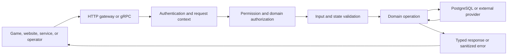

# How Eventun Interfaces Work

This chapter explains how the game, Website V2, dedicated servers, and operators talk to Eventun.
It is not an endpoint catalog. If you need the exact name of an operation or one of its fields, the
generated Swagger document, protobuf definitions, and implementation comments are the better
references.

The useful question here is broader: what happens to a request after it reaches Eventun? The same
basic journey applies whether the request concerns a player, team, gauntlet, match, or progression
goal. Only the product rules for that subject change.

## The Shape Of The Interface

Eventun defines its services and messages in protobuf. Those definitions drive the gRPC server,
the generated HTTP gateway, the merged Swagger document, and the bounded client specifications
used by the game and dedicated server.

Most first-party callers use the generated HTTP gateway rather than talking to gRPC directly. The
transport changes, but the service contract and request-handling model remain the same.

This shared path means callers do not need a different mental model for teams, gauntlets,
progression, or match history. The rules about the thing being changed are different, but the
surrounding identity, permission, validation, and error behavior stays familiar.

## How The Services Are Divided

Eventun exposes three service surfaces.

### ClientService

`ClientService` contains player-facing operations and public reads used by the game, Website V2,
and selected trusted services. A normal call carries a player access token. A small, explicit
allowlist of public reads can also be used by a service token that represents an application rather
than a player.

Match ingestion and replay-artifact association also live here because both player-hosted matches
and dedicated servers submit the same domain records. Eventun determines the producer's trust from
the authenticated caller rather than asking the caller to label its own data.

### ServerService

`ServerService` is the narrow dedicated-server control surface. It owns the trusted mutations that
coordinate a live gauntlet run: claim, admission, roster lock, match acceptance, and completion.

Dedicated servers obtain ordinary presentation and competition context through approved
`ClientService` reads. Eventun does not maintain duplicate read APIs just because the caller is a
server.

### AdminService

`AdminService` contains authoring, operational maintenance, corrections, publication, and live
intervention. Admin transport permission only opens the door; each operation still validates the
domain state it is allowed to change.

## A Typical Request

A player read is the simplest example. Imagine that the website needs to display a team:

1. The caller sends a generated HTTP request with an AccelByte bearer token.
2. The gateway binds the request to the protobuf operation.
3. Eventun validates the token, namespace, client identity, and player subject.
4. The handler checks identifiers and ordinary field constraints.
5. The team rules decide whether the player may see or act on that team.
6. The handler performs the smallest useful database query or transaction.
7. Eventun returns the typed response. Metrics and the access log record the outcome without
   recording the player's payload or credentials.

A dedicated-server change follows the same outline, but the identity is different. It uses a
client-credentials token that represents the server rather than a player and carries Eventun Server
permission. The operation then checks the run, session, roster, or match state. It is normally
designed so retrying the same request is safe and does not create a second result.

Administrative calls add broader permission, not weaker checks. They commonly require stronger
preconditions, a stable retry identity, or evidence describing the state being corrected.

## Identity, Permission, And Domain Authority

It helps to separate three ideas that are easy to blur together:

- **Identity** answers who or what made the request.
- **Permission** answers whether that kind of caller may use the service.
- **Domain authorization** answers whether the caller may perform this action on this exact player,
  team, gauntlet, or other resource.

Keeping the checks separate is important. A valid player token does not make the player a team
manager. An Eventun administrator permission does not make stale correction evidence valid. A
dedicated-server credential does not let its caller invent a player identity.

### Player identity

Eventun validates token authenticity, expiry, revocation, the configured AccelByte namespace, and a
non-empty `client_id`. A nonblank `sub` identifies the player. A whitespace-only subject is invalid
rather than being treated as either a player or a service.

Player calls do not require one blanket Eventun permission granted to every user. Authentication
establishes the player, and Eventun's ownership, membership, manager, creator, and self rules decide
what that player may do.

### Confidential service identity

A subjectless token is accepted only on an explicit allowlist. Shared reads require Eventun Server
`READ`; match ingestion and replay-artifact creation require Server `CREATE`.

`ServerService` requires the resource
`CUSTOM:ADMIN:NAMESPACE:{namespace}:EVENTUN:SERVER`. It rejects tokens that contain a player
subject, even when that user otherwise has the permission.

### Administrative identity

`AdminService` uses `CUSTOM:ADMIN:NAMESPACE:{namespace}:EVENTUN` with the operation's semantic
`CREATE`, `READ`, `UPDATE`, or `DELETE` action. Eventun-local player roles are not a substitute for
this transport permission.

### Token sources and request context

Bearer metadata and the Admin Portal `access_token` cookie are supported. Authorization metadata
wins when both are present. Successful authentication adds the claims, raw access token, client ID,
and optional player subject to one request context used by both unary and streaming handlers.

Missing or unknown permission annotations are service configuration errors and fail closed.

## Validation Is Layered

Validation is easier to understand when it is grouped by what it protects.

### Transport and shape

The gateway and generated protobuf bindings establish the request shape. Eventun then rejects
missing required meaning, unknown enum states where a safe fallback does not exist, malformed
identifiers, and values outside the operation's bounded limits.

### Identity and namespace

Player, team, gauntlet, action, session, and similar identifiers are parsed into their canonical
forms before authorization or persistence. The token namespace or Extend target namespace must
match the Eventun namespace.

### Rules about the requested subject

Eventun then checks the product rules for the requested subject: for example, ownership, active
membership, whether a run may accept another match, or whether a publication preview still
describes the current source data.

These checks belong in domain chapters when they express game or product rules. They belong here
only when they illustrate a rule shared by the interface layer.

### Concurrency and retry

Mutations lock the records that define their decision, re-read state under those locks, and either
commit one coherent result or fail without a partial domain change. Operations that may be retried
use a stable request identity or content hash and distinguish an exact retry from conflicting reuse.

### Public projection

Public responses are deliberately smaller than administrative or runtime state. Eventun exposes
the facts needed by a public experience and omits internal capability, audit, correction, and
authoring details. A public projection is a privacy and stability boundary, not merely a convenient
database view.

## Errors And What Callers See

Eventun preserves deliberate gRPC results such as `InvalidArgument`, `NotFound`,
`FailedPrecondition`, `Aborted`, `Canceled`, and `DeadlineExceeded`. Callers can use those codes to
distinguish bad input, absent resources, stale state, retryable conflicts, and caller cancellation.

Unexpected internal errors are logged with their original diagnostic but cross the interface as
`Internal` with the stable message `internal server error`. This prevents database details,
provider messages, tokens, or implementation paths from becoming part of a public contract.

The interceptor order is metrics, access logging, error sanitization, authorization, then handler
execution. That lets metrics and access records observe the same final status the caller receives,
including authorization failures. [Running Eventun](operations.md) explains what Eventun records
and how its database, provider calls, deadlines, and shutdown are bounded.

## Generated Contracts And Compatibility

The protobuf definitions are the source for the service and gateway shapes. Eventun builds a merged
Swagger document for the Extend application and generates the selected client specifications used
by Unreal. The generated GameServer surface is intentionally smaller than the complete model set.

Eventun and its first-party consumers normally make breaking changes as one coordinated deployment.
The generated clients change with the service instead of preserving stale fields, parallel
endpoint generations, or runtime capability handshakes. A compatibility window is added only for
an independently deployed consumer or another explicit rollout constraint.

For exact routes, request fields, response fields, and generated model names, read the Swagger or
protobuf source associated with the implementation revision being used.

## Where The Rest Of The Knowledge Lives

The interface layer should not become a miscellaneous Eventun notebook. Use the document whose
subject owns the behavior:

| Question | Authoritative chapter |
|---|---|
| What entities exist and how are they related or projected? | [Data model](data-model.md) |
| How are database use, provider calls, telemetry, deadlines, and shutdown handled? | [Running Eventun](operations.md) |
| How are telemetry identity, provenance, acceptance, facts, and recovery handled? | [Identified match ingestion](identified-match-ingestion.md) |
| How do stage runs, admission, fields, rosters, accepted matches, and completion work? | [Gauntlet runtime contract](gauntlet-stage-runtime-contract.md) |
| How do goals, challenges, completions, and rewards work? | [Progression](progression.md) |
| What events and payloads does Eventun consume? | [Event catalog](events.md) |
| How do teams and team gauntlets behave across Eventun, the game client, and web surfaces? | [Team and gauntlet current state](../team-gauntlet-current-state.md) |
| What is proposed or still being delivered? | The relevant [active initiative](../../initiatives/README.md) |

If a new subject does not fit one of these chapters and will matter independently, it should gain a
focused system chapter. It should not be appended here merely because it is reachable through an
API.
